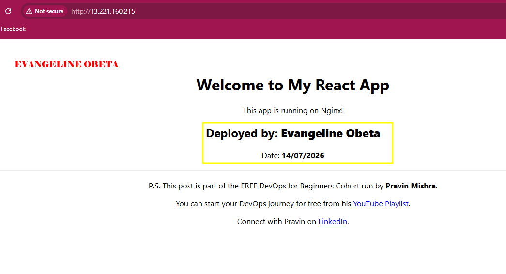
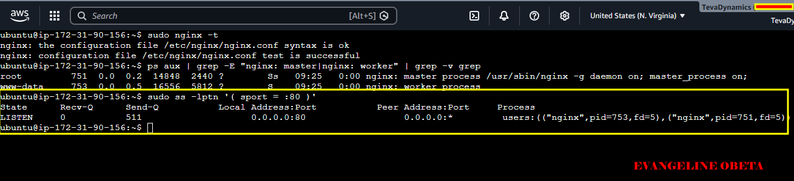
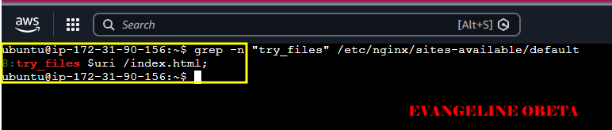
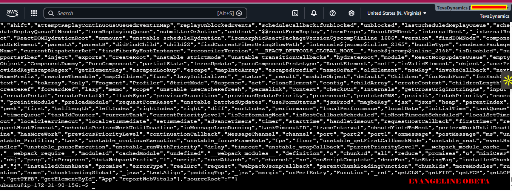
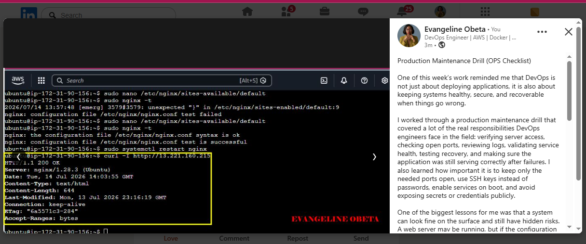

# Assignment 3 — Production Maintenance Drill (OPS Checklist)

Part of the DevOps Micro Internship (DMI) Cohort 3 with Agentic AI

---

## Purpose

In this assignment, you will treat your already deployed React application (on Ubuntu VM with Nginx) as a live production system. You will perform structured operational checks covering network validation, service health, log analysis, resource monitoring, configuration verification, and incident simulation with recovery — mirroring real on-call DevOps responsibilities.

---

# Task 1 — Server Access & Networking Validation

## Goal

Verify that the deployed React application is reachable from the browser and confirm basic network connectivity of the Ubuntu VM.

### Evidence

#### Screenshot 1 — Browser showing the React app with your Full Name visible on the UI

---

#### Screenshot 2 — Output of `ip a`

---

#### Screenshot 3 — Output of `sudo ss -tulpen`

---

#### Screenshot 4 — Output of `sudo ufw status`

---

### Notes

Answer the following in your own words:

**1. What proves Nginx is listening on 0.0.0.0:80?**

The ss -tulpen output shows nginx on 0.0.0.0:80, which means it is listening on all network interfaces and not just locally.

---

**2. What proves SSH is active on port 22?**

The same output shows sshd on 0.0.0.0:22, which confirms SSH is running and ready for remote login.

---

**3. Did you find any unexpected open ports? Explain briefly.**

No, I did not find any unexpected open ports. Only port 80 for Nginx and port 22 for SSH were open externally; the other services were bound to localhost only

---

# Task 2 — Service Health & Systemd Validation (Nginx)

## Goal

Verify that Nginx is properly installed, running, enabled at boot, and safely configured.

### Evidence

#### Screenshot 1 — Output of `systemctl status nginx --no-pager`

---

#### Screenshot 2 — Output of `sudo nginx -t`

---

#### Screenshot 3 — Output of `sudo ss -lptn '( sport = :80 )'`

---

### Notes

Answer the following in your own words:

**1. What happens if Nginx fails to restart in production?**

The app can go down and users may not be able to access the website. In a worse case, a bad Nginx config can stop the server from serving traffic completely.

---

**2. What's your basic rollback plan?**

Keep a backup of the working Nginx config, restore it if the new one fails, then restart Nginx again. If needed, I can also revert the last deployment and copy back the previous working build files.

---

# Task 3 — Logs & Request Trace

## Goal

Verify real traffic flow and analyze logs to understand system behavior and errors.

### Evidence

#### Screenshot 1 — Output of `sudo tail -n 30 /var/log/nginx/access.log`

---

#### Screenshot 2 — Output of `sudo tail -n 30 /var/log/nginx/error.log`

---

#### Screenshot 3 — Output of `sudo journalctl -u nginx --no-pager -n 50`

---

### Notes

Answer the following in your own words:

**1. Were there any errors in the logs?**

- If yes, mention 1–2 example error lines from the logs and explain what each one means in simple terms.
- If no, explain what it means if the error log is empty or shows no recent errors during your check.

No, I did not see any real errors in the error log. The only line shown was a notice saying Nginx was using inherited sockets, which is normal and not a failure.

---

**2. If there were no errors, what does that indicate about the system?**

It means Nginx did not record any recent problems during the time I checked. That does not mean the system is perfect forever, only that it was healthy in that moment.

---

**3. Based on the access logs, were your curl requests visible in the log entries? What does that prove about traffic flow?**

Yes, the curl requests were visible in the access log. That proves the requests reached Nginx successfully and Nginx handled the traffic.

---

# Task 4 — System Resource Health Check (Capacity Red Flags)

## Goal

Assess server capacity and detect potential performance or failure risks.

### Evidence

#### Screenshot 1 — Output of `uptime`

---

#### Screenshot 2 — Output of `free -h`

---

#### Screenshot 3 — Output of `df -h`

---

#### Screenshot 4 — Output of `sudo du -sh /var/* | sort -h`

---

### Notes

Answer the following in your own words:

**1. Which resource looks most critical right now? (CPU/load, memory, or disk) Explain why.**

From my outputs, memory is the most critical resource right now because it is more limited than CPU load and disk usage. 
---

**2. What happens if disk becomes 100% full in a production server?**

If disk reaches 100% full on a production server, the system can stop writing logs, applications may fail to save data, and the server can become unstable or even unresponsive. That is why disk space must always be watched closely, even if it is not the biggest problem in your current output.

---

# Task 5 — Configuration & Deployment Verification

## Goal

Ensure the correct React build is deployed and Nginx is serving it properly.

### Evidence

#### Screenshot 1 — Output of `ls -lah /var/www/html | head -n 20`

---

#### Screenshot 2 — Output of `grep -R "Deployed by" -n /var/www/html 2>/dev/null | head`

---

#### Screenshot 3 — Output of `grep -n "try_files" /etc/nginx/sites-available/default`

---

### Notes

Answer the following in your own words:

**1. How do you confirm that the correct version of the application is deployed?**

I confirmed it by checking /var/www/html with ls -lah and seeing the React build files like index.html and static. I also searched for “Deployed by” to make sure my personalized change was in the deployed build, and I verified that Nginx was using the right web root and SPA routing rule with try_files $uri /index.html;. Finally, I opened the app in the browser to confirm it loaded correctly.

---

# Task 6 — Nginx Configuration Failure Simulation

## Goal

Simulate a real-world Nginx misconfiguration and recover the service safely.

### Evidence

#### Screenshot 1 — Output of `sudo nginx -t` showing the syntax error (broken config)

---

#### Screenshot 2 — Output of `sudo nginx -t` showing syntax ok (fixed config)

---

#### Screenshot 3 — Output of `curl -I http://<public-ip>` confirming recovery (200 OK)

---

### Notes

Answer the following in your own words:

**1. What caused the configuration failure?**

The failure was caused by a syntax mistake in the Nginx config — the try_files line had a missing semicolon, so Nginx could not parse the file correctly

---

**2. How did you fix the issue?**

I opened the Nginx config again, added the missing semicolon back to try_files $uri /index.html;, then ran nginx -t and restarted the service. After that, the config test passed and the app returned 200 OK.

---

**3. How can you avoid this kind of issue in real production systems?**

I can avoid this by testing Nginx config with nginx -t before every restart, keeping a backup of the working config, and making small changes one at a time so mistakes are easier to catch.

---

# Task 7 — Web Application Failure Simulation

## Goal

Simulate missing deployment content and recover the application safely.

### Evidence

#### Screenshot 1 — Output of `curl -I http://<public-ip>` showing failure (non-200 response)

---

#### Screenshot 2 — Output of `curl -I http://<public-ip>` confirming recovery (200 OK)

---

### Notes

Answer the following in your own words:

**1. What caused the application to break in this scenario?**

What broke was the web content directory: I moved /var/www/html away, then created an empty /var/www/html, so Nginx had no proper app files to serve. That is why the request failed with a 500 Internal Server Error.

---

**2. How did you fix the issue and restore the application?**

I fixed it by removing the empty folder, restoring /var/www/html from /var/www/html_backup, restarting Nginx, and then checking the app again with curl -I. After that, it returned 200 OK, which shows the site was working again.

---

**3. What steps would you take to prevent this kind of issue in real production systems?**

To avoid this in production, I would keep backups, deploy changes in a safe way, and always verify the app immediately after any file move or restore. I would also avoid deleting the live web root unless I had a tested rollback plan.

---

# Task 8 — Security & Reliability Review

## Goal

Review and reflect on the security and reliability practices applied during this assignment.

### Security & Reliability Notes

Answer the following in your own words:

**1. Why is SSH key-based authentication more secure than sharing passwords?**

SSH keys use a private/public key pair so I never send a password over the network; only a cryptographic proof is exchanged. That means no password to guess, no brute-force or credential stuffing, and attackers can’t steal a typed password during transit. Private keys stay on my machine (protected by file permissions and optionally a passphrase), so it’s far harder to compromise than a reused or weak password.

---

**2. Why should only required ports be open on a production server?**

Every open port is another door into the server. Keeping only needed ports open (e.g., 22 for SSH, 80 for HTTP) reduces the attack surface and lowers the chance of unwanted scanners or automated exploits finding a vulnerable service.

---

**3. Why is it important for Nginx to be enabled on boot?**

If Nginx is enabled on boot the web service comes up automatically after reboots or maintenance, so users don’t see downtime just because the VM restarted. It keeps availability predictable and reduces manual recovery work after updates or unexpected reboots.

---

**4. What are the risks of sharing secrets, keys, or credentials publicly?**

Public secrets = instant compromise. Anyone with a key or token can access servers or cloud accounts, deploy malicious code, read private data, or incur costs. Secrets leaked in public repos are commonly scanned and abused within minutes, so they must never be committed or shared.

---

**5. Why should cloud resources be stopped or terminated when they are no longer needed?**

Unused cloud resources keep charging money and increase attack surface. Stopping or terminating them saves cost and reduces the number of live targets that need patching or monitoring. It’s also good hygiene for access control and compliance.

---

# LinkedIn Post (Required)

## Evidence

#### LinkedIn Post URL

(https://www.linkedin.com/posts/evangeline-obeta-067089193_devops-linux-aws-ugcPost-7482984291874934784-WXdF/?utm_source=share&utm_medium=member_desktop&rcm=ACoAAC1lNQ8BKNctpF5K7KkXcW9PlnRd3JAwP3E)

`Add your URL here`

---

#### Screenshot — Published LinkedIn post

---

# Submission Instructions

- Add all required screenshots in your submission
- Full name must be visible in required screenshots
- Do not expose sensitive information (keys, passwords, account IDs)

---

# Completion Checklist

- [ ] Task 1: Screenshots (browser, ip a, ss -tulpen, ufw status) + Notes answered
- [ ] Task 2: Screenshots (nginx status, nginx -t, ss port 80) + Notes answered
- [ ] Task 3: Screenshots (access log, error log, journalctl) + Notes answered
- [ ] Task 4: Screenshots (uptime, free -h, df -h, du -sh) + Notes answered
- [ ] Task 5: Screenshots (ls html, grep deployed by, grep try_files) + Notes answered
- [ ] Task 6: Screenshots (nginx -t fail, nginx -t pass, curl recovery) + Notes answered
- [ ] Task 7: Screenshots (curl failure, curl recovery) + Notes answered
- [ ] Task 8: Security & Reliability Notes answered
- [ ] LinkedIn post published and URL submitted
- [ ] Full Name visible in all required screenshots
- [ ] No sensitive data exposed

---

## 📌 About DMI & CloudAdvisory

DevOps Micro Internship (DMI) is a project-based DevOps program run by Pravin Mishra (The CloudAdvisory) focused on real-world execution, systems thinking, and career readiness.

It helps learners build strong DevOps foundations with hands-on experience.

---

## 📌 Resources

- 🌐 DMI Official Website: https://pravinmishra.com/dmi  
- 🎓 DevOps for Beginners (Udemy): https://www.udemy.com/course/devops-for-beginners-docker-k8s-cloud-cicd-4-projects/  
- 🎓 Agentic AI DevOps with Claude Code: https://www.udemy.com/course/ultimate-agentic-ai-devops-with-claude-code/  
- 🎓 DevOps with Claude Code: Terraform, EKS, ArgoCD & Helm: https://www.udemy.com/course/devops-with-claude-code-terraform-eks-argocd-helm/  
- ▶️ YouTube Playlist: https://www.youtube.com/playlist?list=PLFeSNDtI4Cho  
- 🔗 Pravin Mishra (LinkedIn): https://www.linkedin.com/in/pravin-mishra-aws-trainer/  
- 🏢 CloudAdvisory (LinkedIn): https://www.linkedin.com/company/thecloudadvisory/

---

*This submission is part of DevOps Micro Internship (DMI) Cohort 3 — Agentic AI Track.*