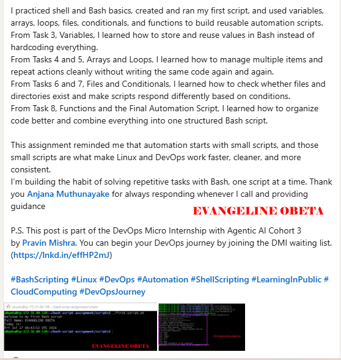

# Assignment 5 — Bash Script Automation Drill (OPS Checklist)

Part of the DevOps Micro Internship (DMI) Cohort 3 with Agentic AI

---

## Purpose

In this assignment, you will practice Bash scripting by building a series of small automation scripts covering environment setup, variables, arrays, loops, file conditionals, if-else logic, and functions. These scripts form the foundation of real-world Linux automation used in DevOps, cloud, and production support environments.

---

# Task 1 — Bash Environment & Workspace Setup

## Goal

Verify that Bash is available on your system and create a clean workspace for this assignment.

### Evidence

#### Screenshot 1 — Output of `echo $SHELL` and `bash --version`

---

#### Screenshot 2 — Output of `pwd` and `ls -lah` showing the scripts directory

---

### Notes

Answer the following in your own words:

**1. What is Bash?**

Bash is a shell and command language interpreter used in Linux and Unix-like systems. It lets me run commands directly in the terminal and also write scripts to automate tasks.

---

**2. What is the difference between shell and Bash?**

A shell is the general command-line interface that lets me talk to the operating system, while Bash is one specific type of shell. Bash is more feature-rich and is one of the most common shells used for scripting and daily terminal work

---

**3. Why is it important to confirm the Bash version before writing scripts?**

It is important because different Bash versions can support different features, and checking first helps me avoid script errors or compatibility problems. Knowing the version also tells me what syntax and commands I can safely use in my script.

---

# Task 2 — Your First Bash Script

## Goal

Create your first Bash script, make it executable, and run it from the terminal.

### Evidence

#### Screenshot 1 — Content of `first-script.sh`

---

#### Screenshot 2 — Output of `./first-script.sh`

---

#### Screenshot 3 — Output of `ls -l first-script.sh` showing executable permission

---

### Notes

Answer the following in your own words:

**1. What is the purpose of `#!/bin/bash`?**

It tells the computer that this script should be run using Bash. It is the line that decides which shell will read and execute the script.

---

**2. Why do we use `chmod +x` before running a script?**

We use chmod +x to make the script executable. Without that permission, the script cannot be run directly from the terminal.

---

**3. What is the difference between running a script using `./script.sh` and `bash script.sh`?**

./script.sh runs the script directly and needs execute permission, while bash script.sh runs the script through Bash and does not necessarily need execute permission. The ./ method uses the shebang line, but bash script.sh explicitly tells Bash to run it.

---

# Task 3 — Variables: User Information Script

## Goal

Use variables to store and display user-related information.

### Evidence

#### Screenshot 1 — Content of `user-info.sh`

---

#### Screenshot 2 — Output of `./user-info.sh`

---

### Notes

Answer the following in your own words:

**1. What is a variable in Bash?**

A variable in Bash is a name that stores a value, like a word, number, or text, so you can use it later in your script.

---

**2. Why should we avoid spaces around the `=` sign when creating variables?**

We avoid spaces because Bash treats spaces as separators. If you write spaces around =, Bash will not see it as a variable assignment and it will cause an error.

---

**3. How do you access the value stored inside a Bash variable?**

You access the value by putting a $ before the variable name. For example, if the variable is name, you use $name to print or use its value.

---

# Task 4 — Arrays & Loops: Tools Checklist Script

## Goal

Use arrays and loops to print a checklist of tools used in Bash scripting.

### Evidence

#### Screenshot 1 — Content of `tools-checklist.sh`

---

#### Screenshot 2 — Output of `./tools-checklist.sh`

---

### Notes

Answer the following in your own words:

**1. What is an array in Bash?**

An array in Bash is a variable that can store multiple values in one place instead of just one value.

---

**2. Why are arrays useful in scripts?**

Arrays are useful because they let me group related items together and handle them easily in a script, especially when I want to work with more than one value.

---

**3. What does `"${tools[@]}"` mean?**

It means all the items stored in the tools array. The @ lets me loop through each item one by one without losing any value.

---

**4. What is the purpose of the `for` loop in this script?**

The for loop is used to go through each item in the array one after the other and perform the same action on each one without repeating the code manually.

---

# Task 5 — Loops: Number Counter Script

## Goal

Use loops to repeat a task multiple times.

### Evidence

#### Screenshot 1 — Content of `counter.sh`

---

#### Screenshot 2 — Output of `./counter.sh`

---

### Notes

Answer the following in your own words:

**1. What is a loop?**

A loop is a way of repeating a set of commands again and again in a script.

---

**2. Why do we use loops in Bash scripting?**

We use loops to save time and avoid writing the same command many times. They help make scripts shorter, cleaner, and easier to manage.

---

**3. How many times did the loop run in your script?**

The loop ran the same number of times as the items in the array, because it went through each item one by one.

---

**4. What would you change if you wanted the loop to run 10 times?**

I would change the loop condition or the range so that it repeats 10 times instead of stopping at the current number of items.

---

# Task 6 — Files & Conditionals: File Validation Script

## Goal

Use file checks and conditionals to verify whether files and directories exist.

### Evidence

#### Screenshot 1 — Output of `ls -lah ../test-folder`

---

#### Screenshot 2 — Content of `file-check.sh`

---

#### Screenshot 3 — Output of `./file-check.sh`

---

### Notes

Answer the following in your own words:

**1. What does `-d` check in Bash?**

-d checks whether a path is a directory.

---

**2. What does `-f` check in Bash?**

-f checks whether a path is a regular file.

---

**3. Why should file and directory paths be stored in variables?**

They should be stored in variables so the script is easier to read, easier to update, and less likely to have repeated path mistakes.

---

**4. What happens if the file does not exist?**

If the file does not exist, the script can show a message saying it is missing and handle the situation with an if-else statement.

---

# Task 7 — Conditionals: Pass or Retry Script

## Goal

Use if-else conditionals to make decisions based on a variable value.

### Evidence

#### Screenshot 1 — Content of `score-check.sh` with `score=85`

---

#### Screenshot 2 — Output showing `Result: Pass`

---

#### Screenshot 3 — Content of `score-check.sh` with `score=55`

---

#### Screenshot 4 — Output showing `Result: Retry`

---

### Notes

Answer the following in your own words:

**1. What is the purpose of if-else in Bash?**

if-else is used to make decisions in a script. It lets the script check a condition and choose what action to take based on whether the condition is true or false.

---

**2. What does `-ge` mean?**

-ge means “greater than or equal to.” It is used to compare numbers in Bash.

---

**3. Why should conditions be tested with different values?**

Conditions should be tested with different values so I can make sure the script works correctly in all cases, not just one example. This helps catch mistakes early.

---

**4. How can conditionals help in automation scripts?**

Conditionals help automation scripts make smart decisions. They allow the script to respond differently depending on whether a file exists, a number is high enough, or a task succeeded or failed.

---

# Task 8 — Functions: Final Bash Automation Script

## Goal

Create a final Bash script using functions to organize reusable code.

### Evidence

#### Screenshot 1 — Content of `final-automation.sh`

---

#### Screenshot 2 — Output of `./final-automation.sh`

---

#### Screenshot 3 — Output of `ls -lah` showing all created scripts

---

### Notes

Answer the following in your own words:

**1. What is a function in Bash?**

A function in Bash is a reusable block of code that performs a specific task. Instead of writing the same commands again and again, I can put them inside a function and call it when needed.

---

**2. Why are functions useful in scripts?**

Functions are useful because they make scripts cleaner, shorter, and easier to understand. They also help organize code better and make it easier to reuse the same logic without repeating it.

---

**3. Which functions did you create in this script?**

In this script, I created functions for the main tasks in the automation check, such as checking system information, checking files or directories, and handling the script output in a simple way.

---

**4. How does this final script combine variables, arrays, loops, conditionals, files, and functions?**

The final script combines all of them by storing values in variables, using arrays to hold multiple items, repeating actions with loops, making decisions with conditionals, checking files and directories, and grouping the work into functions so the script is organized and reusable.

---

# LinkedIn Post (Required)

## Evidence

#### LinkedIn Post URL

https://www.linkedin.com/posts/evangeline-obeta-067089193_bashscripting-linux-devops-ugcPost-7483842925081178112-Z_3Z/?utm_source=share&utm_medium=member_desktop&rcm=ACoAAC1lNQ8BKNctpF5K7KkXcW9PlnRd3JAwP3E

`__________________________`

---

#### Screenshot — Published LinkedIn post

---

# Submission Instructions

- Add all required screenshots in your submission
- Full name must be visible in required screenshots
- All script files must be created and run successfully
- Required notes must be answered clearly for every task
- Do not expose sensitive information (keys, passwords, credentials)

---

# Completion Checklist

- [ ] Task 1: Environment setup verified, workspace created (Screenshots 1–2, Notes answered)
- [ ] Task 2: First script created, executed, permissions verified (Screenshots 1–3, Notes answered)
- [ ] Task 3: Variables script created and run (Screenshots 1–2, Notes answered)
- [ ] Task 4: Arrays and loops script created and run (Screenshots 1–2, Notes answered)
- [ ] Task 5: Counter loop script created and run (Screenshots 1–2, Notes answered)
- [ ] Task 6: File validation script created and run (Screenshots 1–3, Notes answered)
- [ ] Task 7: Pass/Retry conditional script tested with both values (Screenshots 1–4, Notes answered)
- [ ] Task 8: Final automation script created and run (Screenshots 1–3, Notes answered)
- [ ] All scripts run without errors
- [ ] Full Name visible in all required screenshots
- [ ] LinkedIn post published and URL submitted
- [ ] No sensitive data exposed

---

## 📌 About DMI & CloudAdvisory

DevOps Micro Internship (DMI) is a project-based DevOps program run by Pravin Mishra (The CloudAdvisory) focused on real-world execution, systems thinking, and career readiness.

It helps learners build strong DevOps foundations with hands-on experience.

---

## 📌 Resources

- 🌐 DMI Official Website: https://pravinmishra.com/dmi  
- 🎓 DevOps for Beginners (Udemy): https://www.udemy.com/course/devops-for-beginners-docker-k8s-cloud-cicd-4-projects/  
- 🎓 Agentic AI DevOps with Claude Code: https://www.udemy.com/course/ultimate-agentic-ai-devops-with-claude-code/  
- 🎓 DevOps with Claude Code: Terraform, EKS, ArgoCD & Helm: https://www.udemy.com/course/devops-with-claude-code-terraform-eks-argocd-helm/  
- ▶️ YouTube Playlist: https://www.youtube.com/playlist?list=PLFeSNDtI4Cho  
- 🔗 Pravin Mishra (LinkedIn): https://www.linkedin.com/in/pravin-mishra-aws-trainer/  
- 🏢 CloudAdvisory (LinkedIn): https://www.linkedin.com/company/thecloudadvisory/

---

*This submission is part of DevOps Micro Internship (DMI) Cohort 3 — Agentic AI Track.*