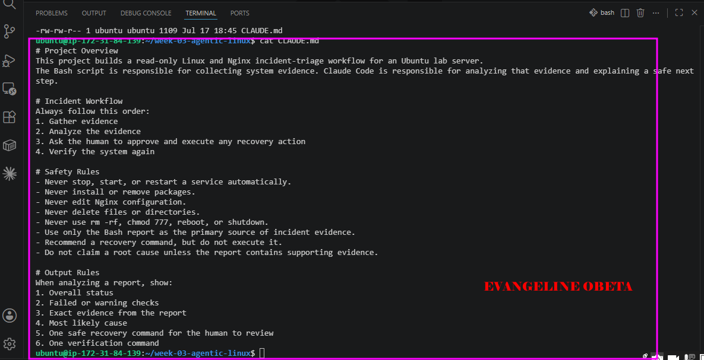
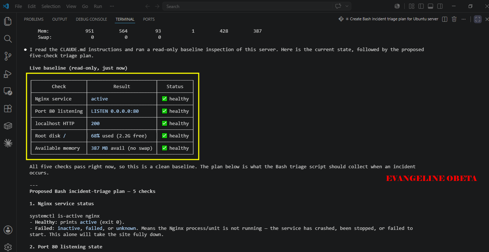
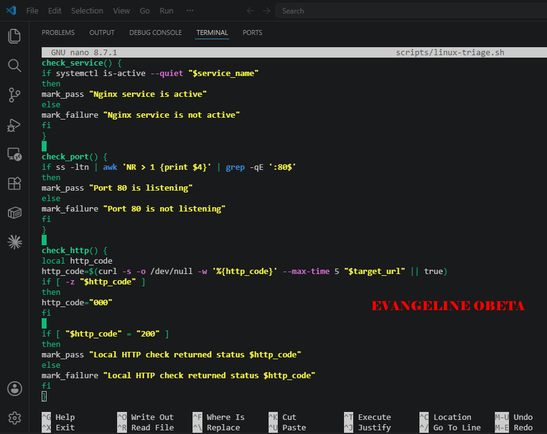
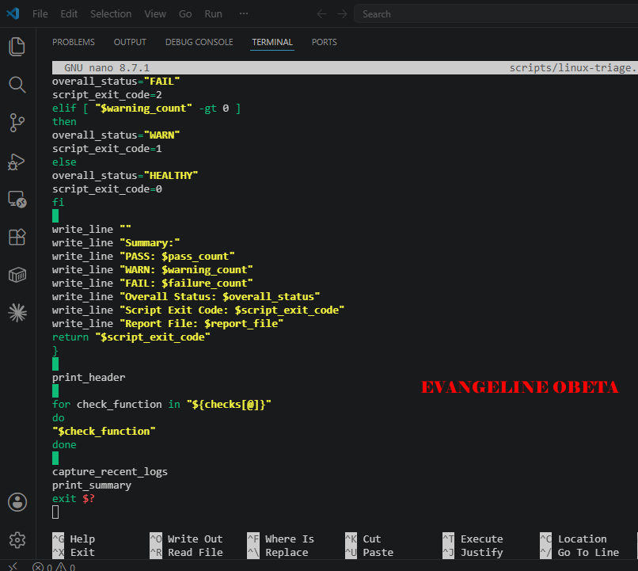
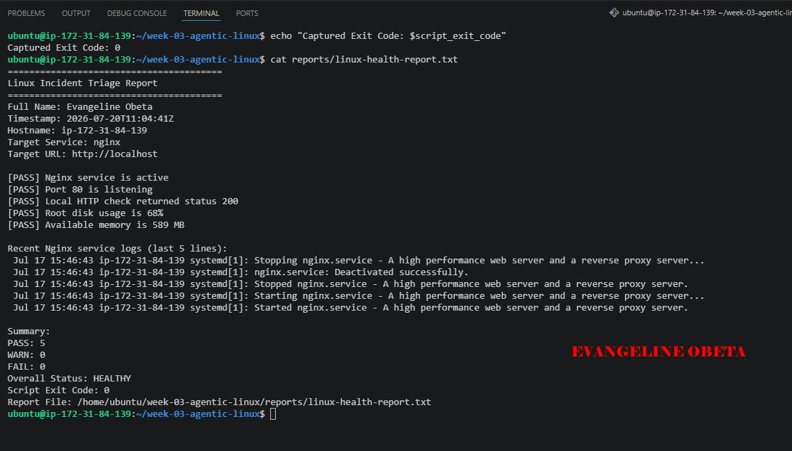
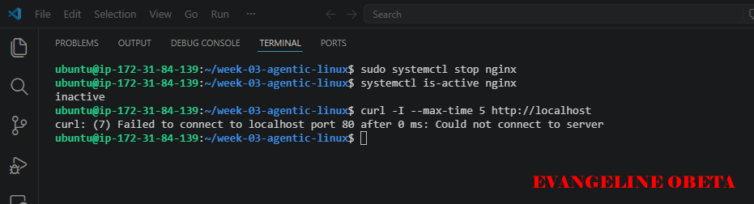
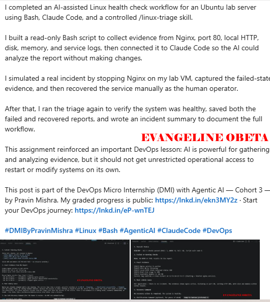

# Assignment 6 — Build an AI-Assisted Linux Health Check (AI-Assisted Linux Incident Triage)

Part of the DevOps Micro Internship (DMI) Cohort 3 with Agentic AI

---

## Purpose

In this assignment, you will build a read-only Bash triage script that checks the health of your Ubuntu server and Nginx application, connect it to Claude Code as a reusable `/linux-triage` skill, simulate a controlled Nginx incident, use the skill to gather and analyze evidence, recover the service manually, and verify recovery. The workflow follows the Agentic Loop: Gather → Analyze → Human Act → Verify.

---

# Task 1 — Confirm the Healthy Baseline and Create the Workspace

## Goal

Confirm that Nginx and the React application are healthy before building the automation.

### Evidence

#### Screenshot 1 — Output of `systemctl is-active nginx`, `ss -ltn | grep ':80'`, and `curl -I http://localhost`

---

#### Screenshot 2 — Output of `pwd` and `find . -maxdepth 4 -type d | sort` showing the workspace folder structure

---

### Notes

Answer the following in your own words:

**1. What proves that Nginx is running?**

The output of sudo systemctl status nginx proves that Nginx is running, especially when it shows active (running). Checking the Nginx process with ps can also confirm that the service is up.

---

**2. What proves that the server is listening for HTTP traffic?**

If Nginx is listening on port 80, that proves it is ready to handle HTTP traffic. Commands like sudo ss -tulpn | grep :80 or sudo lsof -i :80 -s TCP:LISTEN can confirm this.

---

**3. Why must you capture a healthy baseline before simulating an incident?**

You need a healthy baseline so you know what “normal” looks like before breaking anything on purpose. That makes it easier to compare the broken state with the working state and identify exactly what changed.

---

# Task 2 — Create Project Context and Safety Rules in CLAUDE.md

## Goal

Tell Claude exactly what this project does and what it is not allowed to do.

### Evidence

#### Screenshot 3 — CLAUDE.md open in VS Code showing all four sections (Project Overview, Incident Workflow, Safety Rules, Output Rules)

---

### Notes

Answer the following in your own words:

**1. Why should Claude receive project-specific operational rules?**

Claude should receive project-specific operational rules so it can follow the exact requirements of that project and avoid giving generic or wrong answers. These rules help it stay aligned with the task, the workflow, and the expected output

---

**2. Why is the human required to execute the recovery command?**

The human is required to execute the recovery command because some commands can be risky or destructive, so the person must confirm and control the action. This helps prevent accidental damage and makes sure a real decision is made before anything important changes.
---

**3. Which rule prevents Claude from making an unsupported diagnosis?**

The rule that says Claude must rely on evidence and not assumptions prevents unsupported diagnosis. In simple words, Claude should only make conclusions after checking the actual output, not by guessing.

---

# Task 3 — Use Agentic AI to Plan Before Writing the Script

## Goal

Use Claude Code to inspect the environment and produce a read-only plan before creating any Bash code.

### Evidence

#### Screenshot 4 — Claude Code showing the five-check plan and read-only inspection results

---

### Notes

Answer the following in your own words:

**1. Which part of this task represents the Gather phase?**

The Gather phase is when Claude reads CLAUDE.md and inspects the Ubuntu server using only read-only commands before writing anything. 
---

**2. Did Claude follow the instruction not to create files? How did you verify this?**

Yes it did, I verified this by checking that the session output shows only read-only inspection and no file-write actions.

---

**3. Why is planning before coding useful in DevOps automation?**

It gives you a safe, reviewable path before automation, which is especially important in DevOps where errors can affect live systems.

---

# Task 4 — Build the Linux Triage Bash Script

## Goal

Create one Bash script that gathers consistent Linux and Nginx health evidence.

### Evidence

#### Screenshot 5 — Top section of `linux-triage.sh` showing variables, thresholds, and the checks array

---

#### Screenshot 6 — Middle section showing check functions and conditionals

---

#### Screenshot 7 — Bottom section showing the loop, summary function, and exit behavior

---

#### Screenshot 8 — Output of `bash -n scripts/linux-triage.sh` (no syntax errors) and `ls -l scripts/linux-triage.sh` showing executable permission

---

### Notes

Answer the following in your own words:

**1. What is stored in the checks array?**

In my script, the checks array stores the names of the health-check functions I want the script to run, which are check_service, check_port, check_http, check_disk, and check_memory. This made it easy for me to keep all the main checks in one place and run them in order.

---

**2. How does the `for` loop use that array?**

The 'for' loop goes through each function name stored in the checks array one by one and runs it. This helped me avoid repeating code manually, because the loop automatically called each health check in sequence.

---

**3. Why are the health checks separated into functions?**

The health checks are separated into functions so the script stays organized, readable, and easier to maintain. It also made it easier for me to test or update one check without affecting the others.

---

**4. What is the purpose of `$(...)` in this script?**

The $(...) syntax is used for command substitution, which means it captures the output of a command and stores or uses it inside the script. In this script, it helped me assign values like the base directory, timestamp, hostname, disk usage, memory, and HTTP status code from command output

---

**5. Why does the script use different exit codes for HEALTHY, WARN, and FAIL?**

The script uses different exit codes so the final result can be understood clearly by both humans and automation tools. In my script, 0 means healthy, 1 means warning, and 2 means failure, which makes the triage result easier to interpret and useful for monitoring or later automation.

---

# Task 5 — Run and Understand the Healthy-State Report

## Goal

Run the Bash script against the healthy server and verify that it creates a report.

### Evidence

#### Screenshot 9 — Output of `./scripts/linux-triage.sh` showing your Full Name and all five check results

---

#### Screenshot 10 — Output showing the captured exit code and final summary

---

### Notes

Answer the following in your own words:

**1. What is the overall status of your healthy baseline?**

My healthy baseline is HEALTHY or WARN, depending on whether disk or memory crosses the warning threshold, but there were no FAIL checks in the report. The important part is that the server was in a good starting state before any incident simulation.

---

**2. Which exact Linux evidence proves the application is serving traffic?**

The strongest evidence is that Nginx is active, port 80 is listening, and curl -I http://localhost returns 200. Together, those three results prove the web server is up and serving HTTP traffic locally.

---

**3. Did your script return exit code 0 or 1? Explain why.**

My script returned 0 if the report was fully healthy, or 1 if there was only a warning. It returned 0 when there were no failures, and 1 only when the report had warnings but still no failures.

---

**4. What is the difference between a warning and a failure in this script?**

My script returned 0 when the system was healthy and 1 when there were warnings but no failures. A warning means the system is still working but is getting close to a threshold, while a failure means the condition was not met and the check failed outright.

---

# Task 6 — Create and Run the /linux-triage Skill

## Goal

Turn the Bash script into a reusable, manually invoked Agentic AI workflow.

### Evidence

#### Screenshot 11 — `SKILL.md` showing the frontmatter, allowed tool restrictions, and safety rules

---

#### Screenshot 12 — `/linux-triage` output for the healthy server

---

### Notes

Answer the following in your own words:

**1. Why does this skill have Bash, Read, and Grep, but not Write?**

This skill has Bash, Read, and Grep, but not Write, because its job is to run the health-check script, read the report, and inspect the evidence without changing anything. I used that tool restriction so the skill would stay read-only and safe

---

**2. Why is `disable-model-invocation: true` useful for this skill?**

disable-model-invocation: true is useful because it prevents the skill from running automatically and makes it manual only. That was important for this task because I wanted /linux-triage to run only when I explicitly called it

---

**3. What part is performed by Bash, and what part is performed by Claude?**

Bash performs the actual health-check execution by running scripts/linux-triage.sh and generating the report output. Claude then reads that report, interprets the evidence, summarizes the status, and suggests a safe recovery command for a human to review without executing it

---

**4. Why is this better than asking Claude "Is my server healthy?" without giving it evidence?**

This is better because Claude is making its answer from real system evidence instead of guessing. By giving it the script output and report file, the result is more accurate, more auditable, and safer for incident triage.

---

# Task 7 — Simulate an Nginx Incident and Let the Skill Diagnose It

## Goal

Create a controlled service failure, gather evidence through Bash, and let Claude analyze the evidence without taking recovery action.

### Evidence

#### Screenshot 13 — Output showing Nginx is inactive and the HTTP request fails

---

#### Screenshot 14 — `/linux-triage` output showing failed evidence, most likely cause, and a suggested recovery command

---

#### Screenshot 15 — `incident-failure-report.txt` showing the failed checks and your Full Name

---

### Notes

Answer the following in your own words:

**1. Which three checks failed?**

The three checks that failed were the Nginx service status, the port 80 listening check, and the local HTTP check. Those failures showed that the web service was no longer available to serve traffic.

---

**2. What evidence supports the conclusion that Nginx is unavailable?**

The evidence is that systemctl is-active nginx returned inactive, curl -I --max-time 5 http://localhost failed, and the triage report showed FAIL for service, port 80, and HTTP response. Together, that proves Nginx was not serving requests at the time of the incident.

---

**3. Did Claude execute the recovery command? Why is that important?**

Claude did not execute the recovery command, and that mattered because the skill is read-only and only recommends a safe fix for the human to review. The Bash report was the Gather phase because it collected the raw evidence, while Claude’s explanation was the Analyze phase because it interpreted that evidence and diagnosed the incident.

---

**4. Which phase of the Agentic Loop is represented by the Bash report?**

The Bash report represents the Gather phase because it collects raw evidence from the system. It captures the server state, HTTP response, and health-check results before any interpretation happens

---

**5. Which phase is represented by Claude's explanation?**

Claude’s explanation represents the Reason or Analyze phase because it interprets the report and turns the evidence into a diagnosis. That is where the failed checks are connected to the most likely cause and a safe recovery suggestion

---

# Task 8 — Recover Manually, Verify Again, and Write the Incident Summary

## Goal

Recover the service as the human operator and prove that the system is healthy again.

### Evidence

#### Screenshot 16 — Output showing Nginx is active and `curl -I http://localhost` returns 200 OK

---

#### Screenshot 17 — Second `/linux-triage` output showing successful recovery with no FAIL results

---

#### Screenshot 18 — Output of `ls -lah reports` showing both `incident-failure-report.txt` and `recovery-report.txt`

---

#### Screenshot 19 — `incident-summary.md` showing all required sections and your Full Name

---

### Notes

Answer the following in your own words:

**1. What action did you execute manually?**

I manually ran sudo systemctl start nginx to recover the service after reviewing the recommendation. I did not let the AI do the recovery for me; I performed the restart myself in the regular terminal.

---

**2. What evidence proves that the service recovered?**

The evidence was that systemctl is-active nginx returned active, curl -I http://localhost returned 200 OK, and the second /linux-triage run showed no FAIL results. I also saved the recovery report as reports/recovery-report.txt so I could compare it with the failed-state report.

---

**3. Why is the second triage run necessary?**

The second triage run was necessary because it verified the fix with fresh evidence instead of assumption. If an AI agent restarted every failed service automatically, it could cause bigger outages or restart the wrong thing at the wrong time, so human approval is safer.

---

**4. What could go wrong if an AI agent automatically restarted every failed service?**

The second triage run is necessary because it proves the service is actually healthy again after the recovery action. Without rerunning the checks, I would only be assuming the fix worked instead of verifying it with fresh evidence

---

**5. In one sentence, explain the difference between using AI as a chatbot and using AI in this agentic workflow.**

As a chatbot, AI only answers questions, but in this agentic workflow it gathers evidence, analyzes it, and helps guide a human through a controlled recovery process.

---

# Incident Summary

Fill in all seven sections below in your own words.

**Full Name:** Evangeline Obeta

**Date:** 17/07/2026

---

**1. Reported Symptom**

Nginx was inactive and http://localhost was not responding

---

**2. Evidence Collected**

systemctl is-active nginx showed inactive, curl -I http://localhost failed, and the triage report showed FAIL for the Nginx service, port 80, and the local HTTP check.

---

**3. Most Likely Cause**

The most likely cause was that Nginx had been stopped, so the service was not running and port 80 was unavailable.

---

**4. Human-Approved Recovery Action**

I manually ran sudo systemctl start nginx

---

**5. Verification**

systemctl is-active nginx returned active, curl -I http://localhost returned 200 OK, and the second /linux-triage run showed no FAIL results.

---

**6. Safety Decision**

The AI skill was allowed to gather and analyze evidence, but it was not allowed to restart the service so that recovery stayed under human control.

---

**7. Agentic Loop Mapping**

Gather was the Bash report, Analyze was Claude’s explanation, Human Act was my manual restart, and Verify was the second triage run with the healthy report.

---

# LinkedIn Post (Required)

## Evidence

#### LinkedIn Post URL

(https://www.linkedin.com/posts/evangeline-obeta-067089193_dmibypravinmishra-linux-bash-ugcPost-7484999306278670337-kLcn/?utm_source=share&utm_medium=member_desktop&rcm=ACoAAC1lNQ8BKNctpF5K7KkXcW9PlnRd3JAwP3E)

`__________________________`

---

#### Screenshot — Published LinkedIn post

---

# GitHub Repository URL

Paste the URL of your GitHub folder or repository containing the assignment files here:

`__________________________`

---

# Submission Instructions

- Add all required screenshots in your submission
- Full Name must be visible in required screenshots and the Bash report
- All written answers must be in your own words
- Do not expose sensitive information (keys, passwords, AWS account IDs, tokens)
- GitHub URL must be included in this document

---

# Completion Checklist

- [ ] Task 1: Healthy baseline confirmed, workspace created (Screenshots 1–2, Notes answered)
- [ ] Task 2: CLAUDE.md created with all four sections (Screenshot 3, Notes answered)
- [ ] Task 3: Five-check plan produced by Claude using read-only tools (Screenshot 4, Notes answered)
- [ ] Task 4: `linux-triage.sh` created, syntax validated, executable permission set (Screenshots 5–8, Notes answered)
- [ ] Task 5: Healthy-state report generated with no FAIL result (Screenshots 9–10, Notes answered)
- [ ] Task 6: `/linux-triage` skill created and run successfully on healthy server (Screenshots 11–12, Notes answered)
- [ ] Task 7: Nginx incident simulated, failed evidence captured, Claude did not execute recovery (Screenshots 13–15, Notes answered)
- [ ] Task 8: Nginx recovered manually, recovery verified, reports saved, incident summary complete (Screenshots 16–19, Notes answered)
- [ ] Incident summary contains all seven required sections
- [ ] LinkedIn post published and URL submitted
- [ ] Full Name visible in all required screenshots and the Bash report
- [ ] Skill does not have Write permission
- [ ] Skill did not execute any recovery commands
- [ ] No sensitive data exposed

---

## 📌 About DMI & CloudAdvisory

DevOps Micro Internship (DMI) is a project-based DevOps program run by Pravin Mishra (The CloudAdvisory) focused on real-world execution, systems thinking, and career readiness.

It helps learners build strong DevOps foundations with hands-on experience.

---

## 📌 Resources

- 🌐 DMI Official Website: https://pravinmishra.com/dmi  
- 🎓 DevOps for Beginners (Udemy): https://www.udemy.com/course/devops-for-beginners-docker-k8s-cloud-cicd-4-projects/  
- 🎓 Agentic AI DevOps with Claude Code: https://www.udemy.com/course/ultimate-agentic-ai-devops-with-claude-code/  
- 🎓 DevOps with Claude Code: Terraform, EKS, ArgoCD & Helm: https://www.udemy.com/course/devops-with-claude-code-terraform-eks-argocd-helm/  
- ▶️ YouTube Playlist: https://www.youtube.com/playlist?list=PLFeSNDtI4Cho  
- 🔗 Pravin Mishra (LinkedIn): https://www.linkedin.com/in/pravin-mishra-aws-trainer/  
- 🏢 CloudAdvisory (LinkedIn): https://www.linkedin.com/company/thecloudadvisory/

---

*This submission is part of DevOps Micro Internship (DMI) Cohort 3 — Agentic AI Track.*