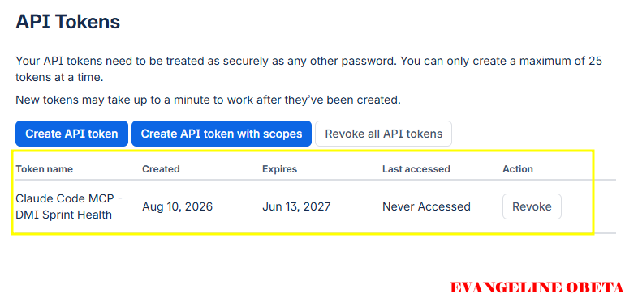

# Assignment 5 — AI-Assisted Sprint Health Report via Jira MCP

Part of the DevOps Micro Internship (DMI) Cohort 3 with Agentic AI

---

## Purpose

In this assignment, you will connect Claude Code to your Jira board through an MCP server, the same way you connected it to GitHub in Week 2, and build a read-only `/sprint-health` skill. The skill reads your current sprint through Jira's API and reports sprint velocity, stories at risk of missing the sprint, and items missing an estimate — but it must never create, edit, comment on, or transition a single ticket itself. You will prove that boundary holds by making a real change on the board yourself and confirming the skill only ever reports, never acts.

---

# Task 1 — Create a Jira API Token

## Goal

Generate an API token from your Atlassian account that the MCP server will use to authenticate with your Jira site. Do not screenshot the token value itself.

### Evidence

#### Screenshot 1 — Jira API token creation confirmation page showing the token name, with the token value not visible

### Notes You Must Write (Very Important):

Why does the MCP server need your site URL and account email in addition to the token?

The MCP server needs three pieces of information to talk to my Jira site: the site URL, my Atlassian email, and the API token. The URL tells the server which Jira cloud instance to call — Atlassian hosts many sites, so it has to know the exact base address for my board. My email identifies which Jira account the token belongs to, so requests run as “me” and can see my projects and sprints. The API token is the actual secret that proves the request is allowed. Without the URL and email, the token would just be a random string with no context; putting all three together lets the MCP server authenticate to the right Jira site as the right user and then read my sprint data safely.

---

# Task 2 — Create .mcp.json at the Project Root

## Goal

Create or update `.mcp.json` at your project root with a Jira MCP server block, following the same shape as the GitHub MCP server you configured in Week 2.

### Evidence

#### Screenshot 2 — `.mcp.json` open in VS Code showing the Jira server configuration

### Notes You Must Write (Very Important):

Compare this jira block to the github block from Week 2 Assignment 5. The GitHub server ran via npx (a Node.js package); this one runs via uvx (a Python package) — what stays exactly the same shape despite that difference, and why doesn't Claude Code care which language a given MCP server is written in?

When I compare the old GitHub mcpServers block to the new Jira one, the overall shape is identical even though one uses npx for a Node server and the other uses uvx for a Python server. Both blocks have a server name key (github or jira), a command field to say how to launch the MCP process, an args array for the package to run, and an env object for any environment variables. This structure stays the same because Claude Code only cares that it can start a MCP server over a standard interface (stdio/HTTP) and exchange messages with it; it doesn’t care what language or runtime is behind that server. As long as the server speaks the MCP protocol, Claude sees it as “just another tool” and can call it the same way, whether it’s GitHub on Node or Jira on Python.

---

# Task 3 — Add Your Credentials to settings.local.json

## Goal

Add your Jira site URL, account email, and API token to `.claude/settings.local.json`, and confirm that file is listed in `.gitignore` so it is never committed.

### Evidence

#### Screenshot 3 — `settings.local.json` open in VS Code showing the `env` section, with the actual token value blurred or covered

### Notes You Must Write (Very Important):

Why must JIRA_API_TOKEN live in settings.local.json and never in .mcp.json?

JIRA_API_TOKEN has to live in .claude/settings.local.json because it is a sensitive secret that should never be committed to the repository. .mcp.json is meant to be shared with the team and checked into git, so putting a raw API token there would leak my Jira credentials to anyone who clones the project or reads the history. In contrast, settings.local.json is gitignored and applies only to my machine, so it’s the safe place for personal secrets like API tokens and machine-specific settings. The idea is that .mcp.json describes which MCP servers the project uses, while settings.local.json quietly supplies my private keys; that way Claude can connect to Jira, but the token never appears in the shared codebase.

---

# Task 4 — Verify the Connection with /mcp

## Goal

Restart Claude Code and confirm the Jira MCP server shows as connected.

### Evidence

#### Screenshot 4 — `/mcp` output showing `jira: connected`

---

# Task 5 — Run a Live Query to Prove Real Board Data

## Goal

Ask Claude to list the issues in your current active sprint through the Jira MCP connection, and confirm the result matches what you see on your live board in the browser.

### Evidence

#### Screenshot 5 — Claude's response showing the live sprint issue list retrieved via Jira MCP

### Notes You Must Write (Very Important):

How did you confirm this was real board data and not something Claude guessed?

To make sure the sprint data Claude returned was real and not something it guessed, I did two checks. First, I watched the MCP output and saw that Claude called the Jira MCP tools (like search and get sprint) rather than using its normal model-only mode. That told me the information was coming from Jira’s API. Second, I opened my “DevOps Micro-Internship Website – My Name” board in the browser and compared the list: issue keys, summaries, statuses, assignees, story points, and priorities all matched exactly between Jira and Claude’s response. When I saw things like a story moved to “In Progress” or a specific point total appear the same in both places, I knew the report was built from live board data, not invented text.

---

# Task 6 — Build the /sprint-health Skill

## Goal

Create a `/sprint-health` skill restricted to read-only Jira tools plus `Read`, with no issue-mutating tools and no `Write`. Run it and confirm it produces a report covering sprint velocity, at-risk stories, and items missing an estimate.

### Evidence

#### Screenshot 6 — `SKILL.md` frontmatter showing `allowed-tools` limited to read-only Jira tools plus `Read`, with `disable-model-invocation: true`

#### Screenshot 7 — `/sprint-health` output showing the full triage report against your real sprint

### Notes You Must Write (Very Important):

1. Which Jira MCP tools does this skill's allowed-tools list include, and which mutating tools (create issue, update issue, transition issue, add comment) does it deliberately exclude?

This skill’s allowed-tools list only includes Jira MCP tools that read data plus the Read tool: things like jira_search, jira_get_issue, jira_get_sprint, and jira_get_board. These tools can look up sprints, fetch issues, and read fields such as status, story points, and last updated timestamps, but they do not change anything on the board. On purpose, the skill excludes all mutating tools: anything that would create a Jira issue, update fields, transition status, or add comments is not allowed. That means it can’t silently move a ticket to “Done”, set an estimate, or close a bug.

2. Why does a Scrum Master need this restriction more than almost any other role in this course?

As a Scrum Master, this restriction is especially important because I am accountable for the state of the board. Standups, burndown charts, and stakeholder reports all depend on the board reflecting reality, and the team expects that humans decide what gets moved or re-estimated. If an AI skill could quietly transition issues or edit them without me noticing, it would break that accountability and make it harder to trust our sprint metrics. With read-only tools, the skill becomes a helper that surfaces risk and missing estimates, while I keep full control over every actual change.

---

# Task 7 — Prove the Skill Never Mutates the Board

## Goal

Manually update one ticket on your board in the browser (for example, move a story to "Done" or add a missing estimate), then run `/sprint-health` again and confirm the new report reflects your change — proving the skill only ever reads live state and never wrote to the board itself.

### Evidence

#### Screenshot 8 — Second `/sprint-health` run showing the report now reflects your manual board change

### Notes You Must Write (Very Important):

Map this assignment to Gather → Analyze → Human Act → Verify from Week 3 Assignment 6. Which step did you perform manually in the browser, and why must that step stay human?

This assignment fits the Gather → Analyze → Human Act → Verify pattern very clearly. The Jira MCP tools and /sprint-health skill handle the Gather step by pulling live issues and sprint details from my board. The skill then Analyzes that data: it calculates points done versus committed, days remaining, and identifies at-risk stories and missing estimates. The Human Act step happens in the browser, where I personally move a ticket (for example, to “Done”) or add a missing story point; that is the one step the assignment insists must stay human. Finally, I Verify by running /sprint-health again and checking that the new report reflects the change I made.

Keeping “Human Act” manual is essential here because changing Jira issues affects the team’s workflow, commitments, and sometimes even stakeholder expectations. Those decisions need a human Scrum Master who understands context, priorities, and trade-offs, not an automated tool acting on its own. The skill’s job is to shine a light on what needs attention; my job is to decide and perform the actual change, then rerun the report to confirm it registered correctly.

---

# Submission Instructions

Complete all tasks in sequence.

Your submission must include:
- All 8 required screenshots
- All the required notes

---

# Completion Checklist

- [ ] Task 1: Jira API token created, value never screenshotted (Screenshot 1)
- [ ] Task 2: `.mcp.json` has the Jira server block (Screenshot 2)
- [ ] Task 3: Credentials stored in `settings.local.json`, token blurred, file gitignored (Screenshot 3)
- [ ] Task 4: `/mcp` shows the Jira server connected (Screenshot 4)
- [ ] Task 5: Live query returned real sprint data, verified against the browser (Screenshot 5)
- [ ] Task 6: `/sprint-health` skill created with correct read-only `allowed-tools`, and produced a full report (Screenshots 6–7)
- [ ] Task 7: A manual board change was reflected in a second `/sprint-health` run (Screenshot 8)
- [ ] Skill never created, edited, transitioned, or commented on any issue
- [ ] Reflection answered (Notes)
- [ ] No API token value exposed

---

## 📌 About DMI & CloudAdvisory

DevOps Micro Internship (DMI) is a project-based DevOps program run by Pravin Mishra (The CloudAdvisory) focused on real-world execution, systems thinking, and career readiness.

It helps learners build strong DevOps foundations with hands-on experience.

---

## 📌 Resources

- 🌐 DMI Official Website: https://dmi.pravinmishra.com?utm_source=github&utm_medium=readme  
- 🎓 University: https://university.pravinmishra.com?utm_source=github&utm_medium=readme  
- 💬 Discord Community: https://discord.pravinmishra.com?utm_source=github&utm_medium=readme  
- 📝 Blog: https://dmi.pravinmishra.com/blog?utm_source=github&utm_medium=readme  
- ▶️ YouTube Playlist: https://www.youtube.com/playlist?list=PLFeSNDtI4Cho  
- 🔗 Pravin Mishra (LinkedIn): https://www.linkedin.com/in/pravin-mishra-aws-trainer/  
- 🏢 CloudAdvisory (LinkedIn): https://www.linkedin.com/company/thecloudadvisory/

---

*This submission is part of DevOps Micro Internship (DMI) Cohort 3 — Agentic AI Track.*
