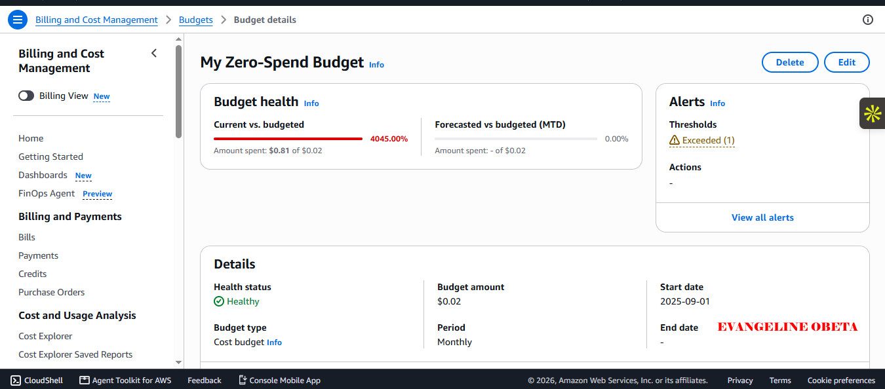

# Assignment 1 — Creating an AWS Free Tier Account & Setting Up Budget Management and Alerts

Part of the DevOps Micro Internship (DMI) Cohort 3 with Agentic AI

---

## Purpose

In this assignment, you will create your own AWS Free Tier account and configure budget management with cost alerts. This is an important first step: it lets you follow along with the rest of the course, and the alerts help ensure you do not exceed your budget.

---

# Task 1 — Sign Up for AWS and Access the Console

## Goal

Create your AWS Free Tier account, select the Basic Support Plan (Free), and log in to the AWS Management Console.

> No screenshot required for this task. Completion is verified through Task 2.

---

# Task 2 — Create a Monthly Cost Budget with Alerts

## Goal

In the Billing Dashboard, create a monthly Cost Budget with a name, amount, and start month, then configure alert thresholds (e.g. 50%, 80%, 100%) and a notification email address.

### Evidence

#### Screenshot 1 — AWS Budget setup page showing the budget name, budget amount, and alert thresholds

---

### Notes

Answer the following in your own words:

**1. Why is it important to set up budget alerts when using an AWS account?**

It’s important to set up budget alerts on an AWS account because they act as an early warning system for your cloud spend. AWS is usage‑based, so costs can grow quietly in the background if you leave resources running or misconfigure a service. With budget alerts in place, AWS notifies you by email as soon as your actual or forecasted spend hits key thresholds (for example 50%, 80%, or 100% of your monthly budget), giving you time to log in, review what is running, and shut down or right‑size anything you don’t need. This is especially critical on a Free Tier account: alerts help you avoid accidental charges, stay within the free limits, and build good cost‑management habits from day one, instead of discovering a surprise bill after the month has already ended.

---

# Submission Instructions

- Add the required screenshot in your submission
- Do not expose sensitive billing, card, identity, or account information

---

# Completion Checklist

- [ ] AWS Free Tier account created and Basic Support Plan (Free) selected
- [ ] Logged in to the AWS Management Console
- [ ] Monthly Cost Budget created with name, amount, and start month
- [ ] Budget alert thresholds and notification email configured
- [ ] Screenshot captured showing budget name, amount, and thresholds (Screenshot 1)
- [ ] Notes question answered
- [ ] No sensitive billing or account information exposed

---

## 📌 About DMI & CloudAdvisory

DevOps Micro Internship (DMI) is a project-based DevOps program run by Pravin Mishra (The CloudAdvisory) focused on real-world execution, systems thinking, and career readiness.

It helps learners build strong DevOps foundations with hands-on experience.

---

## 📌 Resources

- 🌐 DMI Official Website: https://dmi.pravinmishra.com?utm_source=github&utm_medium=readme  
- 🎓 University: https://university.pravinmishra.com?utm_source=github&utm_medium=readme  
- 💬 Discord Community: https://discord.pravinmishra.com?utm_source=github&utm_medium=readme  
- 📝 Blog: https://dmi.pravinmishra.com/blog?utm_source=github&utm_medium=readme  
- ▶️ YouTube Playlist: https://www.youtube.com/playlist?list=PLFeSNDtI4Cho  
- 🔗 Pravin Mishra (LinkedIn): https://www.linkedin.com/in/pravin-mishra-aws-trainer/  
- 🏢 CloudAdvisory (LinkedIn): https://www.linkedin.com/company/thecloudadvisory/

---

*This submission is part of DevOps Micro Internship (DMI) Cohort 3 — Agentic AI Track.*