# Assignment 5 — Deploy a Highly Available Two-Tier Application on AWS (VPC + ALB + ASG + Multi-AZ RDS)

Part of the DevOps Micro Internship (DMI) Cohort 3 with Agentic AI

---

## Purpose

In this assignment, you will design and deploy a highly available two-tier web application on AWS: highly available networking across two Availability Zones, an Application Load Balancer, an Auto Scaling Group for the web tier, and a private Multi-AZ RDS database. You must prove high availability with real failure tests.

---

# Task 1 — Create HA Networking (VPC + 4 Subnets + IGW + NAT + Route Tables)

## Goal

Build a VPC (10.0.0.0/16) with two public and two private subnets across two Availability Zones, an Internet Gateway, a NAT Gateway, and the matching public/private route tables.

### Evidence

#### Screenshot 1 — VPC details showing CIDR 10.0.0.0/16

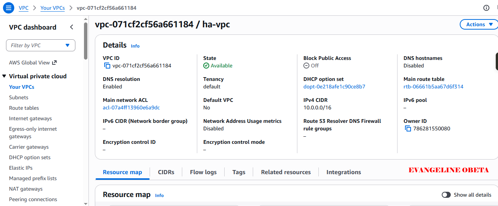

---

#### Screenshot 2 — Subnets list showing four subnets and their Availability Zones

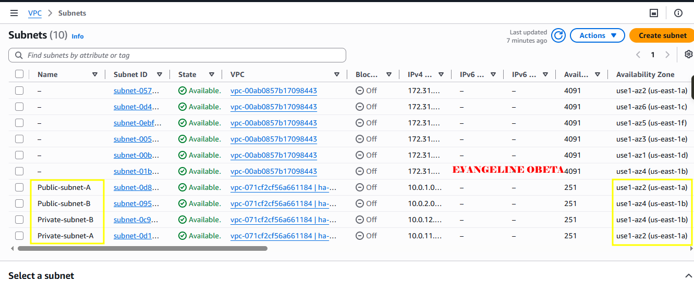

---

#### Screenshot 3 — Public route table showing the Internet Gateway route and both public-subnet associations

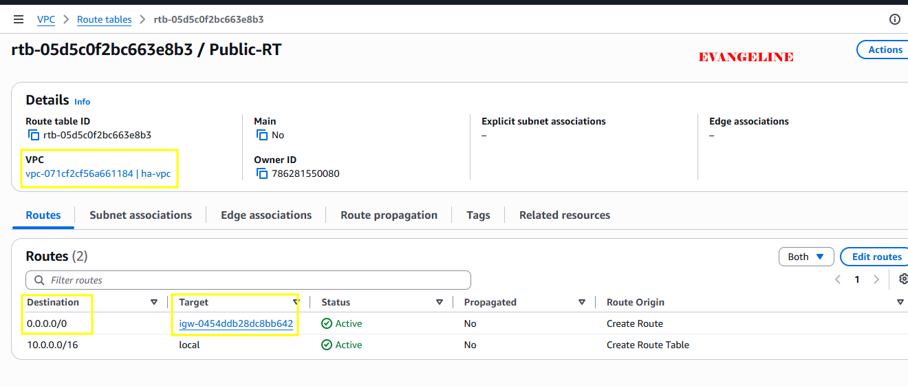

---

#### Screenshot 4 — Private route table showing the NAT Gateway route and both private-subnet associations

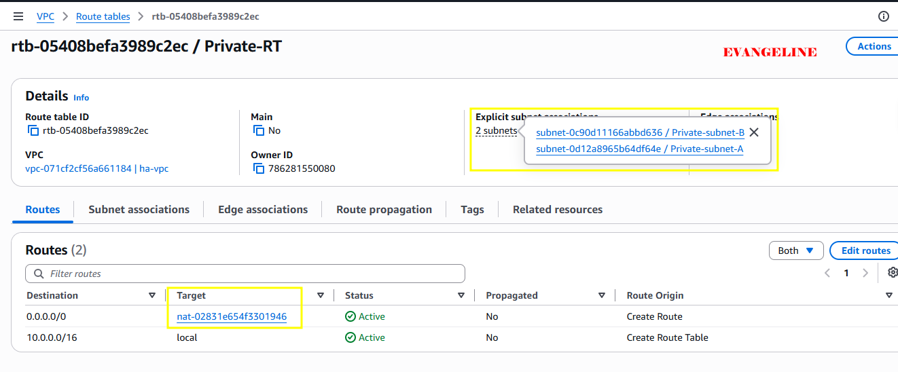

---

#### Screenshot 5 — NAT Gateway status showing Available and the Elastic IP

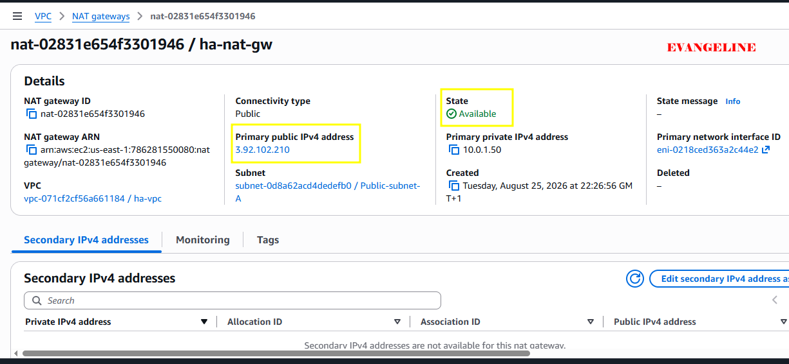

---

# Task 2 — Create Security Groups (ALB, EC2, RDS) with Least Privilege

## Goal

Create `ha-alb-sg` (HTTP public), `ha-web-sg` (HTTP only from `ha-alb-sg`, SSH from your IP), and `ha-db-sg` (database port only from `ha-web-sg`).

### Evidence

#### Screenshot 6 — ALB Security Group inbound rules

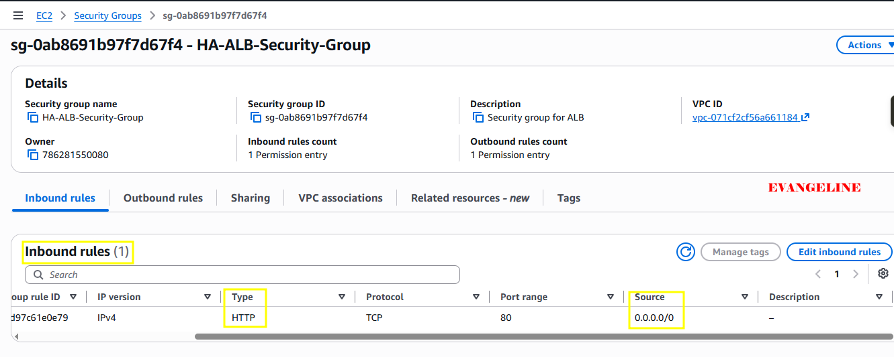

---

#### Screenshot 7 — EC2 Security Group inbound rules showing the ALB Security Group reference and SSH from your IP

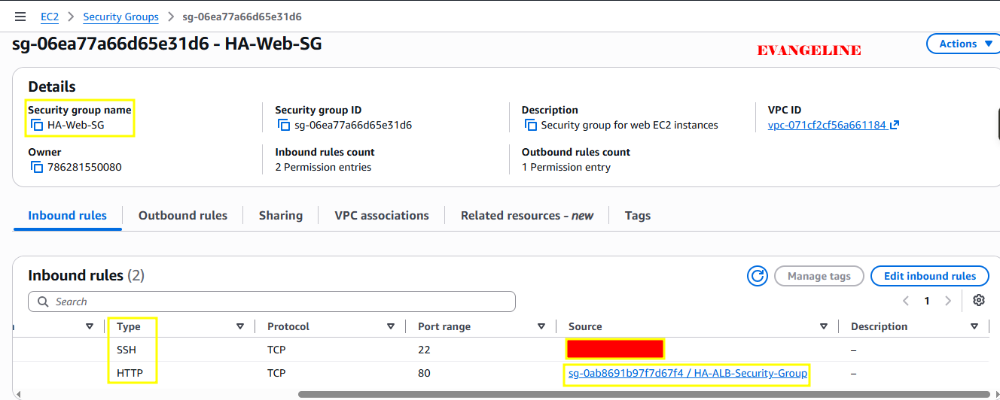

---

#### Screenshot 8 — RDS Security Group inbound rule showing the database port allowed only from the EC2 Security Group

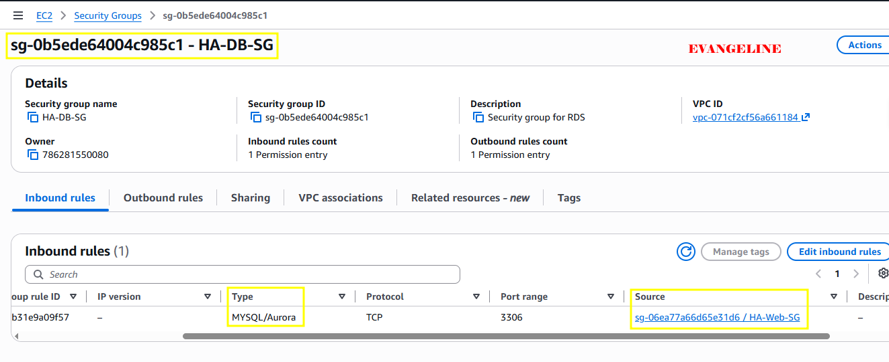

---

# Task 3 — Deploy Database Tier (RDS Multi-AZ in Private Subnets)

## Goal

Launch a private, Multi-AZ RDS database (MySQL or PostgreSQL) using the private DB Subnet Group and `ha-db-sg`.

### Evidence

#### Screenshot 9 — RDS summary showing Multi-AZ = Yes and Publicly accessible = No

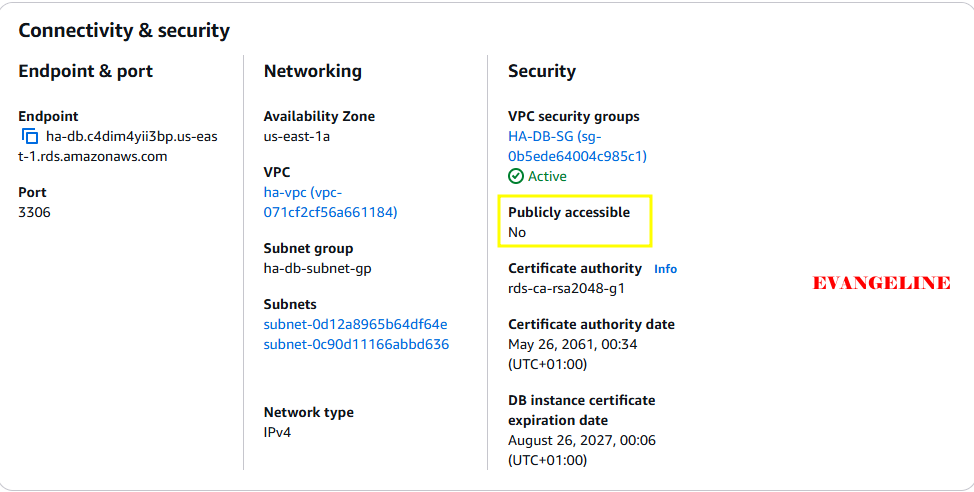

---

#### Screenshot 10 — RDS connectivity section showing the DB Subnet Group and Security Group

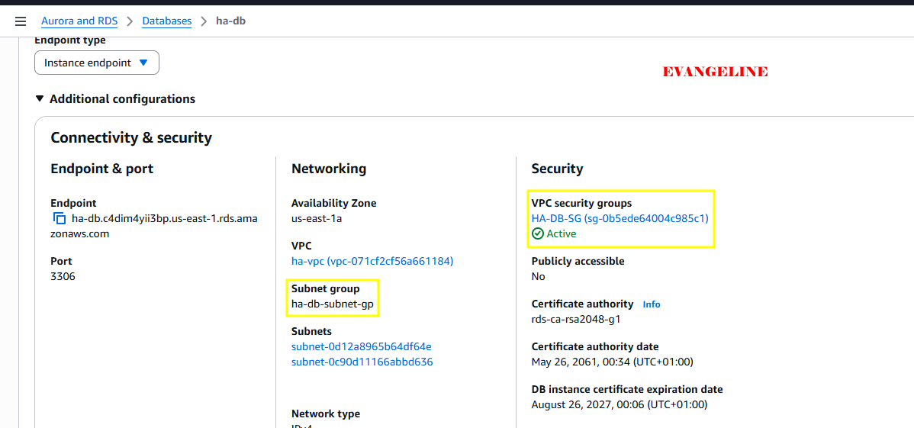

---

# Task 4 — Build a Launch Template (User Data Installs App + Connects to DB)

## Goal

Create a Launch Template whose user data installs the web-server runtime, deploys the application, configures the database connection, and starts the required services.

### Evidence

#### Screenshot 11 — Launch Template details showing that user data exists, including a visible snippet

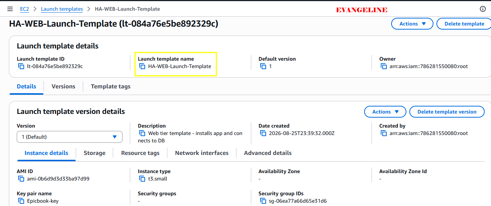

---

#### Screenshot 12 — A running instance created from the template showing that the application responds on port 80 through a local test or browser using its public IP

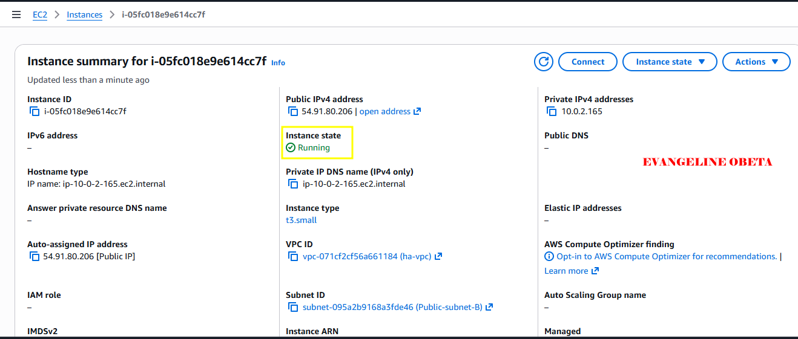

---

# Task 5 — Create an Application Load Balancer (ALB) Across 2 Public Subnets

## Goal

Create an internet-facing ALB across both public subnets with an HTTP listener and a healthy instance target group.

### Evidence

#### Screenshot 13 — ALB details showing two public subnets in two Availability Zones

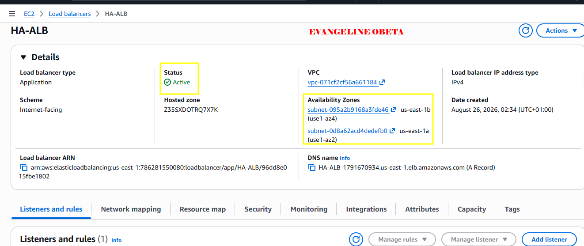

---

#### Screenshot 14 — Target group showing at least one healthy target

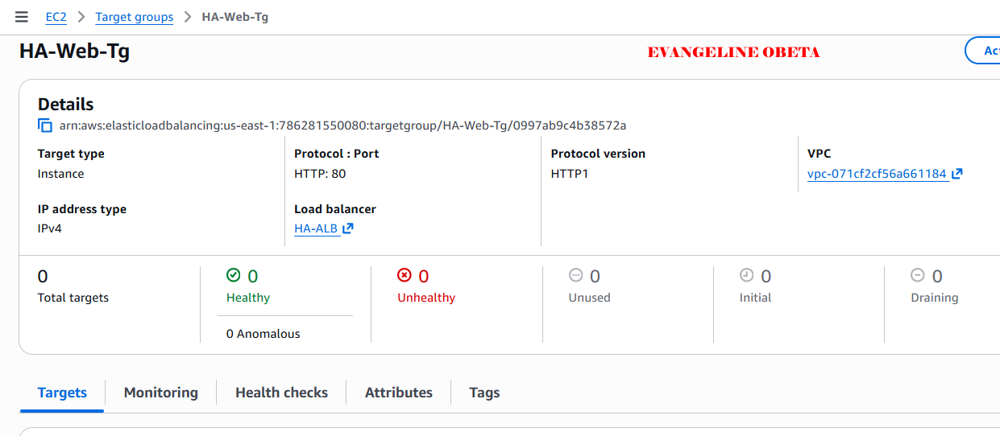

---

# Task 6 — Create Auto Scaling Group (ASG) in 2 Public Subnets

## Goal

Create an Auto Scaling Group from the Launch Template across both public subnets, with desired capacity 2, minimum 2, and maximum 4, registered to the ALB target group.

### Evidence

#### Screenshot 15 — Auto Scaling Group showing desired, minimum, and maximum capacity and the selected subnet Availability Zones

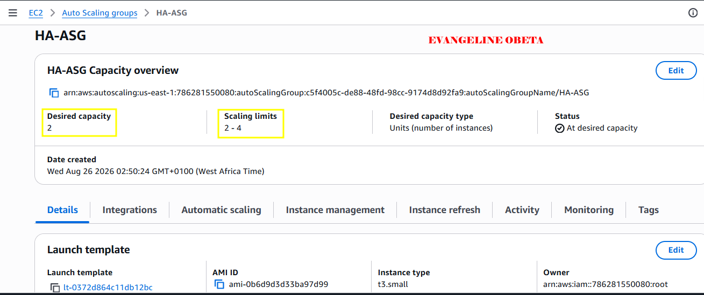

#### Screenshot 15 — Auto Scaling Group showing desired, minimum, and maximum capacity and the selected subnet Availability Zones

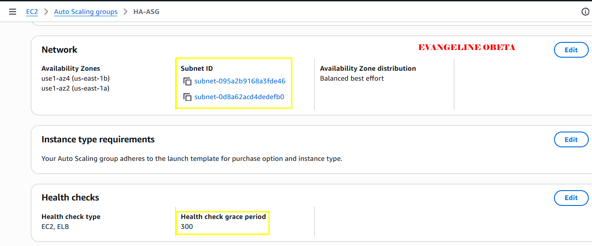

---

#### Screenshot 16 — EC2 instances list showing two running instances in different Availability Zones

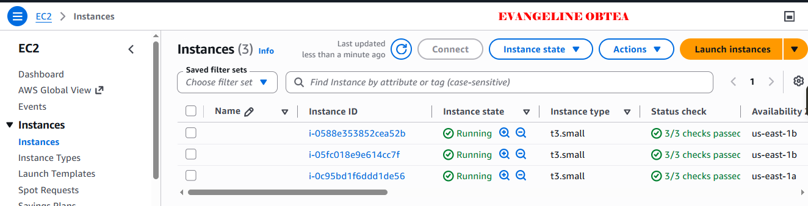

---

# Task 7 — Configure App to Use RDS + Validate Read/Write

## Goal

Confirm the application communicates with the RDS database through the ALB DNS name with at least one read and one write operation.

### Evidence

#### Screenshot 17 — Browser showing the application loaded through the ALB DNS name with the URL visible

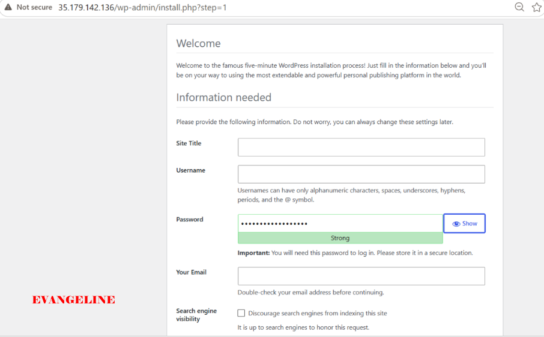

---

#### Screenshot 18 — Proof of a database write through a UI message or database query output

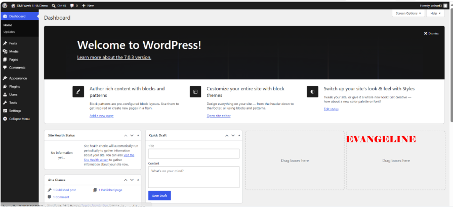

---

# Task 8 — High Availability Tests (Must Do Both)

## Goal

Test A: terminate one web instance and confirm the Auto Scaling Group replaces it automatically without interrupting the ALB.

Test B: simulate an Availability Zone impact (stop, detach, or reduce desired capacity in one AZ) and confirm the application stays available.

### Evidence

#### Screenshot 19 — EC2 showing the terminated instance and the newly launched instance; timestamps are helpful

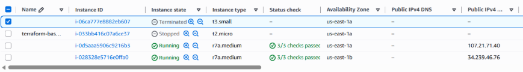

---

#### Screenshot 20 — Target group showing healthy targets after replacement

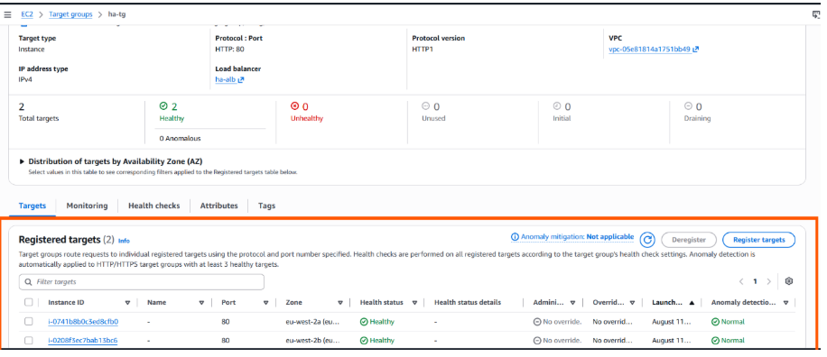

---

#### Screenshot 21 — Evidence that an instance was removed, detached, placed in Standby, or stopped in one Availability Zone

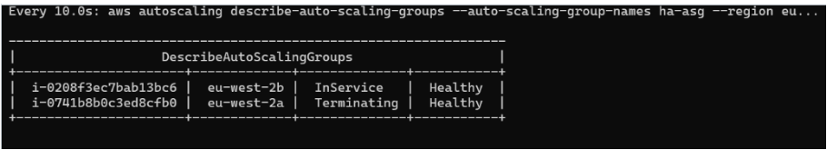

---

#### Screenshot 22 — Browser showing that the ALB DNS endpoint still works during the change

Add your screenshot here.

---

# Task 9 — Architecture and Test-Results Summary

## Goal

Summarize the VPC/subnet layout, the ALB and Auto Scaling Group setup, the private Multi-AZ RDS setup, and the results of both high-availability tests.

### Evidence

#### Screenshot 23 — A simple architecture diagram, which may be hand-drawn, or an AWS console overview showing the components

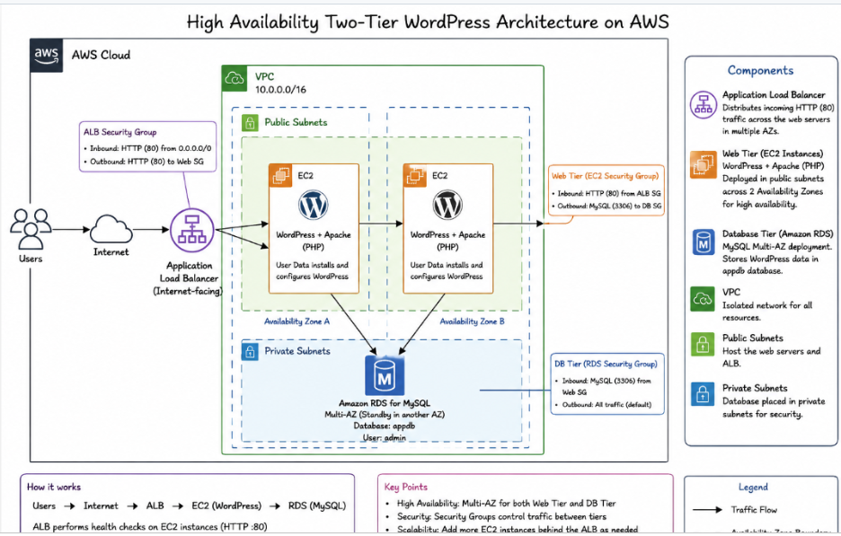

---

### Notes

Summarize the VPC and subnets across the two Availability Zones.

I designed a highly available VPC using the CIDR block 10.0.0.0/16, with two public subnets distributed across Availability Zone A and Availability Zone B (10.0.1.0/24 and 10.0.2.0/24). I also created two private subnets across the same two Availability Zones (10.0.11.0/24 and 10.0.12.0/24) for the database tier. The public subnets used a route table with 0.0.0.0/0 routed to an Internet Gateway, while the private subnets used a private route table with 0.0.0.0/0 routed through a NAT Gateway. This design kept the database private while enabling the overall application architecture to operate across multiple Availability Zones.

Summarize the ALB and Auto Scaling Group setup.

I deployed an internet-facing Application Load Balancer across both public subnets to provide one stable entry point for the web application. The ALB listened on HTTP port 80 and routed requests to a target group containing the web-tier EC2 instances. I then attached the target group to an Auto Scaling Group configured with a desired capacity of 2, minimum capacity of 2, and maximum capacity of 4. The Auto Scaling Group launched instances from a reusable Launch Template, distributed the web tier across two Availability Zones, and used ELB health checks so unhealthy instances could be removed and automatically replaced.

Summarize the private Multi-AZ RDS setup.

I deployed the MySQL RDS database in a private DB Subnet Group containing the two private subnets, with public access disabled. The database security group allowed MySQL traffic on port 3306 only from the web-tier EC2 security group, enforcing the intended security path: Internet → ALB → EC2 → RDS. Multi-AZ was enabled so AWS could maintain a synchronously replicated standby database instance in another Availability Zone and automatically fail over if the primary database instance or its Availability Zone experienced a failure.

Summarize the results of both high-availability tests.

For the first test, I terminated one web-tier EC2 instance. The Auto Scaling Group detected that the desired capacity had dropped below two and automatically launched a replacement instance from the Launch Template. The new instance registered with the target group and became healthy, while the ALB continued routing application traffic to the remaining healthy target.

For the second test, I simulated an Availability Zone impact by removing one web instance from service in one Availability Zone. The web instance in the second Availability Zone remained healthy, and the Application Load Balancer continued serving the application through the same ALB DNS endpoint. These tests proved that the web tier could tolerate an individual instance failure and continue serving traffic when one Availability Zone’s web instance was unavailable.

---

# LinkedIn Post (Required)

## Goal

Publish a LinkedIn post about the high-availability build, including the ALB URL (or a redacted screenshot), three to five lines on what you built and how you tested high availability, and one proof screenshot.

## Evidence

#### LinkedIn Post URL

https://lnkd.in/p/eEWEu8Cs

---

#### Screenshot of LinkedIn post

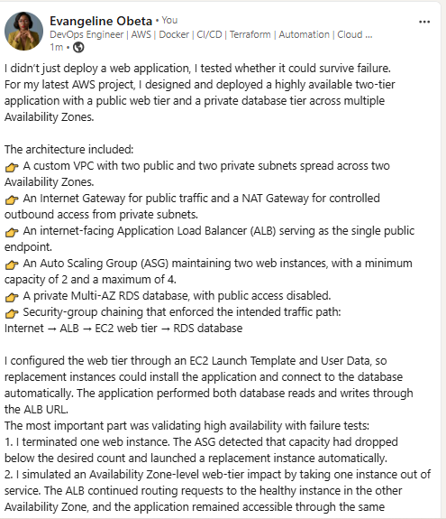

---

# Submission Instructions

- Add all required screenshots in your submission
- Do not expose passwords, connection strings, private keys, or account IDs

---

# Completion Checklist

- [ ] Task 1: VPC, four subnets, IGW, NAT Gateway, and route tables created (Screenshots 1–5)
- [ ] Task 2: Least-privilege ALB, EC2, and RDS security groups created (Screenshots 6–8)
- [ ] Task 3: Private Multi-AZ RDS created (Screenshots 9–10)
- [ ] Task 4: Self-configuring Launch Template created and tested (Screenshots 11–12)
- [ ] Task 5: ALB created across both public subnets (Screenshots 13–14)
- [ ] Task 6: Auto Scaling Group running two instances across two AZs (Screenshots 15–16)
- [ ] Task 7: Application verified through the ALB with a database read and write (Screenshots 17–18)
- [ ] Task 8: Both high-availability tests completed (Screenshots 19–22)
- [ ] Task 9: Architecture and test-results summary completed (Screenshot 23 & Notes)
- [ ] LinkedIn post published and URL submitted
- [ ] No sensitive data exposed

---

## 📌 About DMI & CloudAdvisory

DevOps Micro Internship (DMI) is a project-based DevOps program run by Pravin Mishra (The CloudAdvisory) focused on real-world execution, systems thinking, and career readiness.

It helps learners build strong DevOps foundations with hands-on experience.

---

## 📌 Resources

- 🌐 DMI Official Website: https://dmi.pravinmishra.com?utm_source=github&utm_medium=readme  
- 🎓 University: https://university.pravinmishra.com?utm_source=github&utm_medium=readme  
- 💬 Discord Community: https://discord.pravinmishra.com?utm_source=github&utm_medium=readme  
- 📝 Blog: https://dmi.pravinmishra.com/blog?utm_source=github&utm_medium=readme  
- ▶️ YouTube Playlist: https://www.youtube.com/playlist?list=PLFeSNDtI4Cho  
- 🔗 Pravin Mishra (LinkedIn): https://www.linkedin.com/in/pravin-mishra-aws-trainer/  
- 🏢 CloudAdvisory (LinkedIn): https://www.linkedin.com/company/thecloudadvisory/

---

*This submission is part of DevOps Micro Internship (DMI) Cohort 3 — Agentic AI Track.*