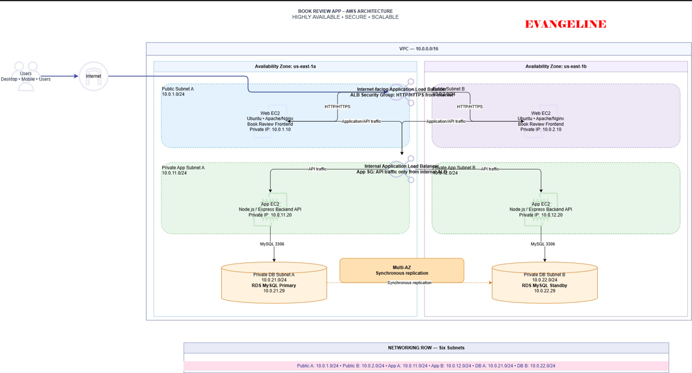
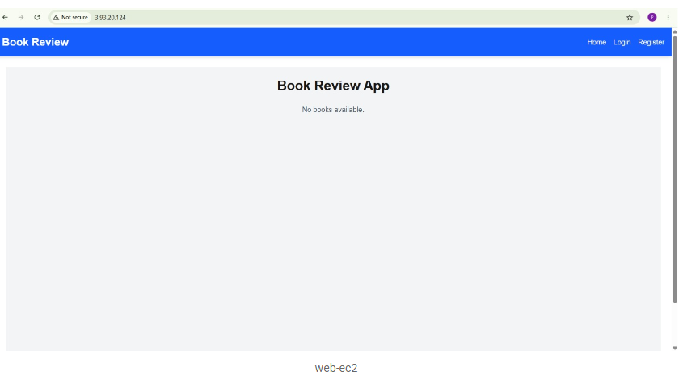
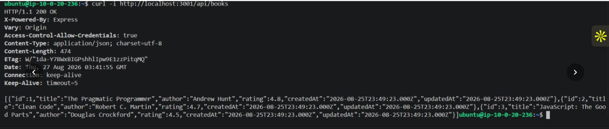
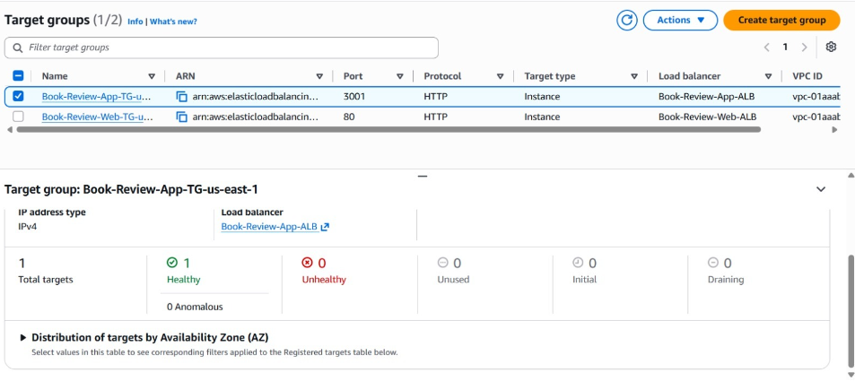
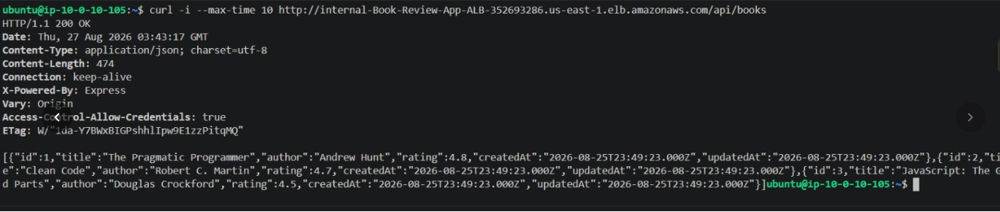
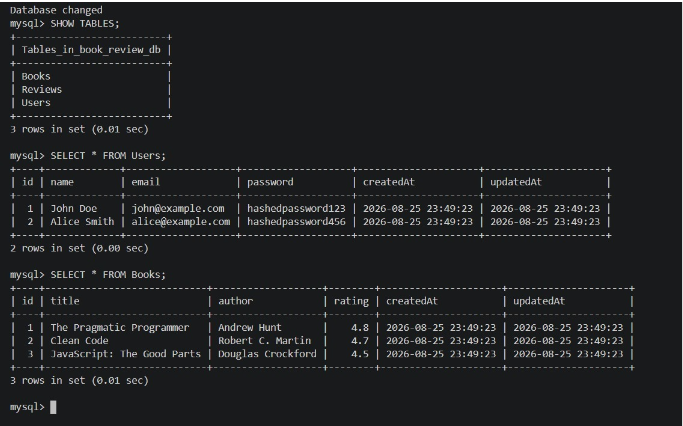
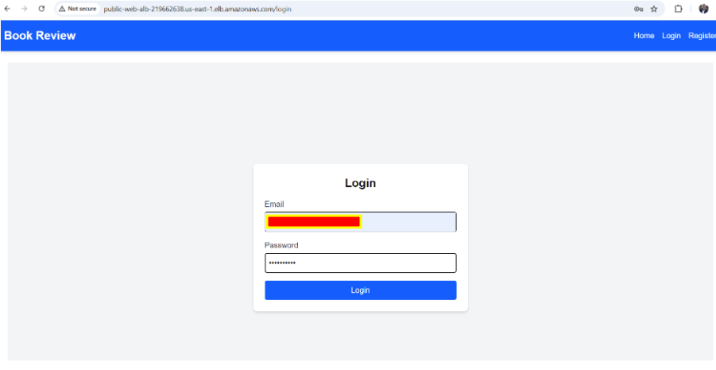

# Assignment 6 — Capstone Assignment — Deploy Book Review App (Three-Tier Architecture) on AWS

Part of the DevOps Micro Internship (DMI) Cohort 3 with Agentic AI

---

## Purpose

This is the most important assignment of the course. You will deploy the Book Review App in a fully production-style three-tier architecture on AWS: a Next.js Web Tier behind Nginx and a public ALB, a private Node.js/Express App Tier behind an internal ALB, and a private Multi-AZ MySQL RDS database with a read replica. You are expected to design, deploy, isolate, debug, and document the result independently.

---

# Task 1 — Architecture Diagram

## Goal

Create an architecture diagram showing the custom VPC (10.0.0.0/16), the six subnets across two Availability Zones (two public Web Tier, two private App Tier, two private Database Tier), the public ALB, Web Tier EC2/Nginx, internal ALB, private App Tier EC2, private Multi-AZ RDS with its read replica, and the permitted traffic flow.

### Evidence

#### Diagram image or link

---

# Task 2 — AWS Region & Services Used

## Goal

Record the AWS Region used and list every AWS service used across networking, compute, load balancing, security, and the database.

### Notes

**Region:**

US East (N. Virginia)

---

**Services:**

Amazon VPC — networking and subnet architecture
Amazon EC2 — Web Tier and App Tier compute instances
Application Load Balancer (ALB) — public ALB for the Web Tier and internal ALB for the App Tier
Amazon RDS for MySQL — Database Tier
Security Groups — traffic control between the three tiers
Nginx — Web Tier reverse proxy/web server
Node.js/Express — App Tier backend
Next.js — Web Tier frontend

---

# Task 3 — Public Entry Point

## Goal

Confirm the Book Review App loads through the public ALB DNS name.

### Evidence

#### Public ALB DNS

Book-Review-Web-ALB

Book-Review-Web-ALB-1626427701.us-east-1.elb.amazonaws.com

---

# Task 4 — Evidence Screenshots

## Goal

Capture visual proof of every tier and load balancer.

### Evidence

#### Web EC2

---

#### App EC2

---

#### Public ALB

---

#### Internal ALB

---

#### RDS + Replica

---

#### App UI proof

---

# Task 5 — Summary

## Goal

Summarize what worked in the final deployment, the issues encountered and how each was fixed, and the tools or sources used to research and debug.

### Notes

**What worked:**

The Book Review App was deployed using a production-style three-tier AWS architecture consisting of a public Web Tier, private App Tier, and private Database Tier. The Web Tier runs the Next.js frontend behind Nginx and a public Application Load Balancer, while the App Tier runs the Node.js/Express backend behind an internal Application Load Balancer. The Database Tier uses Amazon RDS for MySQL in private subnets with Multi-AZ and a read replica.

---

**Issues + fixes:**

MySQL SSL connection failed with SSL_CTX_set_default_verify_paths failed. The RDS CA certificate file global-bundle.pem was missing. It was downloaded from the AWS RDS trust store and supplied with --ssl-ca. The database connection then succeeded using SSL.

The assignment documentation contained different backend port references. The detailed technical requirements specified port 3001, so the Node.js backend, internal ALB target group, and App Tier Security Group were configured consistently to use port 3001.

Nginx was configured to serve the Next.js application on the Web Tier and provide the required HTTP endpoint for the public ALB. Nginx configuration and application availability were checked when validating access through the public ALB.

---

**Tools/sources used:**

AWS Management Console
Amazon VPC documentation
Amazon EC2 documentation
Elastic Load Balancing documentation
Amazon RDS documentation
AWS Security Groups documentation
ChatGPT
Google Search
Developer forums and troubleshooting resources
Ubuntu/Linux terminal
Nginx
Node.js/Express
Next.js
MySQL

---

# LinkedIn Post (Required)

## Goal

Publish a LinkedIn post sharing the capstone deployment, including the public ALB DNS (or a redacted screenshot), three to five lines on what you built and why it is production-style, and one proof screenshot.

## Evidence

#### LinkedIn Post URL

https://lnkd.in/p/eRz4GxBr

---

---

# Submission Instructions

- Add all required screenshots and links in your submission
- Do not expose passwords, RDS credentials, connection strings, private keys, or account IDs

---

# Completion Checklist

- [ ] Task 1: Architecture diagram completed
- [ ] Task 2: AWS Region and services documented
- [ ] Task 3: Public ALB DNS confirmed working
- [ ] Task 4: All six evidence screenshots captured (Web Tier, App Tier, both ALBs, RDS + replica, app UI)
- [ ] Task 5: Deployment summary completed (what worked, issues/fixes, tools/sources)
- [ ] LinkedIn post published and URL submitted
- [ ] App Tier and Database Tier confirmed not publicly accessible
- [ ] No sensitive data exposed

---

## 📌 About DMI & CloudAdvisory

DevOps Micro Internship (DMI) is a project-based DevOps program run by Pravin Mishra (The CloudAdvisory) focused on real-world execution, systems thinking, and career readiness.

It helps learners build strong DevOps foundations with hands-on experience.

---

## 📌 Resources

- 🌐 DMI Official Website: https://dmi.pravinmishra.com?utm_source=github&utm_medium=readme  
- 🎓 University: https://university.pravinmishra.com?utm_source=github&utm_medium=readme  
- 💬 Discord Community: https://discord.pravinmishra.com?utm_source=github&utm_medium=readme  
- 📝 Blog: https://dmi.pravinmishra.com/blog?utm_source=github&utm_medium=readme  
- ▶️ YouTube Playlist: https://www.youtube.com/playlist?list=PLFeSNDtI4Cho  
- 🔗 Pravin Mishra (LinkedIn): https://www.linkedin.com/in/pravin-mishra-aws-trainer/  
- 🏢 CloudAdvisory (LinkedIn): https://www.linkedin.com/company/thecloudadvisory/

---

*This submission is part of DevOps Micro Internship (DMI) Cohort 3 — Agentic AI Track.*