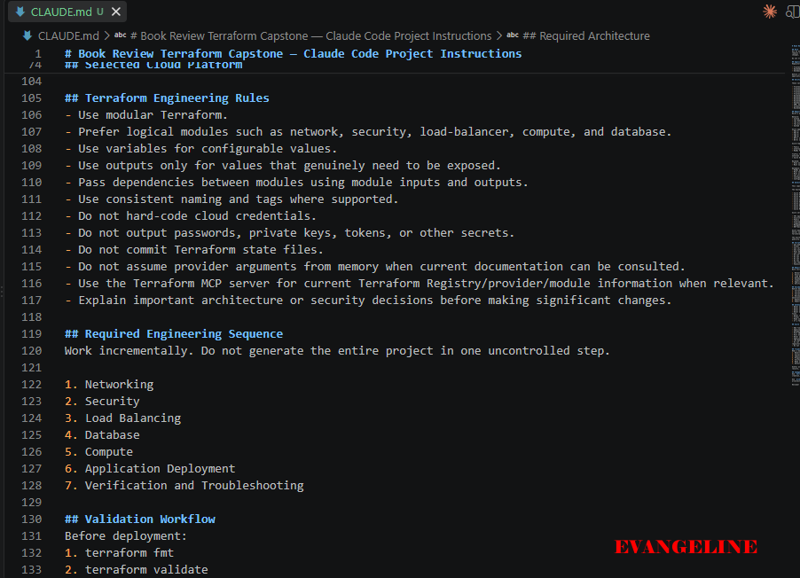
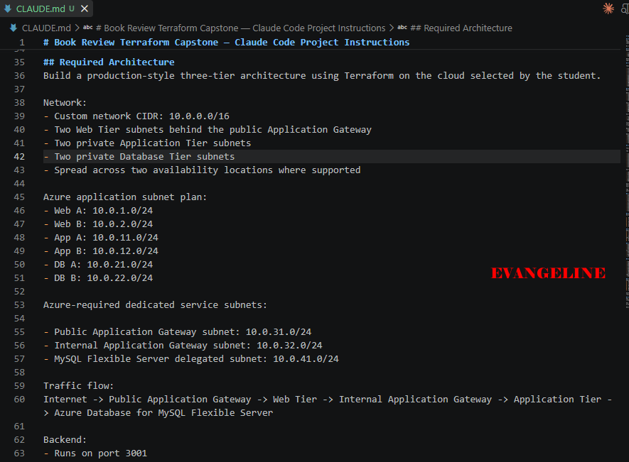
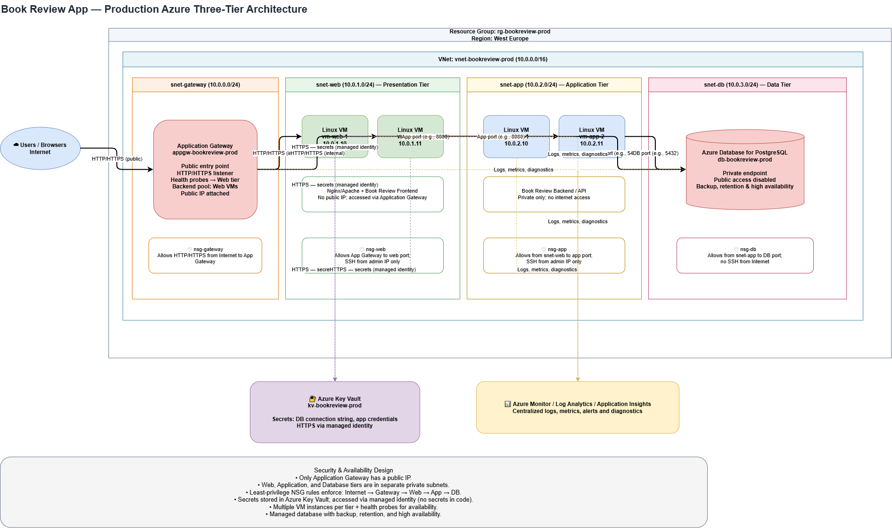

# Capstone Assignment — Deploy the Book Review App Using Terraform and Claude Code Agentic AI

Part of the DevOps Micro Internship (DMI) Cohort 3 with Agentic AI

---

## Student Details

**Full Name:** Evangeline Obeta  
**Cloud Platform:** AWS or Azure  
**GitHub Repository URL:** https://github.com/EAgeless/devops-micro-internship-pravinmishra.git  
**Public Application URL / Load-Balancer DNS:** Add the public URL or DNS here

---

## Purpose

Deploy the Book Review App using Terraform on AWS or Azure in a secure, highly available, production-style three-tier architecture. Use Claude Code, specialized subagents, Terraform MCP, and validation hooks to support the engineering workflow while keeping all infrastructure-changing operations under human control.

---

# Task 0 — Prepare the Project and Agentic AI Environment

## Goal

Prepare the Book Review App project and configure the provided Claude Code Agentic AI starter kit with project context, specialized subagents, Terraform MCP, validation hooks, and safety guardrails.

## Evidence

### Screenshot 1 — Project `CLAUDE.md`

Screenshot of the project `CLAUDE.md` showing the three-tier architecture, security boundaries, Terraform requirements, and human-approval rules.

---

### Screenshot 2 — Terraform Engineer Subagent

Screenshot showing the Terraform Engineer subagent configuration.

---

### Screenshot 3 — Architecture and Security Reviewer Subagent

Screenshot showing the Architecture and Security Reviewer subagent configuration.

---

### Screenshot 4 — Terraform MCP Connection

Screenshot showing Terraform MCP connected and available.

---

### Screenshot 5 — Validation Hooks

Screenshot showing the configured Claude Code validation hooks.

---

# Task 1 — Design the Three-Tier Architecture

## Goal

Design the required secure, highly available three-tier architecture and create an architecture diagram before building the infrastructure.

The diagram must show:

- VPC or VNet
- Availability Zones or equivalent availability locations
- Six subnets
- Internet connectivity
- NAT or outbound design
- Public load balancer
- Web Tier
- Internal load balancer
- Application Tier
- Managed MySQL
- Read replica
- Main traffic flow

## Architecture Diagram

---

# Task 2 — Build the Terraform Networking and Security Layers

## Goal

Create the modular Terraform project and implement the network and security layers across the required public and private subnets.

## Evidence

### Screenshot 6 — Modular Terraform Project Structure

Screenshot showing the modular Terraform project structure.

---

### Screenshot 7 — Six-Subnet Architecture

Screenshot showing the six-subnet architecture across two availability locations.

---

### Screenshot 8 — Public and Private Tier Separation

Screenshot showing the public and private tier separation, including routing and security boundaries.

---

# Task 3 — Build the Load-Balancing and Compute Layers

## Goal

Deploy the public and internal load balancers and the Web and Application compute resources required by the Book Review App.

## Evidence

### Screenshot 9 — Web and Application Compute

Screenshot showing the Web and Application compute resources in their required subnets.

---

### Screenshot 10 — Public Load Balancer

Screenshot showing the internet-facing public load balancer.

---

### Screenshot 11 — Internal Load Balancer

Screenshot showing the private internal load balancer.

---

### Screenshot 12 — Healthy Targets

Screenshot showing healthy target groups or backend pools.

---

# Task 4 — Build the Managed MySQL Database Layer

## Goal

Deploy a private, highly available managed MySQL database with a read replica and restrict database connectivity to the Application Tier.

## Evidence

### Screenshot 13 — Managed MySQL Database

Screenshot showing the managed MySQL database deployment.

---

### Screenshot 14 — High Availability

Screenshot showing the Multi-AZ or high-availability configuration.

---

### Screenshot 15 — Read Replica

Screenshot showing the read replica configuration.

---

### Screenshot 16 — Private Database Access

Screenshot showing that the database is private and accepts MySQL traffic only from the Application Tier.

---

# Task 5 — Validate, Review, and Apply the Terraform Configuration

## Goal

Validate the Terraform configuration, review the execution plan using both Agentic AI and human judgment, and apply the infrastructure changes only after all required checks pass.

## Evidence

### Screenshot 17 — Terraform Validation

Screenshot showing successful `terraform validate` output.

---

### Screenshot 18 — Terraform Plan

Screenshot showing the Terraform plan output.

---

### Screenshot 19 — Terraform Apply

Screenshot showing successful `terraform apply` completion.

---

# Task 6 — Deploy and Configure the Book Review Application

## Goal

Deploy and configure the Book Review App across the Web, Application, and Database tiers and verify the complete application functionality.

## Evidence

### Screenshot 20 — Homepage

Screenshot showing the Book Review App homepage through the public endpoint.

---

### Screenshot 21 — Login or Authentication

Screenshot showing successful login or authentication.

---

### Screenshot 22 — Book Data

Screenshot showing the book listing or book details.

---

### Screenshot 23 — Review Functionality

Screenshot showing the review functionality working successfully.

---

### Screenshot 24 — Backend or API Evidence

Screenshot showing that the backend or API is working successfully.

---

### Screenshot 25 — Database Reads and Writes

Screenshot showing successful database reads and writes.

## Public Application URL

**Public Application URL / DNS:** 

---

# Task 7 — Demonstrate the Agentic AI Workflow

## Goal

Demonstrate how Claude Code assisted with Terraform generation, architecture and security review, and evidence-based troubleshooting while infrastructure-changing decisions remained under human control.

You do not need to submit your complete Claude Code conversation history. Include only focused evidence.

## Evidence

### Screenshot 26 — AI-Assisted Terraform Generation

Screenshot showing one useful example of AI-assisted Terraform generation or improvement.

---

### Screenshot 27 — Architecture or Security Review

Screenshot showing one structured architecture or security review result.

---

### Screenshot 28 — AI-Assisted Troubleshooting

Screenshot showing one AI-assisted troubleshooting interaction based on collected evidence.

---

# Task 8 — Complete the Final Architecture Review

## Goal

Review the completed infrastructure against the original capstone requirements and resolve significant architecture, security, reliability, and cost issues.

Confirm that the final review covers:

- Tier separation
- Availability
- Public exposure
- Routing
- Security rules
- Load balancing
- Database privacy
- Secrets
- Terraform quality
- Module structure
- Reliability
- Obvious cost risks

Use Screenshot 27 as the focused evidence for the structured architecture or security review.

---

# Task 9 — Answer the Reflection Questions

## Goal

Reflect on the architecture, Terraform implementation, and Agentic AI workflow. Answer each question briefly in your own words.

## Architecture

### 1. Why did you separate the Web, Application, and Database tiers?

I separated the tiers so each layer has a clear responsibility and security boundary. The Web tier handles public HTTP traffic, the Application tier runs the book-review business logic, and the Database tier stores persistent data. This separation makes the system easier to secure, scale, troubleshoot, and maintain.

### 2. Why is the Application Tier private?

The Application Tier is private so users cannot connect directly to the application servers from the internet. Traffic reaches the application only through the Web tier and the internal network. This reduces the attack surface and ensures that filtering, routing, and access control happen at the public entry point.

### 3. Why is MySQL private?

MySQL is private because a database should not be directly reachable from the public internet. Keeping it private limits access to approved application resources, reduces the risk of unauthorized connections, and protects stored book-review data and credentials.

### 4. Why are multiple Availability Zones used?

Multiple Availability Zones reduce the effect of a failure in one datacenter zone. By distributing resources across separate zones, the application can continue operating if one zone experiences a power, networking, or hardware problem. This improves resilience and availability.

### 5. What is the difference between Multi-AZ/high availability and a read replica?

Multi-AZ or high availability is mainly designed for resilience and failover. It keeps a standby or redundant instance available so service can continue when the primary fails. A read replica is mainly designed to scale read traffic by copying data to another instance that can serve read-only queries. A read replica is not automatically a replacement for high availability.

## Terraform

### 6. How did you divide your Terraform into modules?

I divided the Terraform configuration by responsibility. The network module creates the resource group, virtual network, subnets, route tables, and network security controls. The web or gateway module handles the public entry point. The application module creates the private application compute resources. The database module creates the private MySQL service and its supporting configuration. This structure keeps the code organized and makes individual parts easier to update.

### 7. How do the modules communicate through variables and outputs?

The root module passes configuration into child modules through variables such as the location, naming prefix, subnet ranges, VM size, and database settings. Child modules expose values such as subnet IDs, private IP addresses, resource IDs, and connection endpoints through outputs. Other modules consume those outputs instead of duplicating resource references or hard-coding IDs.

### 8. What did you specifically check in `terraform plan`?

I checked that Terraform proposed the intended resources and did not plan to destroy or replace existing resources unexpectedly. I verified the region, VM size, availability-zone placement, subnet associations, private database networking, security rules, and dependencies between tiers. I also checked that secrets were supplied through variables rather than exposed directly in the configuration or plan output.

## Agentic AI

### 9. What was the purpose of `CLAUDE.md`?

CLAUDE.md provided persistent project instructions for Claude. It described the architecture, coding conventions, security requirements, Terraform workflow, validation commands, and restrictions such as keeping the database private. This gave Claude consistent project context instead of requiring the same instructions to be repeated in every prompt.

### 10. What work did the Terraform Engineer subagent perform?

The Terraform Engineer subagent translated the architecture into Terraform resources and module structure. It helped define variables and outputs, configure networking and private subnets, create the compute and database resources, and identify dependencies between modules. It also helped format, validate, and review the Terraform configuration.

### 11. What did the Architecture and Security Reviewer identify?

The reviewer checked whether the implementation matched the intended three-tier design and whether the security boundaries were preserved. It identified issues such as avoiding public access to the application and database tiers, limiting network security rules, protecting secrets, checking zone placement, and ensuring that only the required traffic was allowed between tiers.

### 12. Why did you use Terraform MCP instead of relying only on Claude's existing Terraform knowledge?

I used Terraform MCP to give Claude access to more reliable and current Terraform and provider information. Terraform and Azure provider behavior can change, and small schema or argument differences can cause deployment failures. MCP helped verify resource arguments and patterns against structured documentation rather than relying only on general model knowledge.

### 13. What was the purpose of your validation hooks?

The validation hooks caught problems early and kept the workflow consistent. They were used to run checks such as formatting, initialization, validation, linting, security checks, and plan review before deployment. Their purpose was to prevent invalid Terraform, accidental insecure changes, and unintended infrastructure changes from reaching apply

### 14. Describe one real issue Claude helped you troubleshoot.

One real issue was Azure reporting NotAvailableForSubscription for VM sizes that appeared in the Azure portal. Claude helped compare the portal’s general VM-size list with az vm list-skus --all and interpret the subscription-specific location restrictions. This showed that the issue was an Azure subscription or region restriction rather than a Terraform syntax error.

### 15. Describe one recommendation you reviewed, modified, or rejected instead of accepting blindly.

I reviewed the recommendation to keep trying different VM sizes and regions after several returned NotAvailableForSubscription. I did not treat the portal’s list of available VM sizes as proof that deployment would work. I modified the approach by checking subscription-specific SKU restrictions with the Azure CLI and by keeping the Terraform location configurable instead of hard-coding an unverified region.

---

# Task 10 — Publish the Mandatory LinkedIn Post

## Goal

Publish a LinkedIn post describing the capstone, the technical work completed, the Agentic AI workflow, and the lessons learned.

Write the post in your own words, include at least one project image or other proof, and ensure that it can be viewed by the submission reviewer.

## LinkedIn Post URL

**LinkedIn Post URL:** https://lnkd.in/p/d4yr9yaU

---

# Submission Instructions

- Complete Tasks 0–10 in sequence.
- Include all Screenshots 1–28 exactly as specified.
- Ensure that your full name is visible in the required screenshots.
- Include the selected cloud platform.
- Include the completed architecture diagram.
- Include the modular Terraform project structure.
- Include the working public application URL or public load-balancer DNS.
- Include all required Agentic AI workflow evidence.
- Answer all 15 reflection questions briefly in your own words.
- Include the published LinkedIn post URL.
- Do not expose cloud credentials, database passwords, SSH private keys, JWT secrets, access tokens, account IDs, Terraform state containing sensitive values, or other confidential information.
- Review all screenshots and project files carefully before submitting through GitHub.

---

# Completion Checklist

- [ ] Selected AWS or Azure
- [ ] Added and reviewed the Agentic AI starter files
- [ ] Configured `CLAUDE.md`
- [ ] Configured the Terraform Engineer subagent
- [ ] Configured the Architecture and Security Reviewer subagent
- [ ] Connected Terraform MCP
- [ ] Configured validation hooks and safety guardrails
- [ ] Created the architecture diagram
- [ ] Created the six-subnet design
- [ ] Configured public Web Tier routing
- [ ] Kept the Application Tier private
- [ ] Kept the Database Tier private
- [ ] Configured tier-specific Security Groups or NSGs
- [ ] Restricted backend port `3001`
- [ ] Restricted MySQL port `3306` to the Application Tier
- [ ] Created the public load balancer
- [ ] Created the internal load balancer
- [ ] Configured listeners and health checks
- [ ] Deployed the Web Tier compute resources
- [ ] Deployed the private Application Tier compute resources
- [ ] Provisioned private managed MySQL
- [ ] Configured Multi-AZ or high availability
- [ ] Configured a read replica
- [ ] Created the modular Terraform project
- [ ] Used variables, outputs, and module dependencies
- [ ] Used current Terraform documentation through MCP
- [ ] Used hooks for deterministic validation
- [ ] Completed `terraform fmt`
- [ ] Completed `terraform validate`
- [ ] Reviewed `terraform plan`
- [ ] Completed the Terraform Engineer review
- [ ] Completed the Architecture and Security review
- [ ] Applied the infrastructure only after human approval
- [ ] Deployed and configured the backend
- [ ] Deployed and configured the frontend
- [ ] Configured Nginx where required
- [ ] Configured the internal backend endpoint
- [ ] Configured the public frontend endpoint
- [ ] Verified the homepage
- [ ] Verified login or authentication
- [ ] Verified book data
- [ ] Verified review functionality
- [ ] Verified the backend API
- [ ] Verified database reads and writes
- [ ] Verified healthy load-balancer targets
- [ ] Included AI-assisted Terraform generation evidence
- [ ] Included one architecture or security review
- [ ] Included one AI-assisted troubleshooting example
- [ ] Completed the final architecture review
- [ ] Answered all 15 reflection questions
- [ ] Published the mandatory LinkedIn post
- [ ] Added the LinkedIn post URL
- [ ] Captured all 28 required screenshots
- [ ] Confirmed that my full name is visible in the required screenshots
- [ ] Checked that no secrets or sensitive information are exposed

---

## About DMI & CloudAdvisory

DevOps Micro Internship (DMI) is a project-based DevOps program run by Pravin Mishra (The CloudAdvisory), focused on real-world execution, systems thinking, and career readiness.

It helps learners build strong DevOps foundations through hands-on experience.

---

## Resources

- Book Review App Repository: [https://github.com/pravinmishraaws/book-review-app](https://github.com/pravinmishraaws/book-review-app)
- DMI Official Website: [https://dmi.pravinmishra.com](https://dmi.pravinmishra.com)
- University: [https://university.pravinmishra.com](https://university.pravinmishra.com)
- Discord Community: [https://discord.pravinmishra.com](https://discord.pravinmishra.com)
- Blog: [https://dmi.pravinmishra.com/blog](https://dmi.pravinmishra.com/blog)
- YouTube Playlist: [https://www.youtube.com/playlist?list=PLFeSNDtI4Cho](https://www.youtube.com/playlist?list=PLFeSNDtI4Cho)
- Pravin Mishra on LinkedIn: [https://www.linkedin.com/in/pravin-mishra-aws-trainer/](https://www.linkedin.com/in/pravin-mishra-aws-trainer/)
- CloudAdvisory on LinkedIn: [https://www.linkedin.com/company/thecloudadvisory/](https://www.linkedin.com/company/thecloudadvisory/)

---

*This submission is part of the DevOps Micro Internship (DMI) Cohort 3 — Agentic AI Track.*
