# Assignment 02 — Provision Linux VMs with Terraform and Run Ansible Ad-Hoc Commands

Part of the DevOps Micro Internship (DMI) Cohort 3 with Agentic AI

---

## Purpose

In this assignment, you will use Terraform to provision three or four Ubuntu Linux Virtual Machines on either Microsoft Azure or Amazon Web Services.

You will configure SSH key-based authentication, organize the servers using a custom Ansible inventory, and run Ansible ad-hoc commands across individual hosts and inventory groups.

---

# Task 1 — Create the Multi-Host Lab Structure

## Goal

Create a separate project directory for the multi-host lab and prepare the Terraform, Ansible, and documentation files.

This project will use the Git repository and Ansible controller prepared in Assignment 01.

### Evidence

#### Screenshot 1 — Terminal showing the complete `ansible-adhoc-lab` project structure

---

#### Screenshot 2 — Terminal showing `git status --short` with the new project files and updated `.gitignore`

---

### Notes

I created the `ansible-adhoc-lab` project structure inside the existing Git repository. The project contains separate Terraform and Ansible directories, documentation files, and a screenshots directory. I also updated `.gitignore` to prevent sensitive files such as Terraform state files, private SSH keys, and local environment files from being committed. I verified the structure with the terminal and confirmed the new files with `git status --short`.

---

# Task 2 — Create the Terraform Configuration

## Goal

Create the Terraform configuration required to provision three or four Ubuntu Linux VMs on your selected cloud platform.

Complete only one option:

- Option A — Microsoft Azure
- Option B — Amazon Web Services

Do not configure both providers for this assignment.

### Evidence

#### Screenshot 3 — Terraform configuration showing the three or four server roles and the `for_each` or `count` implementation

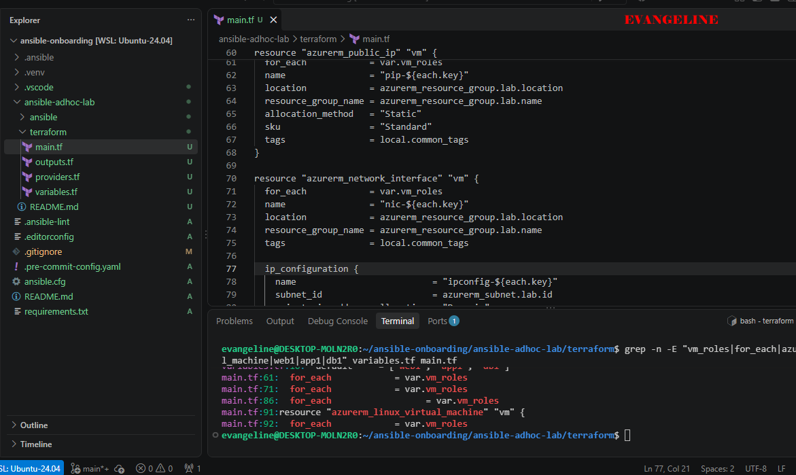

---

#### Screenshot 4 — Terraform configuration showing SSH restricted to the controller IP and HTTP allowed only for web hosts

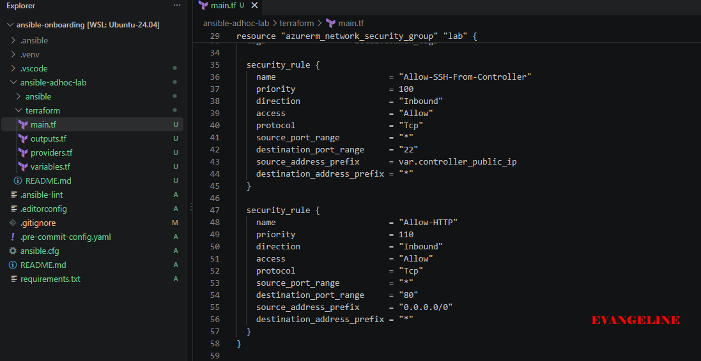

---

#### Screenshot 5 — Terraform output configuration showing how public IP addresses are associated with the server roles

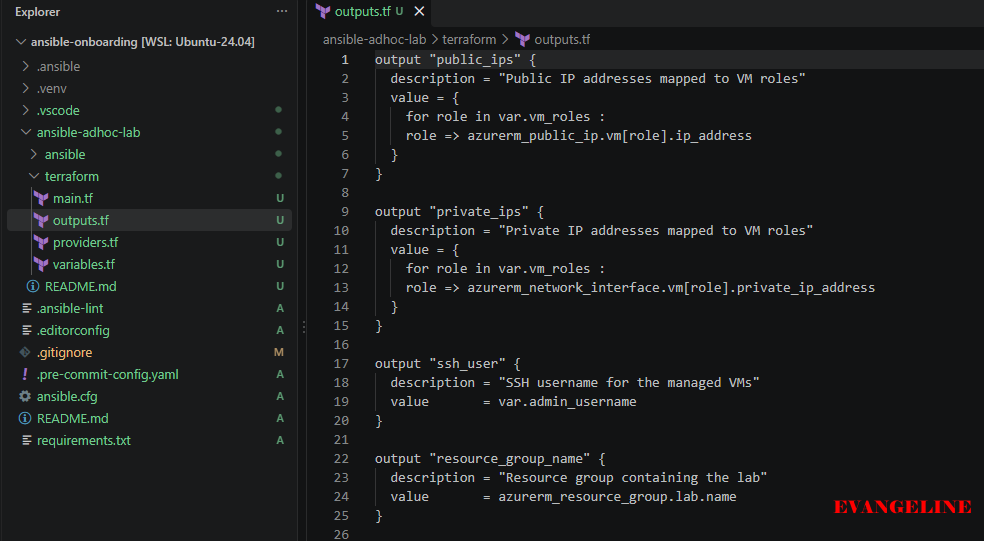

---

### Notes

I created the Terraform configuration for the selected cloud platform and defined the server roles using a Terraform `for_each` implementation. The configuration creates separate role-based servers for the web, app, and database tiers. I also configured SSH access to be restricted to the controller IP address and allowed HTTP access only where it was required for the web hosts. Terraform outputs were configured to associate each server role with its public IP address.
I used Microsoft Azure and the `azurerm` Terraform provider. The final working VM size was `Standard_F1ams_v7` in the `West US 2` region. I configured the infrastructure to create the role-based Ubuntu servers and used Terraform iteration so that the repeated VM resources did not need to be written manually several times.

---

# Task 3 — Provision the Infrastructure with Terraform

## Goal

Initialize and validate the Terraform configuration, review the execution plan, provision the selected three or four VMs, and retrieve their public IP addresses.

### Evidence

#### Screenshot 6 — Final `terraform apply` output showing `Apply complete`

---

#### Screenshot 7 — `terraform output public_ips` showing the role-to-IP mapping for all three or four VMs

---

#### Screenshot 8 — Azure Portal or AWS Management Console showing all three or four VMs in the `Running` state, with their role-based names visible

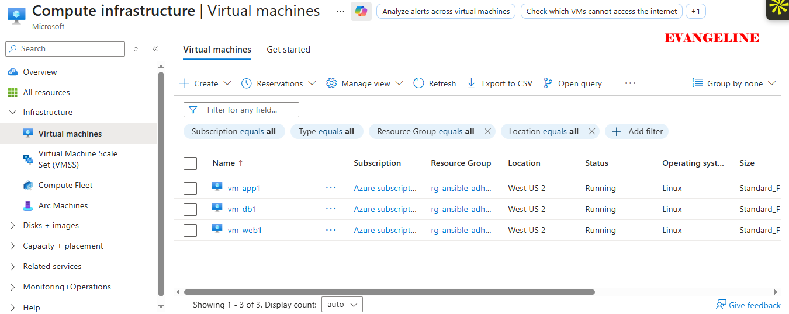

---

### Notes

I initialized and validated the Terraform configuration before provisioning the infrastructure. I reviewed the Terraform plan, confirmed that the expected role-based resources would be created, and then ran `terraform apply`. The apply completed successfully, and I used `terraform output public_ips` to retrieve the public IP address associated with each server role. I also confirmed in the Azure Portal that the VMs were running.
I initially encountered VM-size availability issues while testing Azure SKUs. I resolved the issue by checking the sizes available to my subscription and using the working `Standard_F1ams_v7` size in `West US 2`. This allowed Terraform to provision the infrastructure successfully.

---

# Task 4 — Verify SSH Key-Based Access

## Goal

Verify that each managed VM can be accessed from the Ansible controller using SSH key-based authentication.

### Evidence

#### Screenshot 9 — Terminal showing successful SSH hostname output from all VMs

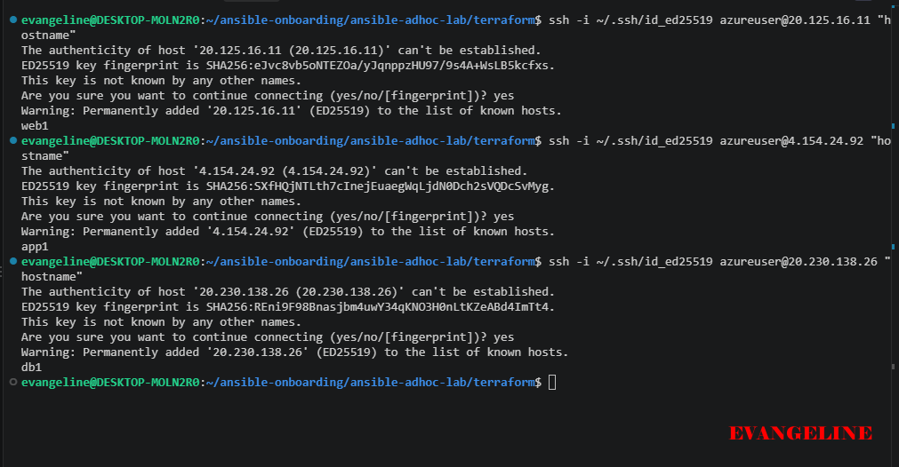

---

### Notes

I verified SSH key-based access from the Ansible controller to each managed VM. I used the correct SSH username, public IP address, and private key for each connection. Each SSH command returned the hostname successfully without requesting a password, confirming that key-based authentication was working.

---

# Task 5 — Create the Custom Ansible Inventory

## Goal

Create an Ansible inventory file that groups the managed VMs by role.

The inventory allows Ansible to run commands against all servers, or only specific groups such as `web`, `app`, or `db`.

### Evidence

#### Screenshot 10 — `inventory.ini` showing the `web`, `app`, and `db` groups

---

#### Screenshot 11 — Output of `ansible-inventory -i inventory.ini --graph`

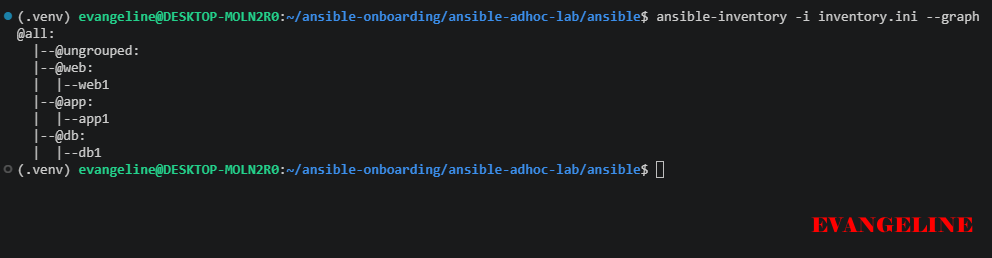

---

### Notes

I created a custom Ansible inventory and grouped the managed servers by role using the `web`, `app`, and `db` groups. I added the connection details required by Ansible, including the SSH username, private-key path, and server addresses. I verified the inventory structure with `ansible-inventory -i inventory.ini --graph`.

---

# Task 6 — Run Ansible Ad-Hoc Commands

## Goal

Run Ansible ad-hoc commands from the controller to verify connectivity, check server information, and manage packages and services across inventory groups.

This task proves that the inventory is working and that Ansible can control multiple managed VMs without writing a playbook.

### Evidence

#### Screenshot 12 — Output of `ansible all -i inventory.ini -m ping`

---

#### Screenshot 13 — Output of `ansible all -i inventory.ini -m command -a "uptime"`

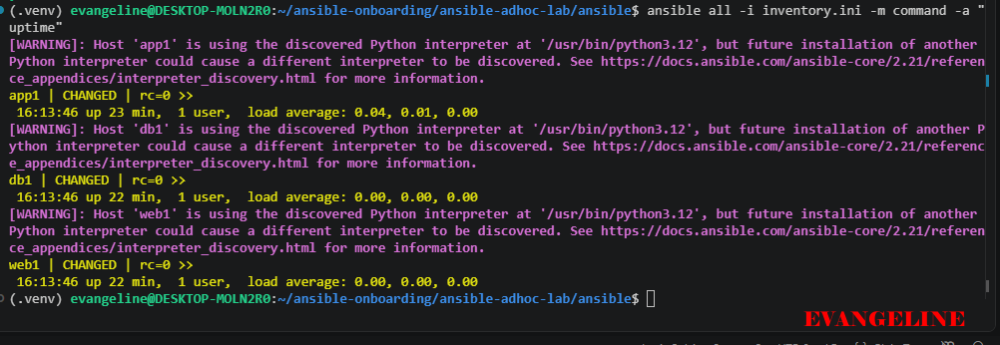

---

#### Screenshot 14 — Output of `ansible web -i inventory.ini -m apt -a "name=nginx state=present update_cache=yes" --become`

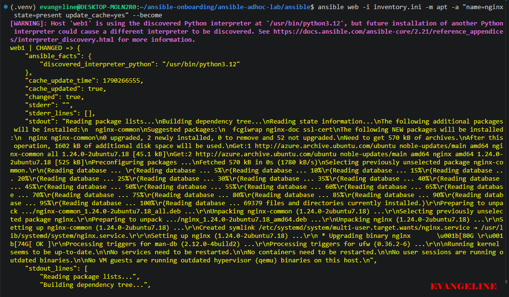

---

#### Screenshot 15 — Output of `ansible web -i inventory.ini -m service -a "name=nginx state=started enabled=yes" --become`

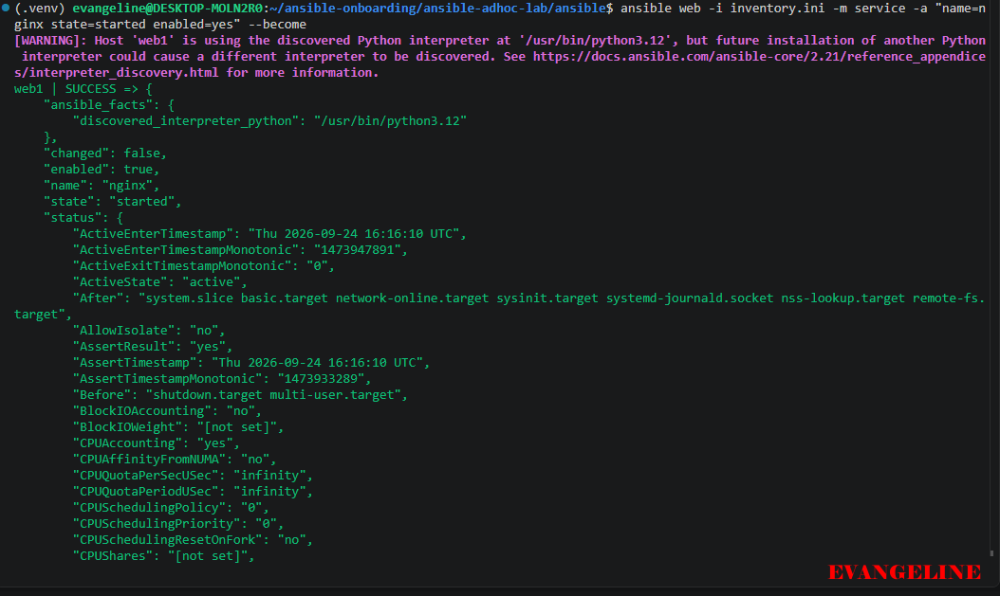

---

#### Screenshot 16 — Output of `ansible all -i inventory.ini -m apt -a "name=htop state=present update_cache=yes" --become`

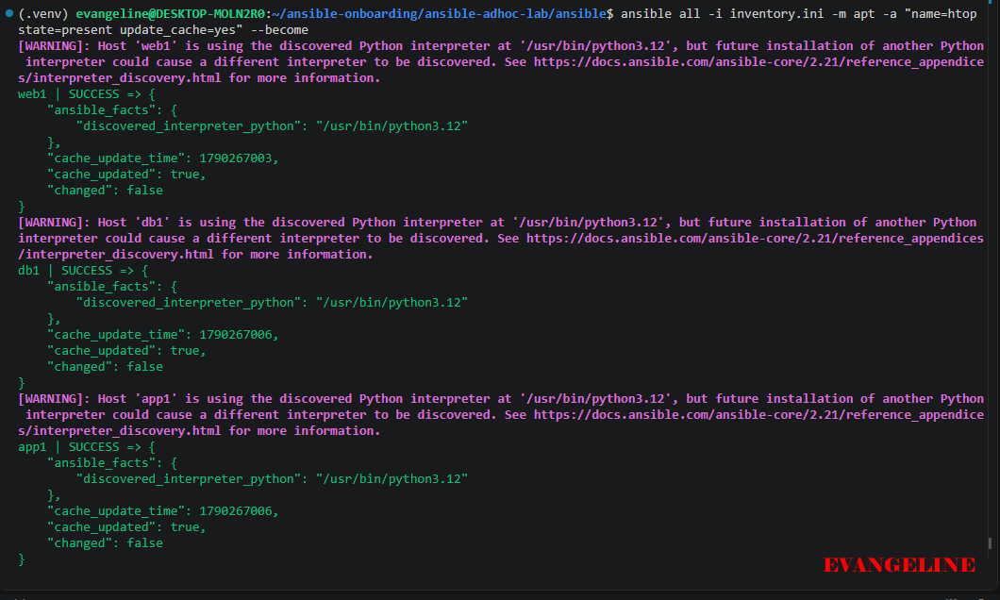

---

#### Screenshot 17 — Output of `ansible web -i inventory.ini -m command -a "systemctl is-active nginx"`

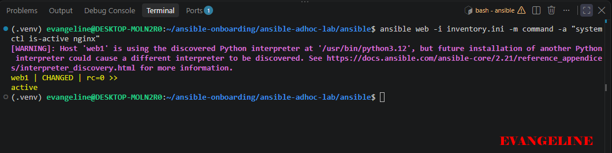

---

### Notes

I used Ansible ad-hoc commands to verify connectivity and manage the servers without creating a playbook. The ping command returned `pong` for all hosts, confirming Ansible connectivity. I also checked uptime across the inventory, installed Nginx on the web group, started and enabled the Nginx service, installed `htop` on all hosts, and verified that Nginx was active.
The final Nginx verification returned `active` on the web host. The `htop` installation returned `SUCCESS` for all hosts, and `changed: false` indicated that the desired package state was already satisfied.

---

# LinkedIn Post Required

## Evidence

#### LinkedIn Post URL

---

#### Screenshot — Published LinkedIn post

---

# Assignment Questions

Answer the following in your own words:

**1. What is the purpose of an Ansible inventory file?**

An Ansible inventory file tells Ansible which managed servers it should connect to. It can also group servers by role, such as web, app, and db, and define connection details such as the username, IP address, and SSH key.

---

**2. What is the difference between the `web`, `app`, and `db` groups in your inventory?**

The groups represent different server roles. The web group contains servers that provide web services such as Nginx. The app group contains application servers, while the db group contains database servers. Grouping hosts allows Ansible commands to target only the servers that need a particular task.

---

**3. What does the Ansible `ping` module verify?**

The Ansible ping module verifies that Ansible can connect to a managed host and execute Python-based Ansible modules on it. A successful result returns `pong`.

---

**4. Why do package installation commands require `--become`?**

Package installation changes system-level files and uses administrative privileges. The `--become` option allows Ansible to use privilege escalation, normally through sudo, so the package can be installed by the root user.

---

**5. When would you use an ad-hoc command instead of a playbook?**

I would use an ad-hoc command for a quick one-time task, such as checking uptime, testing connectivity, or installing a package on a small number of hosts. I would use a playbook for repeatable, multi-step, documented automation that needs to be maintained or run again.

---

**6. What is one challenge you faced while setting up SSH or inventory, and how did you fix it?**

One challenge I faced was connecting to the correct servers after creating the infrastructure. I also encountered Azure VM-size availability issues and initially ran `terraform destroy` from the wrong directory. I fixed the infrastructure issue by checking the available Azure SKU and using the working `Standard_F1ams_v7` size in `polandcentral`. I fixed the Terraform directory issue by locating the directory containing the correct Terraform configuration and state before running Terraform commands.

---

# Required Files

Confirm that the following files are included in your assignment workspace:

- [ ] `ansible-adhoc-lab/README.md`
- [ ] `ansible-adhoc-lab/terraform/providers.tf`
- [ ] `ansible-adhoc-lab/terraform/main.tf`
- [ ] `ansible-adhoc-lab/terraform/variables.tf`
- [ ] `ansible-adhoc-lab/terraform/outputs.tf`
- [ ] `ansible-adhoc-lab/ansible/inventory.ini`
- [ ] Updated `.gitignore`

---

# Submission Instructions

- Add all required screenshots from the tasks.
- Full Name must be visible in required screenshots.
- Mention whether you used Azure or AWS.
- Mention whether you used the three-VM option or four-VM option.
- Add the public IP addresses of the VMs, redacted if preferred.
- Add your `inventory.ini` proof.
- Add a short explanation of what you learned.
- Answer all assignment questions clearly in your own words.
- Add your LinkedIn post URL.
- Do not expose SSH private keys, Terraform state files, cloud credentials, passwords, access keys, secret keys, account IDs, or subscription IDs.
- Submit only one Google Doc link.

---

# Completion Checklist

- [ ] Task 1: `ansible-adhoc-lab` project structure created
- [ ] Task 1: `.gitignore` updated for Terraform files
- [ ] Task 2: Terraform configuration created
- [ ] Task 2: Server roles defined for either three or four VMs
- [ ] Task 2: `count` or `for_each` used
- [ ] Task 2: SSH restricted to the controller public IP
- [ ] Task 2: HTTP allowed only for web hosts
- [ ] Task 2: Terraform output maps roles to public IPs
- [ ] Task 3: Terraform initialized successfully
- [ ] Task 3: Terraform configuration validated
- [ ] Task 3: Terraform apply completed successfully
- [ ] Task 3: All selected VMs are running
- [ ] Task 4: SSH key-based access works for every VM
- [ ] Task 5: `inventory.ini` contains `web`, `app`, and `db` groups
- [ ] Task 5: `ansible-inventory -i inventory.ini --graph` shows the correct groups
- [ ] Task 6: `ansible all -i inventory.ini -m ping` returns `SUCCESS`
- [ ] Task 6: Ad-hoc commands run successfully
- [ ] Task 6: `--become` was used for package and service tasks
- [ ] Task 6: Nginx is active on the `web` group
- [ ] Screenshots 1–17 are included
- [ ] Assignment questions are answered
- [ ] LinkedIn post published
- [ ] LinkedIn post URL added
- [ ] No sensitive information is exposed
- [ ] Google Doc is accessible

---

## About DMI & CloudAdvisory

DevOps Micro Internship (DMI) is a project-based DevOps program run by Pravin Mishra and The CloudAdvisory, focused on real-world execution, systems thinking, and career readiness.

It helps learners build strong DevOps foundations with hands-on experience.

---

## Resources

- DMI Official Website: [https://dmi.pravinmishra.com?utm_source=github&utm_medium=readme](https://dmi.pravinmishra.com?utm_source=github&utm_medium=readme)
- University: [https://university.pravinmishra.com?utm_source=github&utm_medium=readme](https://university.pravinmishra.com?utm_source=github&utm_medium=readme)
- Discord Community: [https://discord.pravinmishra.com?utm_source=github&utm_medium=readme](https://discord.pravinmishra.com?utm_source=github&utm_medium=readme)
- Blog: [https://dmi.pravinmishra.com/blog?utm_source=github&utm_medium=readme](https://dmi.pravinmishra.com/blog?utm_source=github&utm_medium=readme)
- YouTube Playlist: [https://www.youtube.com/playlist?list=PLFeSNDtI4Cho](https://www.youtube.com/playlist?list=PLFeSNDtI4Cho)
- Pravin Mishra LinkedIn: [https://www.linkedin.com/in/pravin-mishra-aws-trainer/](https://www.linkedin.com/in/pravin-mishra-aws-trainer/)
- CloudAdvisory LinkedIn: [https://www.linkedin.com/company/thecloudadvisory/](https://www.linkedin.com/company/thecloudadvisory/)

---

*This submission is part of DevOps Micro Internship (DMI) Cohort 3 — Agentic AI Track.*