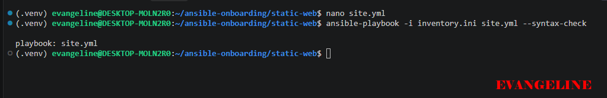
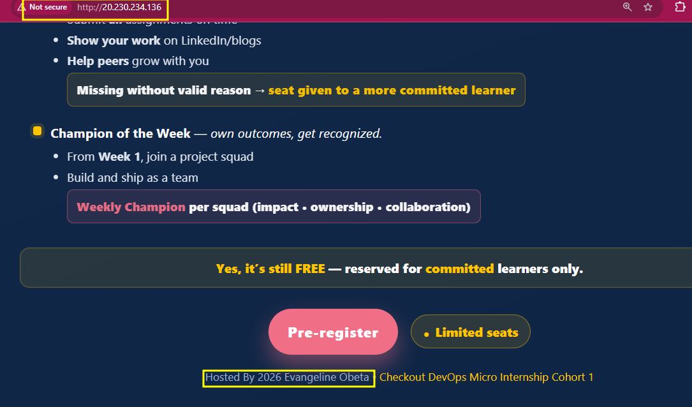
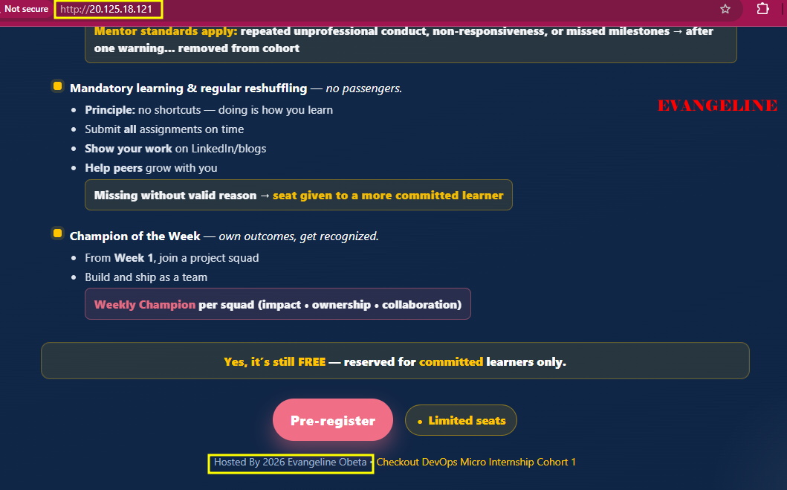

# Assignment 03 — Deploy a Static Website to Multiple Servers Using a Multi-Play Ansible Playbook

Part of the DevOps Micro Internship (DMI) with Agentic AI

---

## Student Details

**Full Name:** Add your full name here  
**Cloud Platform Used:** AWS / Azure  
**Server 1 URL:** `http://<SERVER_1_PUBLIC_IP>`  
**Server 2 URL:** `http://<SERVER_2_PUBLIC_IP>`

---

## Purpose

In this assignment, you will create a multi-play Ansible playbook to install Nginx, deploy a static website to two Ubuntu servers, and verify that the website is accessible from both servers.

You may use either AWS EC2 instances or Azure Virtual Machines as your managed servers.

---

# Task 1 — Create the Project Structure

## Goal

Create the required folders and files for the Ansible project.

## Evidence

### Screenshot 1 — Terminal or VS Code showing the complete `static-web` project structure


---

# Task 2 — Configure the Ansible Inventory

## Goal

Add both Ubuntu servers to the Ansible inventory.

## Evidence

### Screenshot 2 — Output of `ansible-inventory -i inventory.ini --graph` showing `web1` and `web2`


---

## Configuration File

Copy and paste the complete contents of your `inventory.ini` file below:

```ini
[web]
web1 ansible_host=20.230.234.136
web2 ansible_host=20.125.18.121

[web:vars]
ansible_user=azureuser
ansible_ssh_private_key_file=/home/evangeline/.ssh/id_ed25519
```

---

# Task 3 — Verify Ansible Connectivity

## Goal

Confirm that the Ansible controller can connect to both servers.

## Evidence

### Screenshot 3 — Ansible ping output showing `SUCCESS` and `pong` for both servers


---

# Task 4 — Download and Personalize the Static Website

## Goal

Download `index.html` to the Ansible controller and personalize the website with your full name.

## Evidence

### Screenshot 4 — Edited `files/index.html` showing the footer line with your full name


---

# Task 5 — Create the Multi-Play Ansible Playbook

## Goal

Create a single Ansible playbook containing separate plays for installation, deployment, and verification.

## Configuration File

Copy and paste the complete contents of your `site.yml` file below:

```yaml
---
- name: Install and configure Nginx
  hosts: web
  become: true
  tasks:
    - name: Update the APT package cache
      ansible.builtin.apt:
        update_cache: true

    - name: Install Nginx
      ansible.builtin.apt:
        name: nginx
        state: present

    - name: Start and enable Nginx
      ansible.builtin.service:
        name: nginx
        state: started
        enabled: true

- name: Deploy the static website
  hosts: web
  become: true
  tasks:
    - name: Copy index.html to the web root
      ansible.builtin.copy:
        src: files/index.html
        dest: /var/www/html/index.html
        owner: www-data
        group: www-data
        mode: "0644"
      notify: Reload nginx

  handlers:
    - name: Reload nginx
      ansible.builtin.service:
        name: nginx
        state: reloaded

- name: Verify both websites from the controller
  hosts: localhost
  connection: local
  gather_facts: false
  become: false
  tasks:
    - name: Send an HTTP GET request to each web server
      ansible.builtin.uri:
        url: "http://{{ hostvars[item].ansible_host }}"
        status_code: 200
      loop: "{{ groups['web'] }}"
      register: website_checks

    - name: Confirm each server returned HTTP 200
      ansible.builtin.assert:
        that:
          - item.status == 200
        success_msg: "{{ item.item }} returned HTTP {{ item.status }}"
      loop: "{{ website_checks.results }}"
```

---

# Task 6 — Validate the Playbook Syntax

## Goal

Check the playbook for YAML or Ansible syntax errors before running it.

## Evidence

### Screenshot 5 — Successful syntax-check output showing `playbook: site.yml`



---

# Task 7 — Run the Multi-Play Playbook

## Goal

Install Nginx, deploy the website, and verify both servers in one playbook run.

## Evidence

### Screenshot 6 — Play 3 verification showing HTTP `200` for both servers


---

### Screenshot 7 — Final play recap showing `unreachable=0` and `failed=0` for `web1`, `web2`, and `localhost`


---

# Task 8 — Verify Idempotency

## Goal

Run the playbook again and confirm that it does not make unnecessary changes.

## Evidence

### Screenshot 8 — Second playbook run showing the play recap with `changed=0`, `unreachable=0`, and `failed=0` for both web servers


---

# Task 9 — Test Both Websites Manually

## Goal

Confirm that the static website is accessible from both public IP addresses.

## Evidence

### Screenshot 9 — `curl -I` output showing HTTP `200 OK` from both servers


---

### Screenshot 10 — Browser showing the website from Server 1 with the public IP and your full name visible



---

### Screenshot 11 — Browser showing the website from Server 2 with the public IP and your full name visible



---

## Website URLs

Add both deployed website URLs below:

```text
Server 1: http://20.230.234.136
Server 2: http://20.125.18.121
```

---

# Task 10 — Complete the Project README

## Goal

Document how the project works and record what you learned.

## README Content

Copy and paste the complete contents of your `README.md` file below:

```markdown
# Static Website Deployment with Ansible

This project automates the deployment of a personalized static website to two Ubuntu web servers using Ansible.

## What It Does

The Ansible playbook:

- Updates the APT package cache.
- Installs Nginx.
- Starts and enables the Nginx service.
- Copies the personalized `index.html` file to `/var/www/html/index.html`.
- Reloads Nginx only when the website file changes.
- Verifies both web servers return HTTP status 200.

## Project Structure

```text
static-web/
├── ansible.cfg
├── inventory.ini
├── site.yml
├── README.md
└── files/
    └── index.html
```

## Inventory

The `inventory.ini` file defines two managed hosts in the `web` group:

- `web1`
- `web2`

The inventory also specifies the SSH user and private-key path used by Ansible.

## Prerequisites

- Ansible installed on the control node.
- SSH access to the target Ubuntu servers.
- Python installed on the managed servers.
- Inbound SSH access on port 22 from the control node.
- Inbound HTTP access on port 80 for website visitors.

## Validate the Inventory

```bash
ansible-inventory -i inventory.ini --graph
```

## Test Connectivity

```bash
ansible web -i inventory.ini -m ping
```

A successful result returns `pong` from both servers.

## Validate Playbook Syntax

```bash
ansible-playbook -i inventory.ini site.yml --syntax-check
```

## Deploy the Website

```bash
ansible-playbook -i inventory.ini site.yml
```

## Verify the Deployment

```bash
curl -I http://20.230.234.136
curl -I http://20.125.18.121
```

Both commands should return `HTTP/1.1 200 OK`.

## Idempotency

Run the playbook a second time:

```bash
ansible-playbook -i inventory.ini site.yml
```

On the second run, the Nginx installation, service configuration, and website copy tasks should report `ok`. The Nginx reload handler should not run unless `files/index.html` changes.

## Author

Evangeline Obeta
```

---

# LinkedIn Post Required

## Evidence

### LinkedIn Post URL

https://lnkd.in/p/d4yr9yaU

---

### Screenshot — Published LinkedIn post

---

# Assignment Questions

Answer the following in your own words:

**1. What issue did you face while completing this assignment, and how did you fix it?**

I faced an issue where I initially worked in the wrong project directory and had to separate the existing static website files from the new Assignment 04 project. I fixed it by creating a new mini-finance directory with separate terraform and ansible subdirectories, then placed each required file in the correct location. I also verified the structure with find . -maxdepth 2 -type f | sort.

---

**2. What did you learn from this assignment?**

I learned how Terraform and Ansible work together while keeping different responsibilities. Terraform provisions the Azure resource group, networking, security rules, public IP, network interface, and virtual machine, while Ansible connects to the VM, installs Nginx, deploys the website, and verifies that it is accessible. I also learned how SSH keys, inventories, handlers, synchronization, and idempotent automation support repeatable deployments.

---

**3. Why is it useful to split installation, deployment, and verification into separate plays?**

Separating the work into different plays makes the playbook easier to understand, test, troubleshoot, and maintain. The first play prepares the server, the second deploys the application, and the third verifies the result from the controller. Because Ansible runs plays in order, the website is deployed only after the required software is installed, and verification happens after deployment.

---

**4. What is one benefit of using the Ansible `copy` module instead of cloning the website directly from Git on every managed server?**

The copy module allows the controller to keep one approved version of the website and distribute the same files consistently to every managed server. This avoids depending on Git access and repository availability from each server and gives the controller more control over exactly what is deployed. The module can also compare the source and destination and skip the transfer when the file is already current.

---

**5. What does idempotency mean in this assignment?**

Idempotency means that running the same playbook multiple times produces the same desired final state without making unnecessary changes. For example, if Nginx is already installed and the website files have not changed, Ansible should report those tasks as ok instead of reinstalling or copying everything again. This makes repeated deployments safer and more predictable.

---

**6. What does the Ansible `uri` module verify in Play 3?**

The ansible.builtin.uri module sends an HTTP request from the controller to the VM’s public IP address. In Play 3, it verifies that the deployed website is reachable and returns HTTP status code 200. The following assert task confirms that the status returned by uri is actually equal to 200.

---

# Required Files

Confirm that the following files are included in your assignment folder:

- [✅] `inventory.ini`
- [✅] `site.yml`
- [✅] `files/index.html`
- [✅] `README.md`

---

# Submission Instructions

- Add all required screenshots in the correct order.
- Full Name must be visible in required screenshots.
- Include both deployed website URLs.
- Paste `inventory.ini`, `site.yml`, and `README.md` as editable text.
- Answer all assignment questions clearly in your own words.
- Add your LinkedIn post URL.
- Do not expose SSH private keys, passwords, cloud account IDs, or other sensitive information.

---

# Completion Checklist

- [ ] Task 1: `static-web` folder structure is complete
- [ ] Task 2: Both servers are listed under the `[web]` group in `inventory.ini`
- [ ] Task 2: Inventory graph shows `web1` and `web2`
- [ ] Task 3: Ansible ping returns `SUCCESS` and `pong` for both servers
- [ ] Task 4: `files/index.html` contains your full name
- [ ] Task 5: `site.yml` contains three separate plays
- [ ] Task 5: Play 1 installs, starts, and enables Nginx
- [ ] Task 5: Play 2 deploys `index.html` using the `copy` module
- [ ] Task 5: Nginx reload handler is included
- [ ] Task 5: Play 3 verifies both web servers from the controller
- [ ] Task 6: Playbook syntax check passes
- [ ] Task 7: First playbook run completes with `unreachable=0` and `failed=0`
- [ ] Task 7: URI verification returns HTTP `200` for both servers
- [ ] Task 8: Second playbook run demonstrates idempotency
- [ ] Task 8: Second run shows `changed=0` for both web servers
- [ ] Task 9: Both `curl -I` commands return HTTP `200 OK`
- [ ] Task 9: Website loads from Server 1
- [ ] Task 9: Website loads from Server 2
- [ ] Task 9: Full name is visible on both deployed websites
- [ ] Task 10: `README.md` contains all required explanations
- [ ] Screenshots 1–11 are included
- [ ] `inventory.ini`, `site.yml`, and `README.md` are pasted as editable text
- [ ] Both website URLs are included
- [ ] Assignment questions are answered
- [ ] LinkedIn post published
- [ ] LinkedIn post URL added
- [ ] No sensitive information is exposed

---

## About DMI & CloudAdvisory

DevOps Micro Internship (DMI) is a project-based DevOps program run by Pravin Mishra and The CloudAdvisory, focused on real-world execution, systems thinking, and career readiness.

It helps learners build strong DevOps foundations with hands-on experience.

---

## Resources

- DMI Official Website: [https://dmi.pravinmishra.com?utm_source=github&utm_medium=readme](https://dmi.pravinmishra.com?utm_source=github&utm_medium=readme)
- University: [https://university.pravinmishra.com?utm_source=github&utm_medium=readme](https://university.pravinmishra.com?utm_source=github&utm_medium=readme)
- Discord Community: [https://discord.pravinmishra.com?utm_source=github&utm_medium=readme](https://discord.pravinmishra.com?utm_source=github&utm_medium=readme)
- Blog: [https://dmi.pravinmishra.com/blog?utm_source=github&utm_medium=readme](https://dmi.pravinmishra.com/blog?utm_source=github&utm_medium=readme)
- YouTube Playlist: [https://www.youtube.com/playlist?list=PLFeSNDtI4Cho](https://www.youtube.com/playlist?list=PLFeSNDtI4Cho)
- Pravin Mishra LinkedIn: [https://www.linkedin.com/in/pravin-mishra-aws-trainer/](https://www.linkedin.com/in/pravin-mishra-aws-trainer/)
- CloudAdvisory LinkedIn: [https://www.linkedin.com/company/thecloudadvisory/](https://www.linkedin.com/company/thecloudadvisory/)

---

*This submission is part of DevOps Micro Internship (DMI) — Agentic AI Track.*