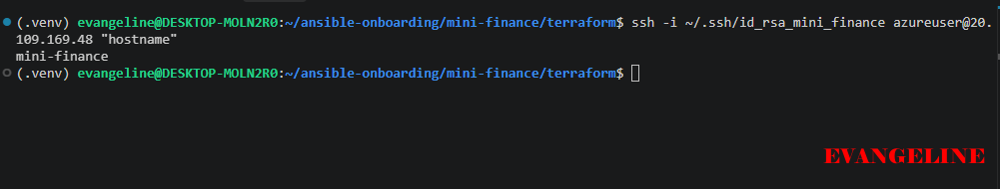
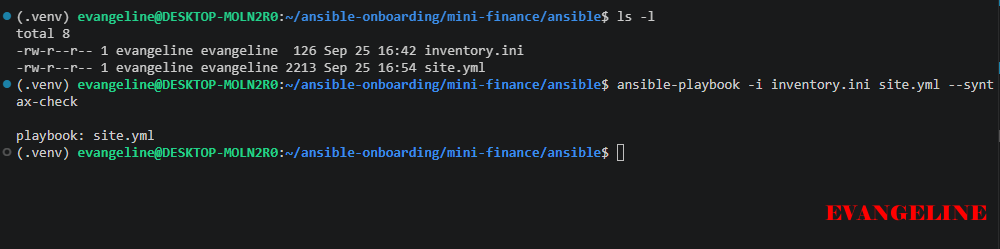
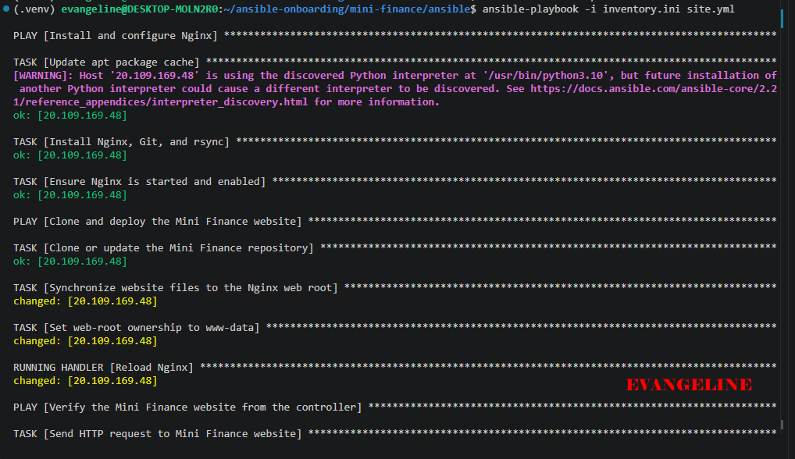
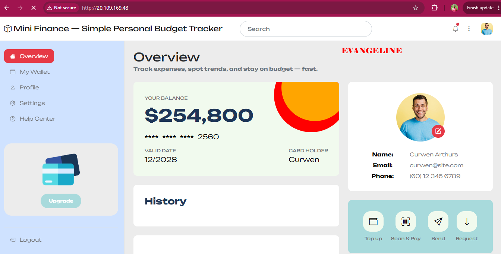

# Assignment 04 — Deploy Mini Finance on Azure Using Terraform and Ansible

Part of the DevOps Micro Internship (DMI) with Agentic AI

---

## Purpose

In this assignment, you will provision Azure infrastructure using Terraform and deploy the Mini Finance website using an Ansible multi-play playbook.

Terraform will create the Azure Virtual Machine and networking resources. Ansible will install Nginx, clone the Mini Finance repository, deploy the website, and verify the deployment.

---

# Task 1 — Create the Project Structure

## Goal

Create separate directories and files for the Terraform infrastructure and Ansible configuration.

### Evidence

#### Screenshot 1 — Terminal or VS Code showing the complete `mini-finance` project structure


---

### Notes

Created the `mini-finance` project inside my Ansible workspace and separated the Terraform and Ansible configurations into dedicated directories. I also created `README.md` and `.gitignore` files to document the project and prevent Terraform state files, provider files, plans, logs, and private key files from being committed.

---

# Task 2 — Create the Azure Infrastructure Using Terraform

## Goal

Use Terraform to provision an Ubuntu Virtual Machine with the required Azure networking and security resources.

### Evidence

#### Screenshot 2 — Terraform code showing the `Allow-SSH` rule for port `22` and the `Allow-HTTP` rule for port `80`


---

#### Screenshot 3 — Terraform code showing the association between `nsg-mini-finance` and `nic-mini-finance`


---

### Notes

Created the Azure infrastructure configuration with Terraform. The configuration creates a resource group, virtual network, subnet, network security group, public IP address, network interface, NSG-to-NIC association, and an Ubuntu 22.04 virtual machine.

The NSG allows SSH on port 22 only from my current public IP address using a `/32` CIDR rule. It allows HTTP on port 80 from the internet so the deployed Mini Finance website can be accessed publicly. I used the required fixed resource names and configured SSH key authentication for the `azureuser` account.

---

# Task 3 — Initialize and Apply the Terraform Configuration

## Goal

Format and validate the Terraform configuration, review the execution plan, and provision the Azure infrastructure.

### Evidence

#### Screenshot 4 — End of the `terraform apply` output showing `Apply complete!` with no errors


---

#### Screenshot 5 — Output of `terraform output public_ip` showing the VM’s public IP address


---

### Notes

Formatted and validated the Terraform configuration, reviewed the execution plan, and applied the infrastructure deployment. Terraform created the Azure networking resources and Ubuntu VM successfully. I used the `public_ip` Terraform output to retrieve the VM public IP address for SSH access, the Ansible inventory, deployment verification, and browser testing.

---

# Task 4 — Verify Passwordless SSH Access

## Goal

Confirm that the Ansible controller can connect to the Terraform-provisioned Azure VM using SSH key authentication.

### Evidence

#### Screenshot 6 — Passwordless SSH command and the returned `mini-finance` hostname



---

### Notes

Verified passwordless SSH access from the Ansible controller to the Azure VM using the RSA private key that matches the public key configured by Terraform. The SSH command returned the hostname `mini-finance`, confirming that the VM was reachable and key-based authentication was working correctly.

---

# Task 5 — Create the Ansible Inventory and Verify Connectivity

## Goal

Add the Terraform-provisioned Azure VM to the Ansible inventory and confirm that Ansible can connect to it.

### Evidence

#### Screenshot 7 — Ansible ping output showing `SUCCESS` and `pong` from the Azure VM


---

### Configuration File

Copy and paste the complete contents of your `ansible/inventory.ini` file below:

```ini
[web]
20.109.169.48

[web:vars]
ansible_user=azureuser
ansible_ssh_private_key_file=/home/evangeline/.ssh/id_rsa_mini_finance
```

---

# Task 6 — Create the Multi-Play Ansible Playbook

## Goal

Create one Ansible playbook containing separate plays to install Nginx, deploy the Mini Finance website, and verify the deployment.

### Evidence

#### Screenshot 8 — `site.yml` showing Play 1 and the beginning of Play 2

Screenshot must show:

- Play 1 targeting the `web` group
- Installation of `nginx`, `git`, and `rsync`
- Nginx service configured as started and enabled
- Beginning of Play 2 with the Git repository URL and synchronization task


---

#### Screenshot 9 — `site.yml` showing the deployment destination, handler, and Play 3 verification

Screenshot must show:

- Website destination `/var/www/html/`
- Ownership set to `www-data:www-data`
- Nginx reload handler
- Play 3 targeting `localhost`
- The `uri` verification and `assert` condition


---

### Configuration File

Copy and paste the complete contents of your `ansible/site.yml` file below:

```yaml
---
# Play 1: Install and configure Nginx
- name: Install and configure Nginx
  hosts: web
  become: true

  tasks:
    - name: Update apt package cache
      ansible.builtin.apt:
        update_cache: true
        cache_valid_time: 3600

    - name: Install Nginx, Git, and rsync
      ansible.builtin.apt:
        name:
          - nginx
          - git
          - rsync
        state: present

    - name: Ensure Nginx is started and enabled
      ansible.builtin.service:
        name: nginx
        state: started
        enabled: true

# Play 2: Clone and deploy the Mini Finance website
- name: Clone and deploy the Mini Finance website
  hosts: web
  become: true

  tasks:
    - name: Clone or update the Mini Finance repository
      ansible.builtin.git:
        repo: https://github.com/pravinmishraaws/mini-finance-project
        dest: /opt/mini-finance
        version: main
        clone: true
        update: true

    - name: Synchronize website files to the Nginx web root
      ansible.posix.synchronize:
        src: /opt/mini-finance/
        dest: /var/www/html/
        recursive: true
        archive: true
        delete: false
        exclude:
          - .git
      delegate_to: "{{ inventory_hostname }}"
      notify: Reload Nginx

    - name: Set web-root ownership to www-data
      ansible.builtin.file:
        path: /var/www/html/
        owner: www-data
        group: www-data
        recurse: true

  handlers:
    - name: Reload Nginx
      ansible.builtin.service:
        name: nginx
        state: reloaded

# Play 3: Verify deployment from the Ansible controller
- name: Verify the Mini Finance website from the controller
  hosts: localhost
  connection: local
  gather_facts: false

  tasks:
    - name: Send HTTP request to Mini Finance website
      ansible.builtin.uri:
        url: "http://{{ groups['web'][0] }}/"
        method: GET
        status_code: 200
      register: website_response

    - name: Assert that the website returned HTTP 200
      ansible.builtin.assert:
        that:
          - website_response.status == 200
        success_msg: "Mini Finance website returned HTTP 200."
        fail_msg: "Mini Finance website did not return HTTP 200."
```

---

# Task 7 — Validate and Run the Ansible Playbook

## Goal

Validate the syntax of the multi-play Ansible playbook and run it to install Nginx, deploy the Mini Finance website, and verify the deployment.

### Evidence

#### Screenshot 10 — Successful playbook syntax check showing `playbook: site.yml`



---

#### Screenshot 11 — Play 3 output showing the successful HTTP verification and assertion



---

#### Screenshot 12 — Final `PLAY RECAP` showing `failed=0` and `unreachable=0`

.

---

### Notes

rsync is useful because it efficiently synchronizes files between directories and transfers only changed content when possible. In this project, it copied the website files from `/opt/mini-finance/` to `/var/www/html/` while excluding the `.git` directory.

---

# Task 8 — Test the Mini Finance Website in a Browser

## Goal

Confirm that the Mini Finance website is publicly accessible through the Azure VM’s public IP address.

### Evidence

#### Screenshot 13 — Mini Finance website successfully loading in the browser, with the Azure VM’s public IP address visible in the address bar



---

### Website URL

Add your deployed website URL below:

```text
http://20.109.166.48
```

---

# Task 9 — Create the Project README

## Goal

Create a `README.md` file to document the Mini Finance infrastructure and deployment project.

### Evidence

#### Screenshot 14 — Completed `README.md` displayed in the VS Code Markdown preview or terminal


---

### README Content

Copy and paste the complete contents of your `README.md` file below:

```markdown
# Mini Finance on Azure with Terraform and Ansible

## Project Objective

This project provisions Azure infrastructure with Terraform and uses Ansible to configure an Ubuntu virtual machine, install Nginx, deploy the Mini Finance static website, and verify that the application returns HTTP status code 200.

The project demonstrates the separation of responsibilities between Terraform and Ansible. Terraform manages the cloud infrastructure, while Ansible manages server configuration and application deployment.

## Tools and Technologies

- Terraform
- Microsoft Azure
- Ansible
- Nginx
- Git
- rsync
- Ubuntu 22.04 Generation 2

## Infrastructure Created

- Azure Resource Group: `rg-mini-finance`
- Virtual Network: `vnet-mini-finance`
- Subnet: `subnet-mini-finance`
- Network Security Group: `nsg-mini-finance`
- Static Standard Public IP: `pip-mini-finance`
- Network Interface: `nic-mini-finance`
- Ubuntu Linux Virtual Machine: `vm-mini-finance`
- SSH key authentication for `azureuser`

The NSG allows SSH only from the controller's current public IP address and allows HTTP traffic on port 80 from the internet.

## Ansible Deployment Workflow

1. Install and configure Nginx on the Azure VM.
2. Install Git and rsync.
3. Clone the Mini Finance repository into `/opt/mini-finance`.
4. Synchronize the website files to `/var/www/html/`.
5. Set ownership to `www-data:www-data`.
6. Reload Nginx when website content changes.
7. Send an HTTP request from the Ansible controller.
8. Assert that the website returns HTTP status code 200.

## Verification

The deployment was verified in three ways:

- Passwordless SSH returned the VM hostname `mini-finance`.
- Ansible ping returned `SUCCESS` and `pong`.
- The Ansible `uri` and `assert` tasks confirmed HTTP status code 200.
- The website loaded successfully in a browser at `http://20.109.169.48`.

## Challenge and Solution

One challenge was that the repository URL provided in the original instructions did not clone successfully. I tested the repository from the Azure VM using `git ls-remote` and confirmed that the accessible repository was `https://github.com/pravinmishraaws/mini_finance`. I updated the Ansible playbook with the working repository URL.

Another issue occurred because the installed `ansible.posix.synchronize` module did not accept the direct `exclude` parameter. I resolved this by using `rsync_opts` with `--exclude=.git`.

The controller's public IP also changed during the deployment. I updated the Terraform configuration to detect the current public IP automatically and apply it as the restricted SSH source CIDR.

## What I Learned

I learned how Terraform and Ansible work together in a DevOps workflow. Terraform provisions repeatable Azure infrastructure, while Ansible configures the operating system and deploys the application.

I also learned the importance of reviewing Terraform plans, restricting SSH access, testing connectivity before deployment, using idempotent Ansible modules, and troubleshooting each layer separately.
```

---

# LinkedIn Post Required

## Evidence

#### Screenshot 15 — Published LinkedIn post showing the text and at least one deployment screenshot


---

#### LinkedIn Post URL

---

### LinkedIn Submission Notes

**One challenge you faced and how you fixed it:**

I faced a repository cloning issue because the initial repository URL was not accessible from the Azure VM. I tested the URL with `git ls-remote`, identified the working repository URL, updated the Ansible playbook, and reran the deployment. I also corrected the synchronize task by using `rsync_opts` to exclude the `.git` directory because the direct `exclude` parameter was unsupported in my environment.

---

**One real-world example where you can use this learning:**

I learned that Terraform and Ansible work well together because they handle different parts of infrastructure automation. Terraform provisions repeatable cloud resources, while Ansible configures the operating system and deploys applications. Separating these responsibilities makes deployments easier to repeat, troubleshoot, maintain, and scale.

---

# Assignment Questions


---

# Required Files

Confirm that the following files are included in your assignment folder:

- [✅] `.gitignore`
- [✅] `README.md`
- [✅] `terraform/providers.tf`
- [✅] `terraform/main.tf`
- [✅] `terraform/variables.tf`
- [✅] `terraform/outputs.tf`
- [✅] `ansible/inventory.ini`
- [✅] `ansible/site.yml`

---

# Submission Instructions

- Add all required screenshots in the correct order.
- Full Name must be visible in required screenshots.
- Add the Azure VM public IP address.
- Add the final Mini Finance website URL.
- Paste `inventory.ini`, `site.yml`, and `README.md` as editable text.
- Answer all assignment questions clearly in your own words.
- Add your LinkedIn post URL.
- Do not expose SSH private keys, passwords, Azure credentials, subscription IDs, Terraform state contents, or other sensitive information.

---

# Completion Checklist

- [ ] Task 1: `mini-finance` project structure created
- [ ] Task 1: `.gitignore` created
- [ ] Task 2: Terraform Azure infrastructure code created
- [ ] Task 2: `Allow-SSH` rule configured for port `22`
- [ ] Task 2: `Allow-HTTP` rule configured for port `80`
- [ ] Task 2: NSG associated with the Network Interface
- [ ] Task 3: `terraform fmt` completed
- [ ] Task 3: `terraform init` completed
- [ ] Task 3: `terraform validate` completed successfully
- [ ] Task 3: `terraform apply` completed successfully
- [ ] Task 3: `terraform output public_ip` displayed the VM public IP
- [ ] Task 4: Passwordless SSH works from the Ansible controller
- [ ] Task 5: `inventory.ini` created
- [ ] Task 5: Ansible ping returns `SUCCESS` and `pong`
- [ ] Task 6: `site.yml` contains three separate plays
- [ ] Task 6: Play 1 installs Nginx, Git, and rsync
- [ ] Task 6: Play 2 clones and deploys the Mini Finance website
- [ ] Task 6: Play 3 verifies HTTP status code `200`
- [ ] Task 7: Playbook syntax check passes
- [ ] Task 7: Ansible playbook completes successfully
- [ ] Task 7: Final recap shows `failed=0` and `unreachable=0`
- [ ] Task 8: Mini Finance website loads in the browser
- [ ] Task 8: Azure VM public IP is visible in the browser screenshot
- [ ] Task 9: `README.md` completed
- [ ] Screenshots 1–15 are included
- [ ] `inventory.ini`, `site.yml`, and `README.md` are pasted as editable text
- [ ] Assignment questions are answered
- [ ] LinkedIn post published with Anyone visibility
- [ ] LinkedIn post URL added
- [ ] No sensitive information is exposed

---

## About DMI & CloudAdvisory

DevOps Micro Internship (DMI) is a project-based DevOps program run by Pravin Mishra and The CloudAdvisory, focused on real-world execution, systems thinking, and career readiness.

It helps learners build strong DevOps foundations with hands-on experience.

---

## Resources

- DMI Official Website: [https://dmi.pravinmishra.com?utm_source=github&utm_medium=readme](https://dmi.pravinmishra.com?utm_source=github&utm_medium=readme)
- University: [https://university.pravinmishra.com?utm_source=github&utm_medium=readme](https://university.pravinmishra.com?utm_source=github&utm_medium=readme)
- Discord Community: [https://discord.pravinmishra.com?utm_source=github&utm_medium=readme](https://discord.pravinmishra.com?utm_source=github&utm_medium=readme)
- Blog: [https://dmi.pravinmishra.com/blog?utm_source=github&utm_medium=readme](https://dmi.pravinmishra.com/blog?utm_source=github&utm_medium=readme)
- YouTube Playlist: [https://www.youtube.com/playlist?list=PLFeSNDtI4Cho](https://www.youtube.com/playlist?list=PLFeSNDtI4Cho)
- Pravin Mishra LinkedIn: [https://www.linkedin.com/in/pravin-mishra-aws-trainer/](https://www.linkedin.com/in/pravin-mishra-aws-trainer/)
- CloudAdvisory LinkedIn: [https://www.linkedin.com/company/thecloudadvisory/](https://www.linkedin.com/company/thecloudadvisory/)

---

*This submission is part of DevOps Micro Internship (DMI) — Agentic AI Track.*