# Assignment — Deploy EpicBook with Terraform and Ansible Roles

Part of the DevOps Micro Internship (DMI) with Agentic AI

---

## Purpose

In this assignment, you will deploy the EpicBook web application using Terraform and Ansible roles.

Terraform provisions the cloud infrastructure, including one Ubuntu VM and one managed MySQL database. Ansible roles configure the VM, install required software, deploy the EpicBook application, configure Nginx, connect the app to the managed MySQL database, and verify the deployment.

---

# Task 1 — Set Up the Project Folder Layout

## Goal

Create the project folder structure for Terraform and Ansible roles.

Terraform will be used to provision the cloud infrastructure. Ansible roles will be used to configure the VM and deploy the EpicBook application.

### Evidence

#### Screenshot 1 — Terminal showing the completed `epicbook-prod` project structure

---

### Notes

Answer the following in your own words:

**1. Which cloud provider did you choose for this assignment?**

I chose Microsoft Azure. I used Azure to provision the Ubuntu virtual machine, public IP address, network security group, and Azure Database for MySQL Flexible Server.

---

**2. Why is it useful to keep Terraform files and Ansible files in separate folders?**

Terraform and Ansible have different responsibilities. Terraform provisions and manages cloud infrastructure, while Ansible configures the VM and deploys the application after the infrastructure exists. Keeping them separate makes the project easier to understand, maintain, test, and reuse.

---

**3. What is the purpose of the `roles` directory in Ansible?**

The roles directory organizes Ansible automation into reusable units with clear responsibilities. In this project, I used separate roles for common server preparation, Nginx configuration, and EpicBook deployment. Ansible roles can automatically load related tasks, templates, variables, files, and handlers from a standard directory structure.

---

# Task 2 — Provision the Infrastructure with Terraform

## Goal

Run Terraform to provision the cloud infrastructure for the EpicBook deployment.

Terraform will create the VM, managed MySQL database, networking, security rules, and required outputs.

### Evidence

#### Screenshot 2 — `terraform apply` completed successfully

---

#### Screenshot 3 — Output of `terraform output`

---

#### Screenshot 4 — Azure Portal or AWS Console showing the VM running

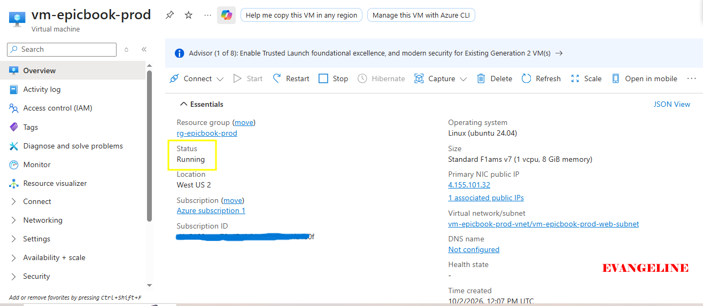

---

#### Screenshot 5 — Azure Portal or AWS Console showing the managed MySQL database created

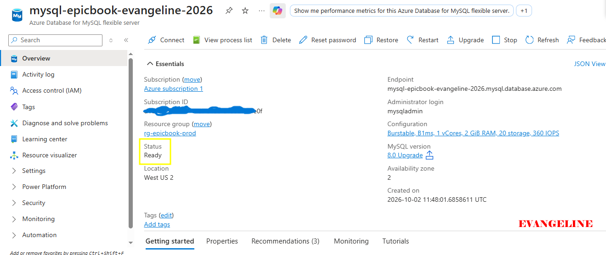

---

### Notes

Answer the following in your own words:

**1. What resources did Terraform create for this assignment?**

Terraform created the Azure infrastructure required for EpicBook, including:

An Ubuntu virtual machine.

A public IP address for the VM.

Virtual networking and a network security group.

An SSH rule allowing my controller’s public IP to access port 22.

An HTTP rule allowing public traffic to port 80.

An Azure Database for MySQL Flexible Server.

MySQL firewall rules to allow the required connections.

Terraform outputs for the VM public IP, database host, database name, and administrator user.

---

**2. Why should you review `terraform plan` before running `terraform apply`?**

I should review terraform plan because it previews the exact resources Terraform will add, modify, or destroy before any change is made in Azure. This helps prevent accidental deletion, unexpected cost, incorrect firewall rules, or deployment changes to the wrong resources. Terraform’s execution plan is specifically intended to show what apply will do before infrastructure is changed.

---

**3. Why should database passwords not be shown in Terraform output?**

Database passwords should not be shown in Terraform output because terminal logs, screenshots, shell history, CI/CD logs, Terraform state, or shared documentation may expose them. Anyone with the password could connect to the database or misuse its data. Passwords should be treated as secrets and stored in a secure secret-management solution in a production environment.

---

# Task 3 — Verify SSH Key-Based Access

## Goal

Verify that the cloud VM can be accessed from the Ansible controller using SSH key-based authentication.

### Evidence

#### Screenshot 6 — Successful SSH hostname check from the Ansible controller

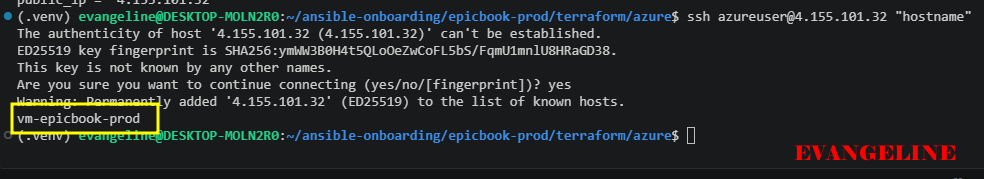

---

### Notes

Answer the following in your own words:

**1. What command did you use to verify SSH access?**

I used:

ssh azureuser@4.155.101.32 "hostname"

---

**2. What proves that SSH key-based access worked successfully?**

The command connected without asking for a password and returned the VM hostname:

vm-epicbook-prod

This proved that the SSH key, username, public IP, Azure NSG rule, and VM SSH service were all working.

---

**3. What would you check if SSH returned `Permission denied (publickey)`?**

If SSH returned Permission denied (publickey), I would check:

That I am using the correct SSH username, such as azureuser.

That the correct private key file is being used.

That the private key has safe file permissions, usually chmod 600.

That the matching public key was added to the VM when it was created.

That ansible_ssh_private_key_file points to the correct private key.

That I am connecting to the correct VM public IP address.

---

# Task 4 — Create the Ansible Inventory and Configuration

## Goal

Create the Ansible inventory file and local Ansible configuration for the EpicBook VM.

The inventory tells Ansible which VM to manage and which SSH user to use.

### Evidence

#### Screenshot 7 — `inventory.ini` showing the VM under the `web` group

---

#### Screenshot 8 — Output of `ansible-inventory -i inventory.ini --graph`

---

#### Screenshot 9 — Output of `ansible web -i inventory.ini -m ping`

---

### Notes

Answer the following in your own words:

**1. What is the purpose of `inventory.ini`?**

inventory.ini tells Ansible which hosts to manage and groups those hosts logically. In this project, it placed the EpicBook VM in the web group so the playbook and group variables could target it.

---

**2. What does `ansible_host` store?**

ansible_host stores the actual network address Ansible should use to connect to a managed host. In my project, it stored the Azure VM public IP address:

4.155.101.32

---

**3. What does `ansible_ssh_private_key_file` tell Ansible?**

ansible_ssh_private_key_file tells Ansible the path to the SSH private key it should use when authenticating to the remote VM. It allows Ansible to connect securely without entering a password interactively.

---

**4. Why is `host_key_checking = False` used only for this temporary lab?**

host_key_checking = False avoids interactive prompts when Ansible connects to a new lab VM for the first time. It is only acceptable for a temporary lab because it removes SSH host identity verification. In production, host key checking should remain enabled to reduce the risk of connecting to an impersonated or incorrect server.

---

# Task 5 — Create the Main Ansible Playbook

## Goal

Create the main Ansible playbook that runs the required roles in the correct order.

The `site.yml` file will call the `common`, `nginx`, and `epicbook` roles.

### Evidence

#### Screenshot 10 — `site.yml` showing the roles in the correct order

---

#### Screenshot 11 — Output of `ansible-playbook -i inventory.ini site.yml --syntax-check`

---

### Notes

Answer the following in your own words:

**1. What is the purpose of `site.yml`?**

site.yml is the main Ansible playbook for the deployment. It defines the target host group and calls the required roles in the correct order so the full server configuration and application deployment can run from one command.

---

**2. Why should the roles run in the order `common`, `nginx`, and `epicbook`?**

The common role runs first because it prepares the VM with shared dependencies, including required packages. The nginx role runs next to install and configure the reverse proxy. The epicbook role runs last because it deploys the Node.js application, configures its database connection, imports its database data, and starts it with PM2.

This order ensures the operating system and reverse proxy are ready before the application is deployed.

---

**3. What does `become: true` allow Ansible to do?**

become: true allows Ansible to elevate privileges on the remote VM, usually by using sudo. This is needed for administrative tasks such as installing packages, managing Nginx configuration files, reloading services, and writing to protected system directories.

---

# Task 6 — Create the `common` Role

## Goal

Create the `common` role to prepare the Ubuntu VM with the basic packages required for the EpicBook deployment.

This role handles the common server setup before Nginx and the application are configured.

### Evidence

#### Screenshot 12 — `roles/common/tasks/main.yml` showing the common setup tasks

---

### Notes

Answer the following in your own words:

**1. What is the responsibility of the `common` role?**

The common role prepares the Ubuntu VM with packages and basic setup that are shared by the rest of the deployment. It updates the package cache and installs common dependencies needed by the Nginx and EpicBook roles.

---

**2. Why should Nginx installation not be placed inside the `common` role?**

Nginx should have its own role because it has a separate responsibility: installing, configuring, validating, and running the reverse proxy. Keeping the roles separate follows separation of concerns, makes the automation easier to maintain, and allows the Nginx role to be reused for other applications.

---

**3. Why is `mysql-client` useful in this deployment?**

mysql-client is useful because it provides the mysql command-line client on the VM. The EpicBook role used it to connect securely to Azure Database for MySQL and import the database schema, author seed data, and book seed data.

---

# Task 7 — Create the `nginx` Role

## Goal

Create the `nginx` role to install Nginx and configure it as a reverse proxy for the EpicBook application.

Nginx will receive browser traffic on port `80` and forward it to the EpicBook Node.js application running on the VM.

### Evidence

#### Screenshot 13 — `roles/nginx/tasks/main.yml` showing Nginx installation and site configuration tasks

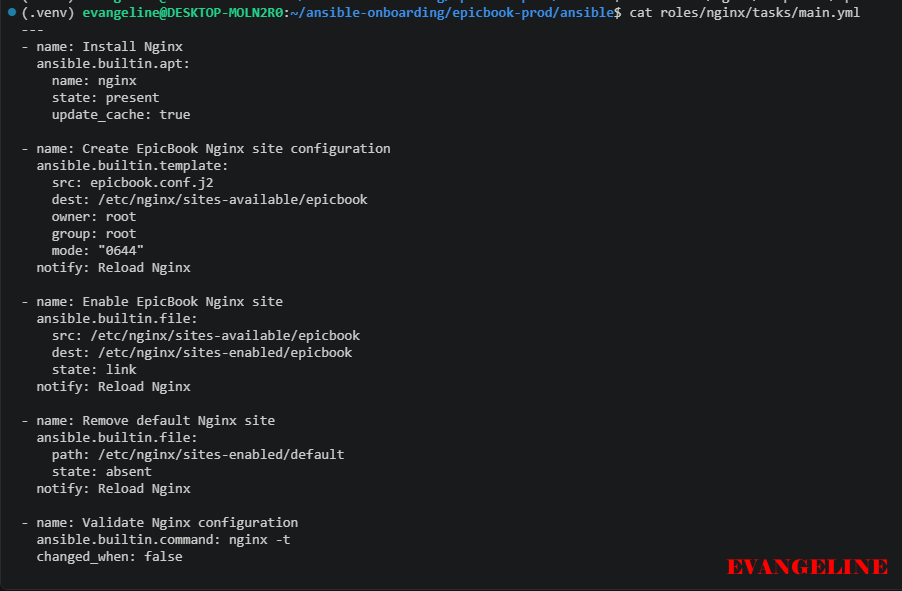

---

#### Screenshot 14 — `roles/nginx/templates/epicbook.conf.j2` showing the reverse proxy configuration

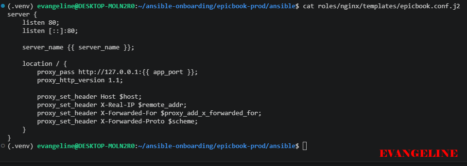

---

### Notes

Answer the following in your own words:

**1. What is the responsibility of the `nginx` role?**

The nginx role installs Nginx, creates the EpicBook site configuration, enables the site, removes the default site, validates the Nginx configuration, and ensures Nginx is running and enabled.

---

**2. Why is Nginx configured as a reverse proxy in this deployment?**

Nginx receives public HTTP traffic on port 80 and forwards it to the EpicBook Node.js application running locally on port 8080. This allows the Node.js application to remain behind Nginx instead of being directly exposed to the internet.

Nginx uses the proxy_pass directive inside a location block to forward requests to an upstream HTTP application. It can also support production capabilities such as TLS/HTTPS, static-file delivery, request headers, caching, and load balancing.

---

**3. Why should the application port come from `group_vars/web.yml` instead of being hard-coded?**

The application port should come from group_vars/web.yml so it can be changed in one central location without editing several tasks or templates. This makes the role reusable across environments and reduces the chance of mismatched configuration between PM2, Nginx, and the application.

---

# Task 8 — Create the `epicbook` Role

## Goal

Create the `epicbook` role to deploy the EpicBook application, connect it to the managed MySQL database, and run the application on port `8080` using PM2.

### Evidence

#### Screenshot 15 — `roles/epicbook/tasks/main.yml` showing application deployment tasks

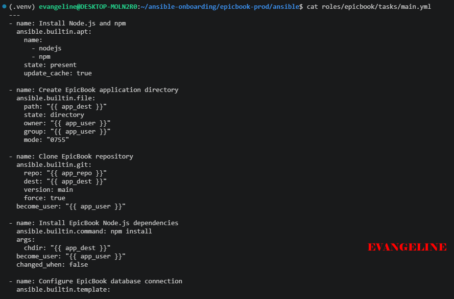

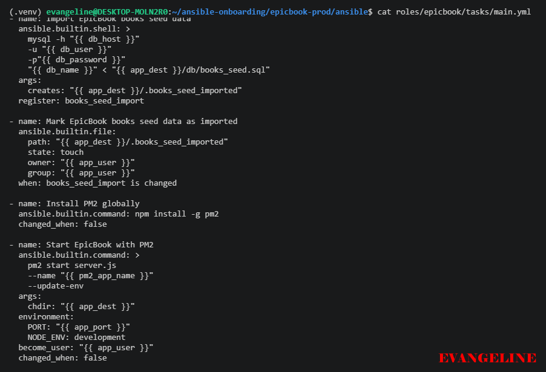

---

#### Screenshot 16 — Task or file showing how the database connection is configured, with secrets hidden

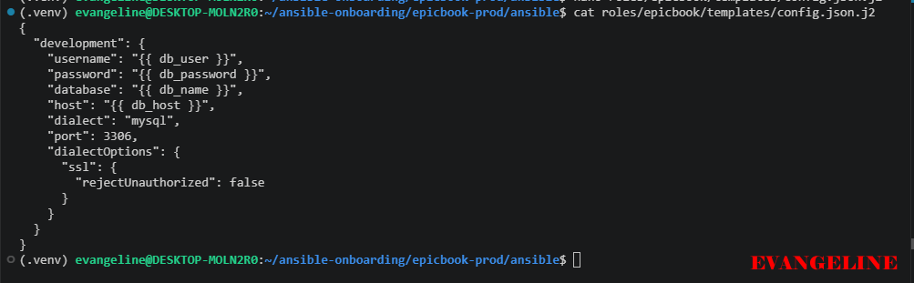

---

#### Screenshot 17 — Task or output showing the EpicBook application managed by PM2

---

### Notes

Answer the following in your own words:

**1. What is the responsibility of the `epicbook` role?**

The epicbook role deploys and runs the EpicBook application. It installs Node.js and npm, creates the application directory, clones the application repository, installs Node dependencies, configures the database connection, imports the database schema and seed data, installs PM2, and starts or restarts the application.

---

**2. Why is PM2 used for the EpicBook Node.js application?**

PM2 is used to run the Node.js application as a managed background process. It keeps the application online, provides process status information, supports restarting the application, and makes it easier to manage a Node.js service on a VM. PM2 is commonly used with Nginx in front of Node.js applications.

---

**3. Why should database passwords not be hard-coded in public files?**

Database passwords should not be hard-coded in public files because they can be exposed through GitHub commits, screenshots, configuration backups, shared repositories, or logs. A leaked password could allow unauthorized access to the managed database. I used an environment variable, EPICBOOK_DB_PASSWORD, and referenced it through Ansible rather than writing the password into a public YAML or application file.

---

**4. What does it mean for the application to run on port `8080` while Nginx listens on port `80`?**

It means the EpicBook Node.js application listens internally on port 8080, while Nginx listens publicly on the standard HTTP port, 80. When a user visits the public IP address, Nginx receives the request and forwards it to the local application at http://127.0.0.1:8080.

---

# Task 9 — Create Group Variables

## Goal

Create reusable variables for the EpicBook deployment.

The `group_vars/web.yml` file stores values that can be reused across the Ansible roles.

### Evidence

#### Screenshot 18 — `group_vars/web.yml` showing the application, PM2, and database variables, with passwords hidden or masked

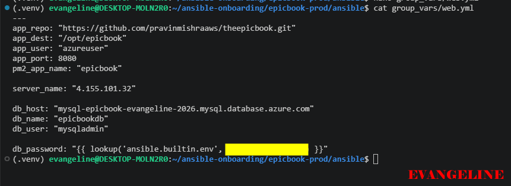

---

### Notes

Answer the following in your own words:

**1. What is the purpose of `group_vars/web.yml`?**

group_vars/web.yml stores variables that apply to every host in the web inventory group. It keeps shared deployment values outside the role task files, making the roles more reusable and easier to configure across environments. Ansible supports defining variables in reusable variable files and roles to manage differences between systems.

---

**2. Which values did you store in `group_vars/web.yml`?**

I stored values such as:

The application user.

The application directory.

The Git repository URL.

The PM2 application name.

The application port, 8080.

The database host.

The database name.

The database user.

The database password reference through an environment variable.

---

**3. How did you handle the database password securely?**

I exported the password in my terminal as:

export EPICBOOK_DB_PASSWORD="..."

Then I referenced the environment variable in Ansible using:

db_password: "{{ lookup('ansible.builtin.env', 'EPICBOOK_DB_PASSWORD') }}"

I also used no_log: true on tasks that used the MySQL password so the sensitive command output would not be displayed in Ansible logs.

---

# Task 10 — Run the Ansible Playbook

## Goal

Run the Ansible playbook to configure the VM and deploy the EpicBook application.

The playbook should run the roles in this order:

1. `common`
2. `nginx`
3. `epicbook`

### Evidence

#### Screenshot 19 — Ansible playbook output showing the roles running

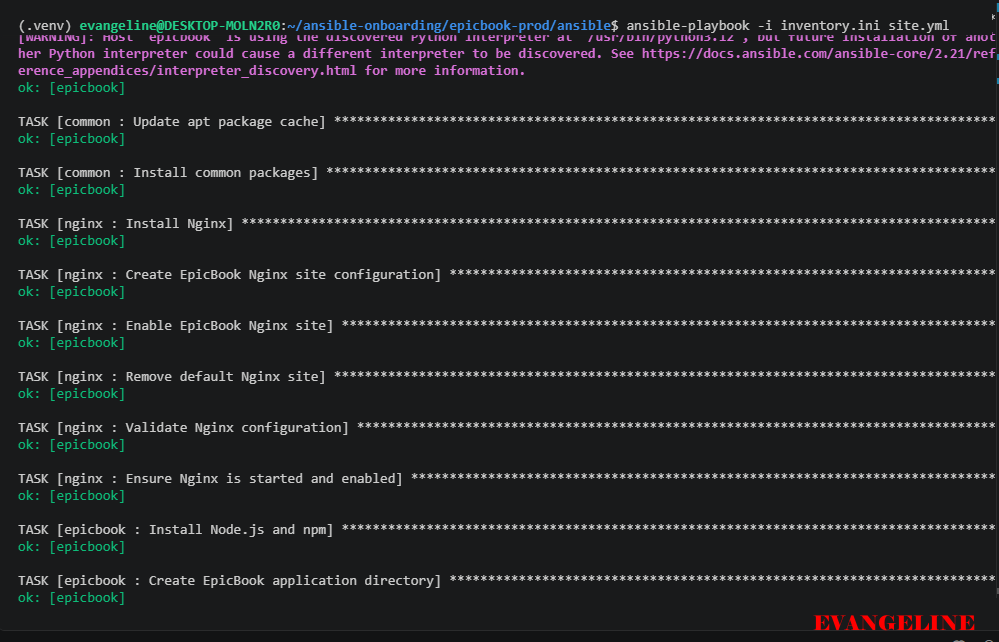

---

#### Screenshot 20 — Final Ansible recap showing `failed=0`

---

#### Screenshot 21 — Output of `ansible web -i inventory.ini -m command -a "systemctl is-active nginx" --become`

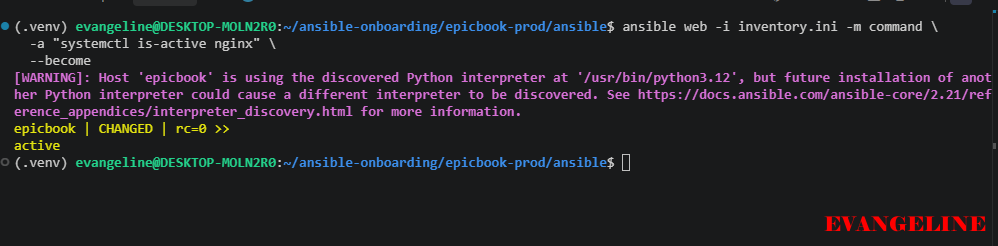

---

#### Screenshot 22 — Output of `ansible web -i inventory.ini -m command -a "pm2 status"`

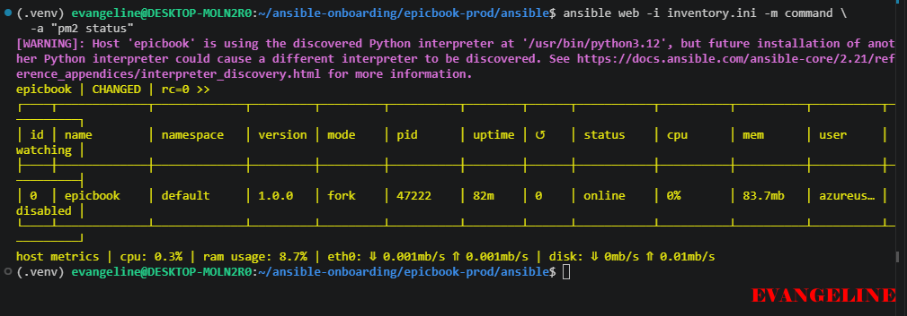

---

#### Screenshot 23 — Output of `ansible web -i inventory.ini -m command -a "curl -I http://localhost:8080"`

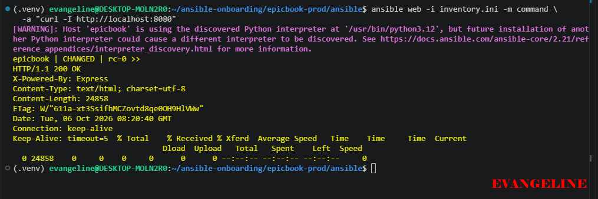

---

### Notes

Answer the following in your own words:

**1. What command did you run to execute the Ansible playbook?**

I ran:

ansible-playbook -i inventory.ini site.yml

---

**2. How do you know all roles completed successfully?**

I knew the roles completed successfully because the final Ansible recap showed:

unreachable=0
failed=0

The playbook also completed the schema import, author seed import, books seed import, and PM2 startup tasks successfully.

---

**3. What proves that Nginx is active?**

I ran:

ansible web -i inventory.ini -m command -a "systemctl is-active nginx" --become

The output was:

active

This confirmed that the Nginx systemd service was running.

---

**4. What proves that PM2 is managing the EpicBook application?**

I ran:

ansible web -i inventory.ini -m command -a "pm2 status"

The output showed the epicbook process with status:

online

This proved PM2 was managing the EpicBook Node.js application.

---

**5. What proves that the EpicBook application responds on port `8080`?**

I ran:

ansible web -i inventory.ini -m command -a "curl -I http://localhost:8080"

The output included:

HTTP/1.1 200 OK
X-Powered-By: Express

This confirmed that the EpicBook Express application was responding successfully on port 8080.

---

# Task 11 — Verify the EpicBook Deployment

## Goal

Verify that the EpicBook application is running, accessible in the browser, and connected to the managed MySQL database.

### Evidence

#### Screenshot 24 — Output of `curl -I http://<public_ip>`

---

#### Screenshot 25 — Output of the cart API test command

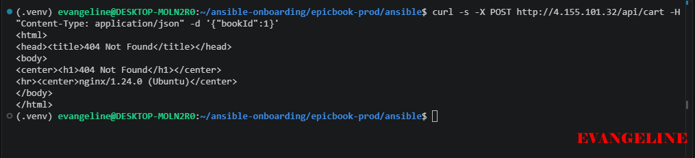

---

#### Screenshot 26 — Output of the `/cart` HTTP status check

---

#### Screenshot 27 — Browser showing the EpicBook application loaded from `http://<public_ip>`

---

### Notes

Answer the following in your own words:

**1. What HTTP response did you receive from the public application URL?**

I received:

HTTP/1.1 200 OK

This confirmed that the EpicBook application was publicly reachable through the Azure VM’s public IP address and Nginx.

---

**2. What did the cart API test prove?**

The cart API test proved that a request could travel from the public HTTP endpoint through Nginx to the EpicBook Node.js application, and that the application could use the managed MySQL database to process a cart operation for bookId: 1.

Because the request used a seeded book ID, a successful JSON response confirmed that the application, API route, seeded database data, and database connection were working together.

---

**3. What did the `/cart` status check return?**

The /cart status check returned:

200

This confirmed that the cart page was reachable and returned a successful HTTP response.

---

**4. What issue did you face during verification, and how did you fix it?**

During verification, the public /cart page initially returned 404 Not Found, even though the same route returned 200 OK when tested directly on localhost:8080.

I identified two configuration issues:

The cart route was mounted at /cart in server.js, but the route file also defined router.get("/cart"). This created an effective route of /cart/cart. I changed the route inside the cart router to router.get("/").

The Nginx reverse-proxy configuration contained incorrectly formatted proxy_pass content. I corrected it so Nginx forwarded requests to the local EpicBook application.

After restarting PM2, validating and reloading Nginx, the public /cart check returned 200

---

# LinkedIn Post Required

## Evidence

#### LinkedIn Post URL

https://lnkd.in/p/dBrhd5Bi

---

#### Screenshot — Published LinkedIn post

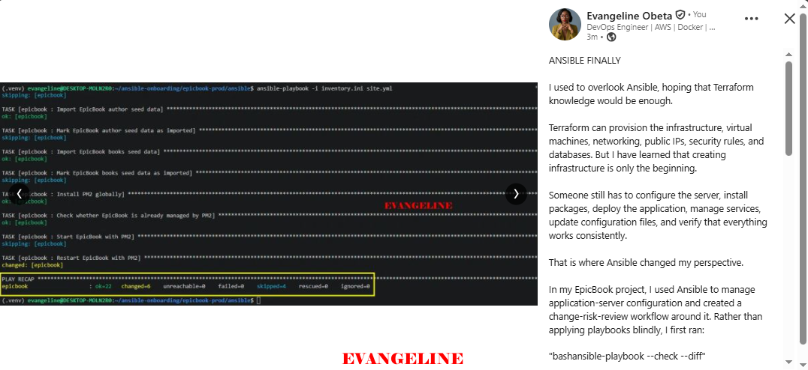

---

# Assignment Questions

Answer the following in your own words:

**1. Why is Terraform used for infrastructure provisioning?**

Terraform is used because it allows infrastructure to be defined as code and created consistently from version-controlled configuration files. It can provision cloud resources such as virtual machines, databases, public IPs, networks, and firewall rules repeatedly instead of requiring manual portal configuration.

Terraform also provides a plan step that shows the intended changes before they are applied, helping avoid surprises.

---

**2. Why are Ansible roles useful for production-style deployments?**

Ansible roles are useful because they organize deployment automation into reusable, focused components. For example, I separated the deployment into common, nginx, and epicbook roles. This makes the automation easier to read, test, update, share, and reuse across different environments. Roles load related tasks, variables, templates, files, and handlers based on a standard structure.

---

**3. What is the purpose of `group_vars/web.yml`?**

The purpose of group_vars/web.yml is to store configuration values shared by the hosts in the web group. It centralizes values such as the app directory, application port, PM2 name, database host, database user, and database name, so they do not need to be hard-coded repeatedly in Ansible roles.

---

**4. Why should database passwords not be committed to GitHub?**

Database passwords should not be committed to GitHub because repository history can preserve secrets even after they are deleted. Public repositories can expose them to anyone, while private repositories can still be accessed accidentally or by unauthorized collaborators. A leaked password can give attackers access to the database and its data.

---

**5. What is the purpose of Nginx in this deployment?**

Nginx acts as the public-facing web server and reverse proxy. It listens on port 80 for browser traffic and forwards requests to the EpicBook Node.js application on port 8080. It also provides a better place to add production features such as HTTPS/TLS, security headers, caching, and static content handling. Nginx is designed to function as an HTTP web server and reverse proxy.

---

**6. Why should the managed MySQL database not be publicly accessible?**

The managed MySQL database should not be publicly accessible because databases contain sensitive application data and should have the smallest possible attack surface. Restricting access with firewall rules, private networking, or approved IP addresses reduces the risk of unauthorized login attempts, data exposure, brute-force attacks, and accidental access.

In production, I would prefer private networking or private endpoints rather than broad public database access.

---

**7. Why is PM2 used for the EpicBook Node.js application?**

PM2 is used to keep the Node.js application running as a managed service. It allows the application to run in the background, provides process monitoring and status information, and supports restarting the application after a deployment or failure. It helps keep the EpicBook application available behind Nginx.

---

**8. What does idempotency mean in Ansible?**

Idempotency means that running the same Ansible playbook multiple times should produce the same desired server state without making unnecessary repeated changes. For example, if Nginx is already installed and running, Ansible should report ok instead of reinstalling or restarting it unnecessarily.

This makes automation safer and repeatable. Ansible evaluates the desired state and changes the host only when it does not already match that state.

---

**9. What issue did you face during the deployment, and how did you fix it?**

I faced several deployment issues:

My public controller IP changed, causing SSH timeouts because the Azure NSG rule allowed the old IP. I reran Terraform to update the SSH and MySQL firewall rules with my new public IP.

The database password variable was initially referenced incorrectly in group_vars/web.yml, so MySQL received no password. I corrected it to use lookup('ansible.builtin.env', 'EPICBOOK_DB_PASSWORD').

The SQL files referenced bookstore while my Azure database was named epicbookdb. I added Ansible automation to replace the database name after the repository was cloned.

The public cart page initially returned 404 because of an incorrect route definition and Nginx reverse-proxy issue. I corrected the route, restarted PM2, corrected the Nginx proxy configuration, validated Nginx, and reloaded it.

---

**10. What security improvement would you make before using this setup in production?**

Before using this in production, I would move secrets such as the MySQL password into a managed secret service such as Azure Key Vault, grant access through managed identities, and remove passwords from local environment variables where possible.

I would also improve network security by using a private endpoint or private VNet access for Azure Database for MySQL, restrict SSH further or replace it with Azure Bastion/JIT access, enable HTTPS with a valid TLS certificate, and keep SSH host-key checking enabled.

---

# Required Files

Confirm that the following files are included in your GitHub repository or assignment folder:

- [ ] `README.md`
- [ ] Terraform files under either `terraform/azure/` or `terraform/aws/`
- [ ] `ansible/ansible.cfg`
- [ ] `ansible/inventory.ini`
- [ ] `ansible/site.yml`
- [ ] `ansible/group_vars/web.yml`
- [ ] `ansible/roles/common/tasks/main.yml`
- [ ] `ansible/roles/nginx/tasks/main.yml`
- [ ] `ansible/roles/nginx/templates/epicbook.conf.j2`
- [ ] `ansible/roles/epicbook/tasks/main.yml`

---

# Submission Instructions

- Add all required screenshots in your submission.
- Full Name must be visible in required screenshots.
- Mention the cloud provider used: Azure or AWS.
- Add the VM public IP address.
- Add the final application URL.
- Add Terraform output proof.
- Add Ansible role tree proof.
- Add all required notes and assignment question answers.
- Add your LinkedIn post URL.
- Do not expose SSH private keys, passwords, cloud credentials, database credentials, Terraform state files, subscription IDs, or account IDs.

---

# Completion Checklist

- [ ] Task 1: Project folder layout created
- [ ] Task 2: Terraform infrastructure provisioned
- [ ] Task 3: SSH key-based access verified
- [ ] Task 4: Ansible inventory and configuration created
- [ ] Task 5: Main Ansible playbook created
- [ ] Task 6: `common` role created
- [ ] Task 7: `nginx` role created
- [ ] Task 8: `epicbook` role created
- [ ] Task 9: Group variables created
- [ ] Task 10: Ansible playbook run completed
- [ ] Task 11: EpicBook deployment verified
- [ ] Terraform files created under only one cloud provider folder
- [ ] One Ubuntu VM was created
- [ ] One managed MySQL database was created
- [ ] SSH port `22` is restricted to the controller public IP
- [ ] HTTP port `80` is accessible
- [ ] MySQL port `3306` is not publicly open
- [ ] `ansible web -i inventory.ini -m ping` returns `SUCCESS`
- [ ] `site.yml` calls the roles in the correct order
- [ ] Database secrets are hidden or handled securely
- [ ] Nginx is active
- [ ] PM2 shows the EpicBook application running
- [ ] EpicBook responds on port `8080`
- [ ] Public URL loads in the browser
- [ ] Cart API verification works
- [ ] Playbook completes with `failed=0`
- [ ] Screenshots 1–27 are included
- [ ] Assignment questions are answered
- [ ] LinkedIn post published
- [ ] LinkedIn post URL added
- [ ] No sensitive information is exposed

---

## About DMI & CloudAdvisory

DevOps Micro Internship (DMI) is a project-based DevOps program run by Pravin Mishra and The CloudAdvisory, focused on real-world execution, systems thinking, and career readiness.

It helps learners build strong DevOps foundations with hands-on experience.

---

## Resources

- DMI Official Website: [https://dmi.pravinmishra.com?utm_source=github&utm_medium=readme](https://dmi.pravinmishra.com?utm_source=github&utm_medium=readme)
- University: [https://university.pravinmishra.com?utm_source=github&utm_medium=readme](https://university.pravinmishra.com?utm_source=github&utm_medium=readme)
- Discord Community: [https://discord.pravinmishra.com?utm_source=github&utm_medium=readme](https://discord.pravinmishra.com?utm_source=github&utm_medium=readme)
- Blog: [https://dmi.pravinmishra.com/blog?utm_source=github&utm_medium=readme](https://dmi.pravinmishra.com/blog?utm_source=github&utm_medium=readme)
- YouTube Playlist: [https://www.youtube.com/playlist?list=PLFeSNDtI4Cho](https://www.youtube.com/playlist?list=PLFeSNDtI4Cho)
- Pravin Mishra LinkedIn: [https://www.linkedin.com/in/pravin-mishra-aws-trainer/](https://www.linkedin.com/in/pravin-mishra-aws-trainer/)
- CloudAdvisory LinkedIn: [https://www.linkedin.com/company/thecloudadvisory/](https://www.linkedin.com/company/thecloudadvisory/)

---

*This submission is part of DevOps Micro Internship (DMI) — Agentic AI Track.*