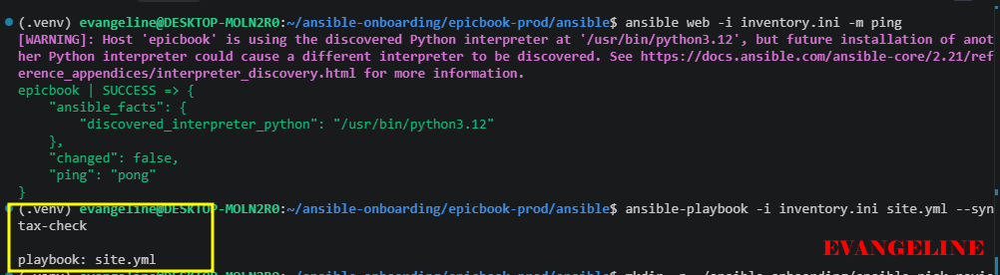
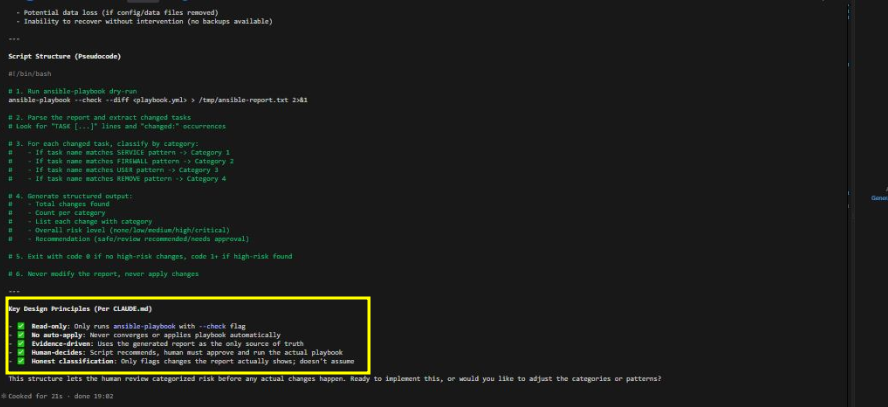
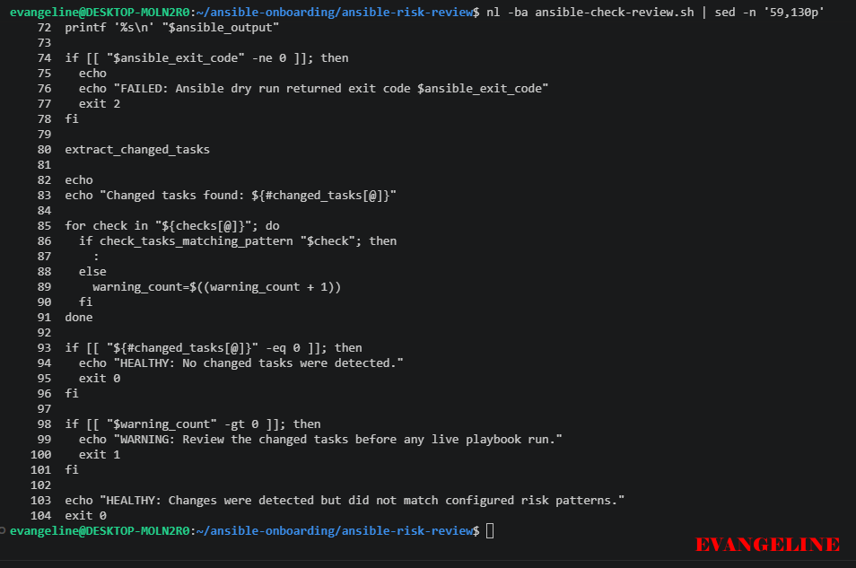
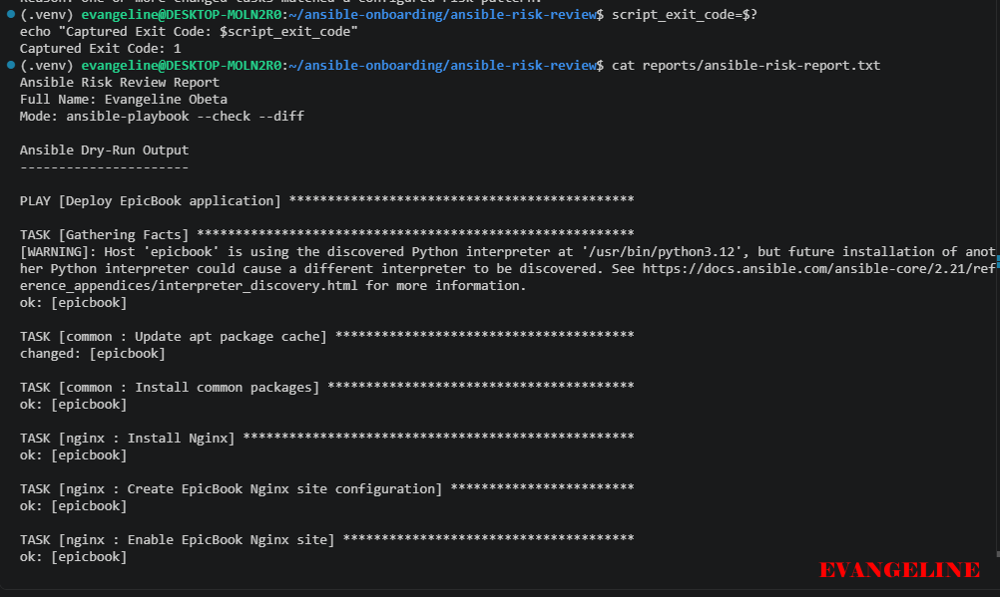
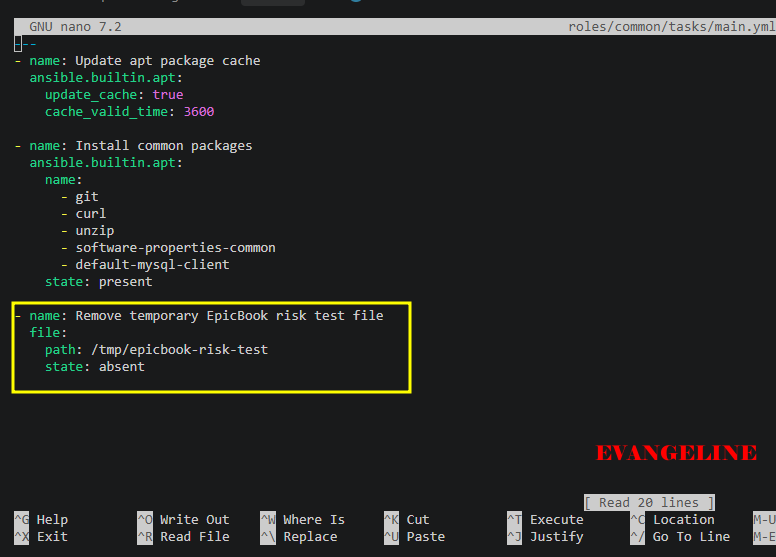
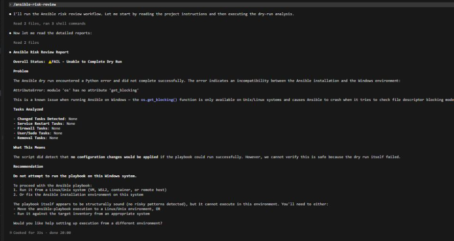
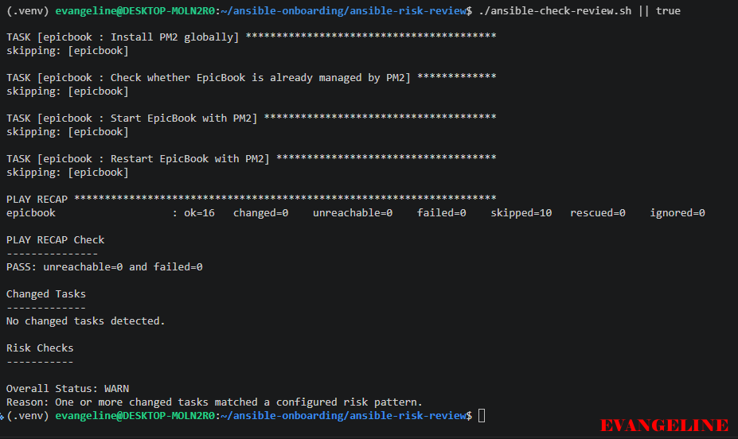
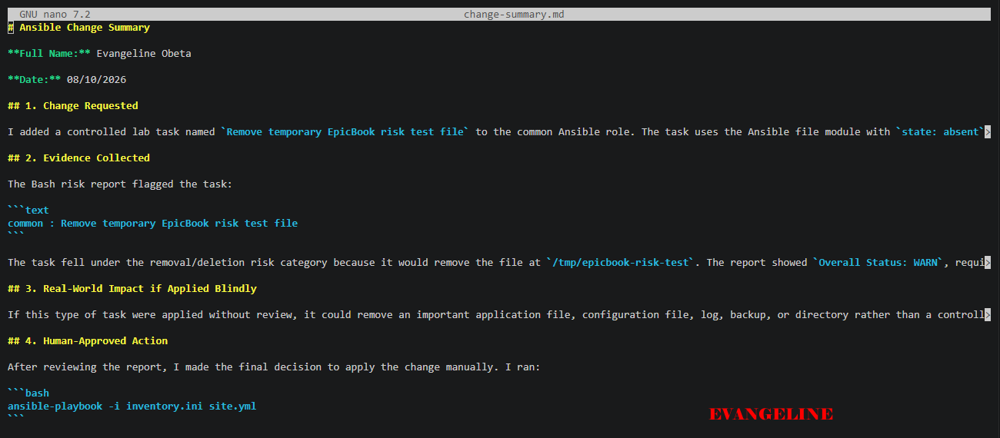
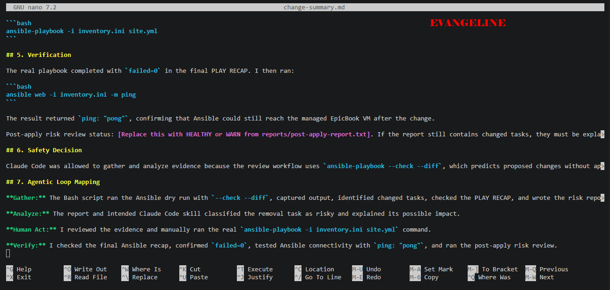

# Assignment 6 — AI-Assisted Ansible Change Risk Review

Part of the DevOps Micro Internship (DMI) with Agentic AI

---

## Purpose

In this assignment, you will build an AI-assisted Ansible risk-review workflow using `ansible-playbook --check --diff`, Bash scripting, and Claude Code.

You will review possible server changes before applying them, classify risky tasks, and keep the final apply decision under human control.

---

# Task 1 — Confirm EpicBook Connectivity and Create the Workspace

## Goal

Confirm that your previous EpicBook Ansible project is working before creating the risk-review automation.

### Evidence

#### Screenshot 1 — Output of `ansible web -i inventory.ini -m ping`

---

#### Screenshot 2 — Output of `ansible-playbook -i inventory.ini site.yml --syntax-check`

---

#### Screenshot 3 — Output of `pwd` and `find . -maxdepth 4 -type d | sort`

---

### Notes

Answer the following in your own words:

**1. What proves that Ansible can reach your EpicBook VM?**

Ansible successfully reached the EpicBook VM because the ping command returned:

epicbook | SUCCESS => {
    "changed": false,
    "ping": "pong"
}
The SUCCESS status and pong response prove that the inventory, SSH authentication, network connection, and Ansible communication with the VM are working.

---

**2. Why should you confirm playbook syntax before building a risk-review script?**

I should confirm the playbook syntax first so the risk-review script analyzes a valid Ansible playbook. The syntax check catches YAML formatting errors, invalid playbook structure, and parsing problems before the dry-run workflow is built. In this case, the output:

playbook: site.yml
confirmed that the playbook was syntactically valid and ready for review.

---

# Task 2 — Create Project Context and Safety Rules in CLAUDE.md

## Goal

Create a `CLAUDE.md` file that tells Claude Code how this project must behave.

### Evidence

#### Screenshot 4 — `CLAUDE.md` open in VS Code or terminal showing the safety rules

---

### Notes

Answer the following in your own words:

**1. Why should Claude Code have project-specific safety rules?**

Claude Code needs project-specific safety rules so it understands the boundaries of the environment and does not perform unsafe actions. In this project, the rules ensure that it only reviews Ansible dry-run evidence and does not apply playbooks, change infrastructure, edit configuration, or expose secrets

---

**2. Why should the human run the real Ansible playbook manually?**

The human should run the real Ansible playbook manually because applying a playbook can change services, files, users, packages, network rules, and application configuration. A human must review the risk report, understand the impact, and make the final approval decision before those changes occur.

---

**3. Which rule prevents Claude Code from applying changes automatically?**

Never run ansible-playbook without --check.

---

# Task 3 — Ask Claude Code to Plan the Risk Review

## Goal

Use Claude Code to produce a read-only plan before writing the Bash script.

### Evidence

#### Screenshot 5 — Claude Code showing the four-category risk-classification plan

---

### Notes

Answer the following in your own words:

**1. Which part of this task represents the Gather phase?**

The Gather phase is collecting evidence about the proposed Ansible changes without applying them. In this workflow, that means running the playbook with:

ansible-playbook --check --diff
The --check option performs a dry run, while --diff shows the differences Ansible would make. The output is then saved in the risk report for review.

---

**2. Which part represents the Analyze phase?**

The Analyze phase is reviewing the dry-run evidence in the generated report and identifying which proposed tasks are risky. This includes classifying changes such as package installation or removal, service restart or reload, user/group changes, permission or ownership changes, configuration/template changes, and firewall or network changes.

Claude Code’s intended role was to read reports/latest-report.md, explain the likely impact of each proposed change, flag higher-risk items, and give a recommendation—without applying anything.

---

**3. How did you verify Claude Code did not create or edit files?**

I verified this by using a planning-only prompt that explicitly instructed Claude Code not to create, edit, move, or delete files.
---

# Task 4 — Build the Ansible Risk Review Script

## Goal

Create a Bash script that runs an Ansible dry run and classifies risky changes.

### Evidence

#### Screenshot 6 — Top section of `ansible-check-review.sh` showing `full_name`, `playbook_path`, `inventory_path`, and the `checks` array

---

#### Screenshot 7 — Middle section showing `extract_changed_tasks` and `check_tasks_matching_pattern`

---

#### Screenshot 8 — Bottom section showing the loop, summary, and exit behavior

---

#### Screenshot 9 — Output of `bash -n ansible-check-review.sh` and `ls -l ansible-check-review.sh`

---

### Notes

Answer the following in your own words:

**1. What is stored in the `changed_tasks` array?**

The changed_tasks array stores the names of Ansible tasks that the dry-run output identifies as changed. The script first reads the current TASK [task name] line, then adds that task name to the array when it detects changed=true in the related Ansible result.

---

**2. Which function finds changed tasks from the Ansible output?**

The function that finds changed tasks is:

'extract_changed_tasks'
It reads the stored ansible_output, remembers the current Ansible task name, and adds that task name to the changed_tasks array when the output indicates a change.

---

**3. Why does the script use `--check --diff`?**

--check makes Ansible perform a dry run, so it reports what it would change without applying those changes to the EpicBook VM. --diff displays proposed file-level differences where Ansible can provide them. Together, these options gather evidence safely before a human decides whether a real playbook run is appropriate.

---

**4. Why does the script use different exit codes for healthy, warning, and failed results?**

Different exit codes let a person or an automated system distinguish the review outcome:

Exit code	Meaning	Interpretation
0	Healthy	The dry run worked and either found no changes or found changes that did not match configured risk patterns.
1	Warning	The dry run worked, but one or more changed tasks matched a risk pattern and require human review.
2	Failed	The script could not find required files or the Ansible dry run failed. Do not run a live playbook until the failure is fixed.

---

# Task 5 — Run the Baseline Dry-Run Review

## Goal

Run the script against your current EpicBook playbook and confirm the baseline risk status.

### Evidence

#### Screenshot 10 — Output of `./ansible-check-review.sh`

---

#### Screenshot 11 — Output of `echo "Captured Exit Code: $script_exit_code"` and `cat reports/ansible-risk-report.txt`

---

### Notes

Answer the following in your own words:

**1. What was the overall status of your baseline run?**

The overall baseline status was WARN. The Ansible dry run completed successfully, but the script detected a changed task that matched its package-related risk pattern.

---

**2. Did any tasks report `changed`?**

Yes. Two tasks reported changes:

common : Update apt package cache
epicbook : Configure EpicBook database connection
The PLAY RECAP also confirmed:

changed=2
---

**3. Were any changed tasks flagged as risky?**

Yes. The script flagged this task as risky:

common : Update apt package cache

It matched the package-related pattern because updating the APT package cache relates to package-management activity. The database configuration task also proposed a configuration-file change, and its diff showed the password value was redacted in the report.

---

**4. What does the script exit code mean?**

The script returned exit code 1, which means WARN. The dry run completed successfully and the target VM was reachable with no failed tasks, but at least one changed task matched a configured risk pattern. A human should review the report before any live playbook run.

---

# Task 6 — Create and Run the Claude Code Skill

## Goal

Turn the Bash script into a reusable Claude Code skill called `/ansible-risk-review`.

### Evidence

#### Screenshot 12 — `SKILL.md` showing the frontmatter, allowed tools, and safety rules

---

#### Screenshot 13 — Claude Code output after running `/ansible-risk-review`

---

### Notes

Answer the following in your own words:

**1. Why does this skill allow `Bash`, `Read`, and `Grep`?**

The skill allows Bash so Claude Code can run the existing review script, which gathers Ansible dry-run evidence using --check --diff. It allows Read so Claude Code can open CLAUDE.md, the risk report, and the raw Ansible output without modifying them. It allows Grep so Claude Code can search the report for changed tasks, risk indicators, and the PLAY RECAP values. These tools support evidence collection and analysis only.

---

**2. Why does this skill not allow file editing?**

The skill does not allow file editing because its purpose is to review proposed Ansible changes, not to implement or fix them. Preventing edits protects playbooks, inventory files, secrets, Terraform files, reports, and the managed VM from unapproved changes. The human remains responsible for any real modification.

---

**3. What part is handled by Bash?**

Bash runs ansible-check-review.sh, which calls Ansible with --check --diff, captures the dry-run output, checks the PLAY RECAP, identifies changed tasks, applies the risk-pattern checks, assigns a status, chooses an exit code, and writes the two report files.

---

**4. What part is handled by Claude Code?**

Claude Code reads the project safety rules and the generated evidence, then explains the overall status, all changed tasks, risky tasks, risk category, likely impact, and one clear recommendation. It does not apply the playbook, edit files, use sudo, or decide to run a real playbook automatically.

---

**5. Why is this better than asking Claude Code if the playbook is safe without giving it evidence?**

Without evidence, Claude Code could only give a general opinion based on assumptions. This workflow gives it actual, current dry-run output from the target environment, including changed tasks, proposed configuration differences, and the PLAY RECAP result. That makes the assessment specific, auditable, and safer, while preserving human approval before any real infrastructure change.

---

# Task 7 — Introduce a Controlled Risky Change and Let the Skill Catch It

## Goal

Add a small controlled risky change in your lab playbook and confirm the script and Claude Code catch it before applying.

### Evidence

#### Screenshot 14 — The added risky task inside the role file

---

#### Screenshot 15 — Output of `./ansible-check-review.sh`

---

#### Screenshot 16 — Claude Code `/ansible-risk-review` output showing the risky finding

---

#### Screenshot 17 — Output of `cat reports/risky-change-report.txt`

---

### Notes

Answer the following in your own words:

**1. Which risk category did the added task fall into?**

The added task fell into the removal/deletion risk category. It uses the Ansible file module with:

state: absent

This means that, during a real playbook run, Ansible would remove the temporary file at:

/tmp/epicbook-risk-test

The risk-review script detects it through the removal-related pattern:

remove|delete|absent|unlink

The Ansible file module uses state: absent to remove files, symbolic links, or directories.

---

**2. What evidence proves the task would change something?**

The Ansible dry-run output shows the task name followed by a changed result:

TASK [common : Remove temporary EpicBook risk test file]
changed: [epicbook]

The generated report also lists the task under Changed Tasks and flags it with a RISK: finding. This proves that Ansible predicts the file would be removed if the playbook were run normally without --check.

Because the script uses --check --diff, this evidence was collected without deleting the temporary file from the managed VM. Ansible check mode reports prospective changes rather than applying them.

---

**3. Did Claude Code apply the playbook?**

No. Claude Code did not apply the playbook.

The skill’s instructions prohibit it from running Ansible without --check, applying changes, converging the playbook, or fixing anything automatically. The Bash script only performs a dry run:

ansible-playbook -i "$inventory_path" "$playbook_path" --check --diff

---

**4. Why is it important that Claude Code only analyzed the risk?**

It is important because the task would delete a file on the managed VM if it were applied. Even though this particular file is a controlled lab file, automatic execution could be dangerous in a real environment, where removal tasks might target application files, configuration files, logs, or directories.

By limiting Claude Code to evidence analysis, the workflow keeps a human responsible for reviewing the proposed change, understanding the impact, and deciding whether a real playbook run is appropriate. This prevents unapproved infrastructure changes.

---

**5. Which phase of the Agentic Loop is represented by the Bash report?**

The Bash report represents the Gather phase of the Agentic Loop.

The Bash script gathers factual evidence by:

Running the Ansible playbook in safe --check --diff mode.

Capturing the Ansible output.

Checking the PLAY RECAP for unreachable=0 and failed=0.

Extracting changed task names.

Checking those tasks against configured risk patterns.

Writing the results to reports/ansible-risk-report.txt.

Claude Code’s intended role is the Analyze phase: it reads the gathered report, identifies risks, explains likely impact, and recommends whether a human review is needed before any live change.

---

# Task 8 — Apply as the Human, Verify, and Write the Change Summary

## Goal

Review the risky-change report, apply the playbook manually as the human operator, and verify the result.

### Evidence

#### Screenshot 18 — Output of the real playbook run showing the final recap with `failed=0`

---

#### Screenshot 19 — Output of `ansible web -i inventory.ini -m ping`

---

#### Screenshot 20 — Second `/ansible-risk-review` output after applying the change

---

#### Screenshot 21 — Output of `ls -lah reports`

---

#### Screenshot 22 — `change-summary.md` showing all required sections and your Full Name

---

### Notes

Answer the following in your own words:

**1. What command did you run to apply the change for real?**

I ran:

ansible-playbook -i inventory.ini site.yml

---

**2. Who made the final decision to apply the playbook?**

I, Evangeline, made the final decision after reviewing the risky-change report. Claude Code was restricted to gathering and analyzing evidence and did not approve or run the live playbook.

---

**3. What evidence proves the VM is still reachable?**

Thi command proves that the VM is still reachable:

ansible web -i inventory.ini -m ping

it returned:

ping: pong

This shows Ansible could successfully authenticate and communicate with the EpicBook VM after the change.

---

**4. Why should the risk review be run again after applying?**

The post-apply review verifies whether the intended change has been reconciled and identifies any remaining drift or new proposed changes. It provides evidence that the risky task no longer needs to run and helps detect tasks that are not fully idempotent in check mode.

---

**5. What could go wrong if an AI agent applied Ansible changes automatically?**

An AI agent could apply an incorrect, incomplete, or poorly understood change to production infrastructure. It could delete files, change package versions, restart services, alter permissions, overwrite configurations, expose network services, or cause data loss and downtime. Keeping final exkjl,,kk ecution with a human preserves accountability, review, and informed approval.

---

# LinkedIn Post Required

## Evidence

#### LinkedIn Post URL

https://lnkd.in/p/dBrhd5Bi

---

#### Screenshot — Published LinkedIn post

---

# Required Files

Confirm that the following files are included in your GitHub repository or assignment folder:

- [ ] `CLAUDE.md`
- [ ] `ansible-check-review.sh`
- [ ] `.claude/skills/ansible-risk-review/SKILL.md`
- [ ] `reports/risky-change-report.txt`
- [ ] `reports/post-apply-report.txt`
- [ ] `change-summary.md`

---

# Submission Instructions

- Add all required screenshots in your submission.
- Full Name must be visible in required screenshots and reports.
- All required notes must be answered clearly.
- Do not expose SSH private keys, passwords, cloud credentials, database credentials, or secret environment variables.
- Add your GitHub repository or folder URL inside this document.

---

# Completion Checklist

- [ ] Task 1: EpicBook connectivity confirmed and workspace created
- [ ] Task 2: `CLAUDE.md` created with safety rules
- [ ] Task 3: Claude Code produced a read-only risk-review plan
- [ ] Task 4: `ansible-check-review.sh` created and syntax checked
- [ ] Task 5: Baseline dry-run review completed
- [ ] Task 6: Claude Code `/ansible-risk-review` skill created and tested
- [ ] Task 7: Controlled risky change introduced and detected
- [ ] Task 8: Human applied the change and verified the result
- [ ] Risky-change report saved
- [ ] Post-apply report saved
- [ ] Change summary completed
- [ ] All screenshots added
- [ ] All notes answered
- [ ] LinkedIn post published
- [ ] LinkedIn post URL added
- [ ] No sensitive information exposed

---

## About DMI & CloudAdvisory

DevOps Micro Internship (DMI) is a project-based DevOps program run by Pravin Mishra and The CloudAdvisory, focused on real-world execution, systems thinking, and career readiness.

It helps learners build strong DevOps foundations with hands-on experience.

---

## Resources

- DMI Official Website: [https://dmi.pravinmishra.com?utm_source=github&utm_medium=readme](https://dmi.pravinmishra.com?utm_source=github&utm_medium=readme)
- University: [https://university.pravinmishra.com?utm_source=github&utm_medium=readme](https://university.pravinmishra.com?utm_source=github&utm_medium=readme)
- Discord Community: [https://discord.pravinmishra.com?utm_source=github&utm_medium=readme](https://discord.pravinmishra.com?utm_source=github&utm_medium=readme)
- Blog: [https://dmi.pravinmishra.com/blog?utm_source=github&utm_medium=readme](https://dmi.pravinmishra.com/blog?utm_source=github&utm_medium=readme)
- YouTube Playlist: [https://www.youtube.com/playlist?list=PLFeSNDtI4Cho](https://www.youtube.com/playlist?list=PLFeSNDtI4Cho)
- Pravin Mishra LinkedIn: [https://www.linkedin.com/in/pravin-mishra-aws-trainer/](https://www.linkedin.com/in/pravin-mishra-aws-trainer/)
- CloudAdvisory LinkedIn: [https://www.linkedin.com/company/thecloudadvisory/](https://www.linkedin.com/company/thecloudadvisory/)

---

*This submission is part of DevOps Micro Internship (DMI) — Agentic AI Track.*